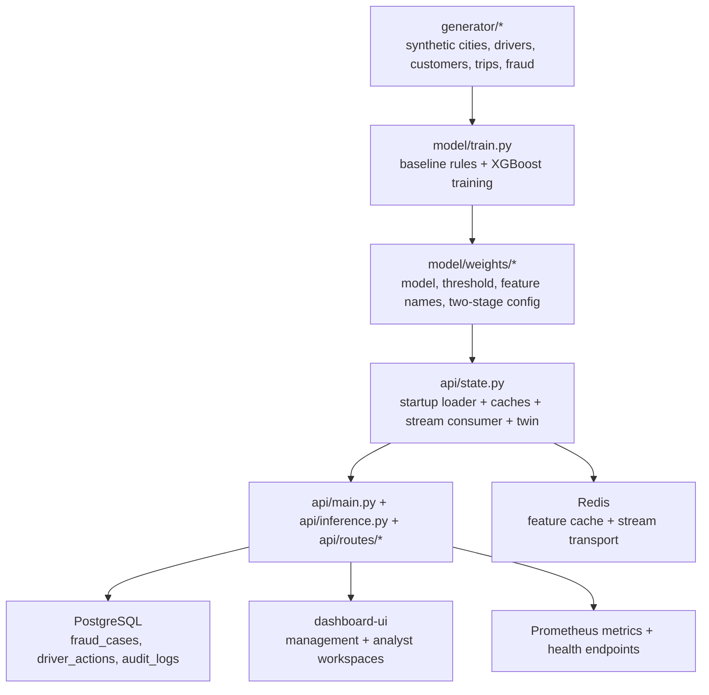

# Current System Overview

Related docs:
[Current Index](./README.md) |
[Data and ML Pipeline](./02-data-and-ml-pipeline.md) |
[Runtime and API Flow](./03-runtime-and-api-flow.md) |
[Target Architecture](../part-2-target/01-final-system-architecture.md)

## What The Product Is Right Now

Today, Porter Intelligence Platform is a multi-module logistics risk and operations system built around one central idea:

`take raw or simulated trip events, score them for fraud risk, persist the most important cases, and expose the results through both management and analyst-facing interfaces.`

It already combines six real capability clusters:

1. Synthetic logistics data generation
2. Fraud detection and tiered decisioning
3. Demand forecasting
4. Driver intelligence and ring-risk analysis
5. Route efficiency and reallocation logic
6. Web application surfaces for executives and analysts

## What It Is Not Yet

It is not yet a fully proven live Porter control-plane because:

- the operational evidence is still synthetic or internal
- real Porter ingestion is not yet integrated
- shadow-mode validation on reviewed Porter cases is not yet complete
- several hardening items still sit between “good product” and “buyer-safe enterprise asset”

## Current Product Shape

## Current Modules By Responsibility

### Synthetic Data Layer

The system can generate a large synthetic logistics dataset using:

- `generator/config.py`
- `generator/cities.py`
- `generator/drivers.py`
- `generator/customers.py`
- `generator/trips.py`
- `generator/fraud.py`

This layer creates the historical and evaluation data used by the models and demos.

### ML Layer

The ML layer is split into specialist modules:

- `model/train.py` for model training and comparison against baseline rules
- `model/scoring.py` for two-stage action/watchlist/clear decisioning
- `model/demand.py` for per-zone Prophet demand models
- `model/driver_intelligence.py` for timeline, peer, and ring-style analysis
- `model/route_efficiency.py` for dead-mile and reallocation analysis
- `model/query.py` for natural-language answers backed by structured context

### Runtime Layer

The live app is a FastAPI service:

- `api/main.py` wires middleware and routers
- `api/state.py` loads data, models, caches, and background tasks
- `api/inference.py` serves scoring and analytics endpoints
- `api/routes/*` adds auth, cases, reports, route efficiency, live KPI, query, and driver-intelligence routes

### Persistence Layer

The current persistence stack is:

- PostgreSQL through `database/connection.py` and `database/models.py`
- Redis through `database/redis_client.py`

The database is already used for:

- fraud cases
- driver actions
- audit logs
- live KPI aggregation

### UI Layer

The frontend is a Vite/React app in `dashboard-ui`.

It has two primary user surfaces:

- a management dashboard at `/`
- an analyst workspace at `/analyst`

## What Is Genuinely Built Versus Framed

### Already Real In Code

- online scoring endpoint
- two-stage scoring logic
- persistent fraud cases
- analyst actions
- live KPI endpoint from PostgreSQL
- digital twin simulator
- AWS buyer environment scripts
- Prometheus metrics exposure

### Present But Not Yet Finished To Buyer-Grade Depth

- ingestion mapping
- shadow mode isolation
- multi-replica-safe architecture
- final production-grade secrets posture
- richer analyst workflow details
- buyer packet, runbooks, ROI tooling, and handover completeness

## How Far Along It Feels

The product is no longer a toy demo.
It is a substantial pre-integration platform with:

- real module boundaries
- persisted operational entities
- a working web app
- a believable digital twin
- a real deployment story

But it is still in the zone where a buyer asks:

`Can I trust this enough to buy it now and connect my real data later?`

That question is why the remaining work matters.

## Related Docs

- [Data and ML pipeline](./02-data-and-ml-pipeline.md)
- [Runtime and API flow](./03-runtime-and-api-flow.md)
- [Completion map](./06-current-completion-map.md)
