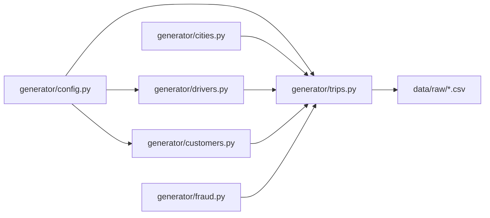
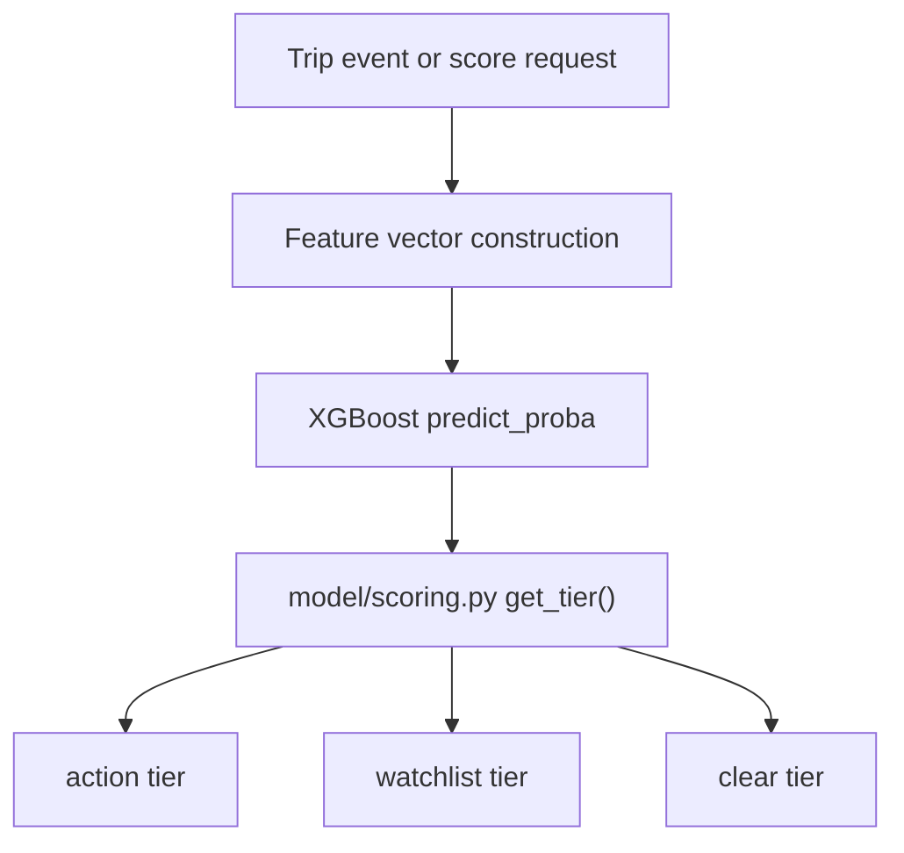

# Current Data And ML Pipeline

Related docs:
[System Overview](./01-system-overview.md) |
[Runtime and API Flow](./03-runtime-and-api-flow.md) |
[Ingestion, Cases, and KPIs](./04-ingestion-cases-and-kpis.md) |
[Final Ingestion + Live Data](../part-2-target/02-final-data-ingestion-shadow-and-live.md)

## The ML Pipeline In One Sentence

The current ML stack is a synthetic-data-first logistics intelligence pipeline that trains an XGBoost fraud model, wraps it in two-stage decisioning, and complements it with demand, driver-risk, and route-efficiency modules.

## Current Data Sources

The current training and demo evidence comes from repo-managed artifacts:

- `data/raw/trips_full_fraud.csv`
- `data/raw/drivers_full.csv`
- `data/raw/customers_full.csv`
- `data/raw/evaluation_report.json`
- `model/weights/xgb_fraud_model.json`
- `model/weights/threshold.json`
- `model/weights/feature_names.json`
- `model/weights/two_stage_config.json`
- `model/weights/demand_models.pkl`

## Data Creation Flow

## Fraud Training Pipeline

The main training file is `model/train.py`.

It performs several linked tasks:

1. Compute a baseline rule engine
2. Build feature matrices through `model/features.py`
3. Train XGBoost using weighted labels
4. Tune the classification threshold under an FPR ceiling
5. Compare the learned model against the baseline
6. Emit an evaluation report used by the dashboard and query layer

## Baseline Versus Model

The baseline in `model/train.py` is intentionally simple.
It approximates manual operations logic with rules like:

- cash + high fare inflation
- suspicious distance/time behavior
- high driver cancellation velocity

The learned model is more expressive because it combines:

- pricing anomalies
- route geometry
- time context
- zone-level priors
- driver behavior features
- complaint/cancellation context

## Current Fraud Decision Layer

After the model outputs a probability, `model/scoring.py` applies a two-stage policy:

- `action` tier: `>= 0.94`
- `watchlist` tier: `>= 0.45 and < 0.94`
- `clear` tier: `< 0.45`

The operational meaning is not just “fraud or not.”
It is a workflow instruction:

- immediate action
- monitor and accumulate evidence
- no action

## Current Scoring Diagram

## Demand Forecasting

Demand forecasting is handled in `model/demand.py`.

Current design:

- one Prophet model per zone
- hourly demand forecasts
- daily and weekly seasonality
- regressors like weekend, Friday, and late-month effects

Current behavior:

- if a Prophet model exists for the zone, the API returns model-based forecasts
- otherwise, the system falls back to rule-based zone demand patterns from `generator/cities.py`

## Driver Intelligence

`model/driver_intelligence.py` turns driver history into investigation context.

It currently computes:

- a daily risk timeline
- peer comparison against zone medians
- ring/co-ordination style indicators

This is important because the platform is not only about trip scoring.
It is also about explaining why a driver deserves attention.

## Route Efficiency

`model/route_efficiency.py` is the operational efficiency side of the platform.

It estimates:

- dead-mile rate
- idle versus active fleet utilization
- reallocation suggestions by zone and vehicle type

This is one reason the product can be sold as more than “fraud detection.”
It is drifting toward a broader operations intelligence layer.

## Natural-Language Query Layer

`model/query.py` loads summary context from `evaluation_report.json` and can answer common questions using:

- structured keyword-based logic first
- local LLM fallback through Ollama for unstructured queries

Current role:

- explain the model and system in plain English
- answer ops-style summary questions
- make the demo feel interactive without exposing raw technical details

## Current ML Strength

The strongest part of the whole system today is the ML and decisioning core:

- the scoring logic is explicit
- thresholds are documented in code and saved artifacts
- model outputs feed multiple product surfaces
- reviewed-case KPI framing has already started to separate truth from proxy metrics

## Current ML Weakness

The weakest part is not the model math itself.
It is the validation context:

- synthetic data, not Porter data
- reviewed-case truth depends on analyst activity
- some runtime evidence is still pre-integration rather than production-proven

## Related Docs

- [Runtime and API flow](./03-runtime-and-api-flow.md)
- [Current completion map](./06-current-completion-map.md)
- [Final security, scale, and buyer readiness](../part-2-target/04-final-security-scale-and-buyer-readiness.md)
