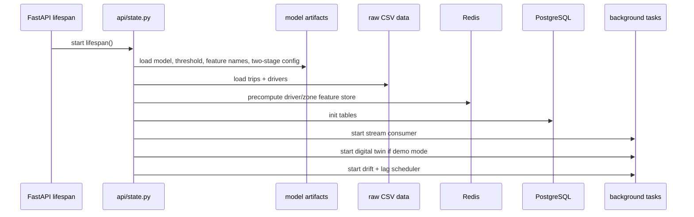
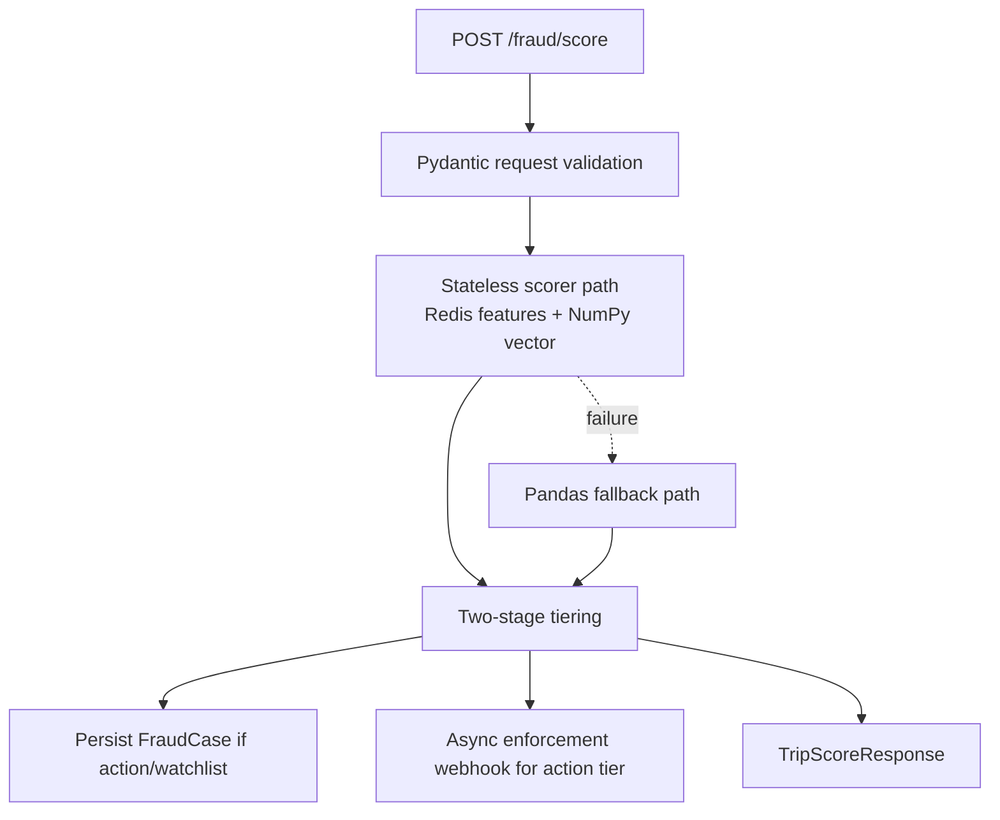

# Current Runtime And API Flow

Related docs:
[Current Index](./README.md) |
[Data and ML Pipeline](./02-data-and-ml-pipeline.md) |
[Ingestion, Cases, and KPIs](./04-ingestion-cases-and-kpis.md) |
[Final System Architecture](../part-2-target/01-final-system-architecture.md)

## The Runtime Core

The live service is assembled around:

- `api/main.py`
- `api/state.py`
- `api/inference.py`
- `api/routes/*`

The most important architectural fact right now is this:

`a large amount of runtime intelligence is preloaded at startup into app_state and then reused by request handlers.`

That design makes the demo fast and self-contained, but it is also one of the reasons scalability is not yet 10/10.

## Startup Flow

`api/state.py` does much more than start FastAPI.
It loads and prepares the entire working context.

At startup it:

1. resolves runtime mode via `runtime_config.py`
2. loads the XGBoost fraud model
3. loads threshold and feature-name artifacts
4. loads evaluation report and two-stage config
5. loads trip and driver CSVs
6. warms driver and zone features into Redis
7. loads demand models
8. preloads query context
9. initializes the database tables
10. precomputes route-efficiency and top-risk caches
11. starts the Redis stream consumer
12. optionally starts the 22-city synthetic twin
13. starts APScheduler jobs for drift and stream-lag monitoring

## Startup Diagram

## Request Classes

There are three broad request classes in the current backend:

### 1. Online Scoring

Main route:

- `POST /fraud/score`

Behavior:

- validate a single trip
- try stateless scoring first using Redis-backed feature lookups
- fall back to pandas feature computation if needed
- assign action/watchlist/clear tier
- persist a fraud case for action/watchlist
- optionally trigger enforcement webhook for action tier

### 2. Analytical Reads

Examples:

- `GET /fraud/heatmap`
- `GET /fraud/live-feed`
- `GET /fraud/driver/{driver_id}`
- `GET /demand/forecast/{zone_id}`
- `GET /kpi/summary`
- `GET /kpi/live`
- route-efficiency and driver-intelligence routes

Some of these read from:

- startup-loaded pandas DataFrames

Some read from:

- PostgreSQL operational tables

### 3. Operational Writes

Examples:

- `POST /auth/token`
- `PATCH /cases/{case_id}`
- `POST /cases/{case_id}/driver-action`
- ingestion routes that push events into the stream

## Scoring Request Flow

## Current API Surfaces By Audience

### Executive / Management

- dashboard shell at `/`
- KPI and trend endpoints
- heatmap and route-efficiency surfaces
- natural-language query surface

### Analyst / Ops

- login and JWT issue path
- `/analyst` workspace
- case list
- case details
- status updates
- driver actions

### Integration / System

- ingestion webhook
- stream consumer
- `/health`
- `/metrics`

## Health And Provenance

One of the most important buyer-trust improvements already added is provenance awareness.

`GET /health` now returns:

- runtime mode
- whether the synthetic feed is enabled
- data provenance text
- model loaded state
- DB and Redis availability
- simulator summary when demo mode is active

That matters because the system can now tell the truth about whether the viewer is seeing:

- synthetic demo data
- non-production operational data
- production-mode data-backed case records

## Current Architecture Strength

The current runtime is readable.
The service has a clear center of gravity and the request flows make sense.

## Current Architecture Weakness

The current runtime also exposes the biggest pre-integration architectural compromise:

- a lot of important state lives in `app_state`
- multi-replica safety is therefore not fully solved yet
- startup still depends on loading local CSVs and artifacts into memory

That is acceptable for a strong pre-integration platform demo.
It is not the final target architecture.

## Related Docs

- [Ingestion, cases, and KPI layer](./04-ingestion-cases-and-kpis.md)
- [Frontend, security, and infrastructure](./05-frontend-security-infra.md)
- [Final architecture](../part-2-target/01-final-system-architecture.md)
