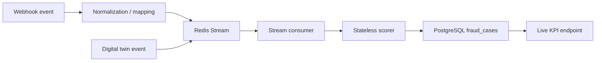

# Current Ingestion, Cases, And KPI Layer

Related docs:
[Runtime and API Flow](./03-runtime-and-api-flow.md) |
[Frontend + Infra](./05-frontend-security-infra.md) |
[Final Ingestion + Shadow + Live](../part-2-target/02-final-data-ingestion-shadow-and-live.md)

## What This Layer Does

This is the bridge between “model output” and “operational product.”

It handles:

- inbound event intake
- async scoring transport
- persistent fraud cases
- analyst case actions
- buyer-facing live KPI aggregation

Without this layer, the system would just be an ML demo.

## Current Ingestion Paths

Today there are two main ingestion concepts in code:

### 1. Real-Time Webhook Path

Implemented in `ingestion/webhook.py`

Current behavior:

- accepts a Porter-style trip completion event
- optionally verifies HMAC signature
- normalizes field names into platform schema
- queues the event for async scoring
- returns immediately

### 2. Synthetic Twin Path

Implemented in:

- `ingestion/live_simulator.py`
- `ingestion/city_profiles.py`

Current behavior:

- creates synthetic but structured trip events
- feeds them into the same Redis stream path
- uses 22 city profiles
- is only enabled in demo runtime mode

## Async Stream Path

`ingestion/streams.py` is the key async backbone.

Current pattern:

- producer pushes JSON payload into Redis stream `porter:trips`
- consumer group `scoring-workers` reads from the stream
- each message is scored using the stateless scorer
- action/watchlist cases are written into PostgreSQL
- the message is acknowledged only after successful processing

## Ingestion Diagram

## Inline Fallback

The webhook path has an important current fallback:

- if Redis stream publish fails
- the system falls back to inline scoring and persistence

That improves robustness for demos and reduced environments.
It also reveals a current architecture compromise:

- Redis is intended to be the primary async path
- but synchronous fallback still exists to avoid losing the event

## Fraud Case Model

Fraud cases are the core operational entity.

Current `FraudCase` fields include:

- trip ID
- driver ID
- zone ID
- tier
- fraud probability
- top signals
- fare and recoverable value
- status
- analyst notes
- override reason
- timestamps

These are stored in PostgreSQL via `database/models.py`.

## Driver Actions And Audit Trail

The case layer also supports:

- driver actions in `driver_actions`
- audit entries in `audit_logs`

From the product point of view, this is what transforms scoring into workflow.

## Live KPI Layer

`api/routes/live_kpi.py` is one of the most buyer-aware modules in the repo.

It explicitly separates:

### Reviewed-Case Truth

- reviewed cases in the last 24h
- reviewed-case precision
- reviewed false-alarm rate
- confirmed recoverable value
- pending review queue

### Operational Signals

- action-tier volume
- watchlist volume
- action score average
- estimated recoverable value

The system also exposes review-confidence labels so the product can admit when sample size is too small for finance-grade claims.

## Why This Matters Commercially

This is one of the strongest “trust upgrades” already made to the product.

Instead of pretending model confidence equals business truth, the system now says:

- reviewed analyst verdicts are the primary truth layer
- live signal metrics are useful, but secondary

That is exactly the kind of distinction enterprise buyers care about.

## Current Gaps In This Layer

The ingestion and workflow bridge is still incomplete in three important ways:

1. schema-mapper depth is still limited
2. queue replay / retry staging is not yet finished
3. shadow mode is not yet fully isolated and buyer-safe

Those are roadmap issues, not conceptual missing pieces.
The shape is already visible in the code.

## Related Docs

- [Current runtime and API flow](./03-runtime-and-api-flow.md)
- [Current completion map](./06-current-completion-map.md)
- [Target ingestion, shadow mode, and live data](../part-2-target/02-final-data-ingestion-shadow-and-live.md)
