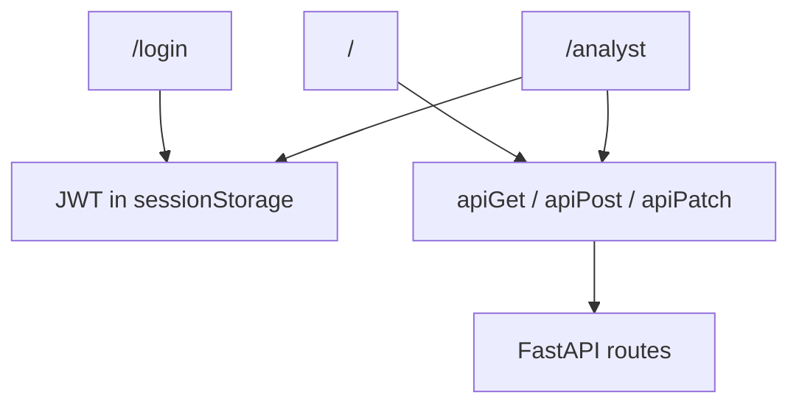

# Current Frontend, Security, Infrastructure, And Observability

Related docs:
[Current Runtime and API Flow](./03-runtime-and-api-flow.md) |
[Current Completion Map](./06-current-completion-map.md) |
[Final Security + Scale + Buyer Readiness](../part-2-target/04-final-security-scale-and-buyer-readiness.md)

## Frontend Surfaces

The React frontend in `dashboard-ui` is not a toy landing page.
It already has two distinct workspaces with different jobs.

### 1. Management Dashboard

Main files:

- `dashboard-ui/src/pages/Dashboard.jsx`
- `dashboard-ui/src/components/KPIPanel.jsx`
- `dashboard-ui/src/components/TierSummaryBar.jsx`
- `dashboard-ui/src/components/ZoneMap.jsx`
- `dashboard-ui/src/components/DriverIntelligence.jsx`
- `dashboard-ui/src/components/ReallocationPanel.jsx`
- `dashboard-ui/src/components/QueryPanel.jsx`
- `dashboard-ui/src/components/TripScorer.jsx`

Purpose:

- show management-level operational signals
- explain fraud, recovery, and risk visually
- demonstrate the digital twin and live case flow

### 2. Analyst Workspace

Main files:

- `dashboard-ui/src/pages/Analyst.jsx`
- `dashboard-ui/src/components/ProtectedRoute.jsx`
- `dashboard-ui/src/hooks/useAuth.js`
- `dashboard-ui/src/utils/auth.js`

Purpose:

- list cases
- inspect risk details
- update statuses
- trigger driver actions

## Frontend Flow Diagram

## Current Security Model

The security story is meaningful but not finished.

### Already Present

- JWT creation and verification in `auth/jwt.py`
- role-based permissions in `auth/models.py` and `auth/dependencies.py`
- bcrypt password hashing
- HMAC webhook signature verification
- AES-256-GCM support for PII encryption in `security/encryption.py`
- security headers middleware in `api/main.py`

### Current Weaknesses

- seeded credentials still exist in code
- default secrets still exist in some runtime defaults
- encryption can still fall back to plaintext when the key is not set
- wildcard CORS is still enabled

This is why the product can be called “security-aware” today, but not yet “10/10 enterprise-secure.”

## Persistence And Runtime Infrastructure

### Database

`database/connection.py` builds an async SQLAlchemy engine over PostgreSQL.

Current use cases:

- cases
- driver actions
- audit logs
- live KPI aggregation

### Redis

`database/redis_client.py` currently serves two jobs:

- hot cache / feature store backing
- stream transport for async ingestion

### AWS Deployment

The AWS path in `infrastructure/aws/*` has already been hardened substantially.

It currently supports:

- VPC and subnets
- ALB
- ECS
- RDS
- Redis
- CloudWatch logs
- Secrets Manager
- buyer environment provisioning

But the live buyer environment still has account-side constraints:

- no ACM certificate attached yet
- no fully private ECS networking yet
- limited IAM role-management rights

## Observability

Current observability is good enough to prove intent, but not yet complete enough to win enterprise diligence on its own.

### Already Present

- `/health`
- `/metrics`
- Prometheus counters, histograms, and gauges
- drift checks
- stream-lag gauge
- model metadata reporting
- Grafana / Prometheus infrastructure files

### Not Yet Fully Mature

- no full traces across every path
- no mature alert catalog
- no full SLO/SLA layer exposed to the buyer packet yet

## Current Strength Of This Layer

This is a real product stack, not a single demo server.

The UI, auth, persistence, telemetry, and deployment layers all exist in code and all connect to the business narrative.

## Current Weakness Of This Layer

This layer is also where many buyer objections still live:

- secrets posture
- least privilege
- wildcard exposure
- fail-open encryption behavior
- incomplete deployment hardening

Those are exactly the kinds of things that separate a `7/10 promising asset` from a `10/10 buyable enterprise asset`.

## Related Docs

- [Current completion map](./06-current-completion-map.md)
- [Final buyer-ready architecture](../part-2-target/01-final-system-architecture.md)
- [Final security and scale target](../part-2-target/04-final-security-scale-and-buyer-readiness.md)
