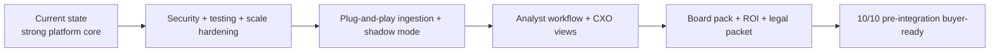

# Current Completion Map

Related docs:
[Current Index](./README.md) |
[System Overview](./01-system-overview.md) |
[Target Index](../part-2-target/README.md) |
[Sale Checklist](../../_archive/archive/checklist.md)

## The Honest Summary

The current system is substantial, coherent, and increasingly buyer-aware.
It is no longer accurate to call it “just a prototype.”

At the same time, it is also not honest to call it fully finished.

The right current label is:

`a serious pre-integration enterprise asset with real product shape, but not yet fully buyer-complete.`

## What Is Actually Done

### Built And Working

- synthetic logistics data generation
- model training and saved fraud model artifacts
- two-stage action/watchlist/clear scoring
- fraud scoring API
- demand forecasting API
- driver intelligence computations
- route efficiency computations
- live KPI API from PostgreSQL
- analyst login and case management routes
- persistent fraud cases, driver actions, and audit logs
- digital twin simulator with 22-city profiles
- buyer-mode runtime separation
- health and metrics endpoints
- AWS buyer environment provisioning and deployment path

## What Exists But Is Not Final Yet

### Partially Built / Needs Hardening

- secrets and default credential cleanup
- wildcard CORS removal
- fail-closed encryption
- stronger test coverage
- distributed-state cleanup away from `app_state`
- replay/retry staging for ingestion
- schema mapping depth for external feeds
- shadow-mode isolation
- richer analyst workflow completeness
- ROI tooling and board-pack generation
- final legal/handover packaging

## Current Versus Target Shape

## Completion By Product Layer

| Layer | Current status | Notes |
|---|---|---|
| Core fraud model | Strong | One of the most mature parts |
| Two-stage decisioning | Strong | Action/watchlist/clear works end-to-end |
| Demand forecasting | Strong | Prophet + fallback logic present |
| Driver intelligence | Strong | Good analytical depth |
| Route efficiency | Strong | Adds operational breadth |
| Runtime API | Strong but compromised | Clean flows, but still state-heavy |
| Case management | Good | Real persistence and actioning exist |
| Ingestion | Emerging | Webhook/stream path exists, plug-and-play not finished |
| Shadow mode | Planned | Not yet fully isolated |
| Frontend | Good | Real dashboards and analyst workspace |
| Security posture | Mixed | Good foundation, unfinished hardening |
| Testing | Weak to improving | Not yet enough for buyer confidence |
| Observability | Good foundation | Not yet complete enterprise story |
| Deployment / handover | Good direction | Not yet fully polished for diligence |

## What A Buyer Would Still Push On Today

If a serious Porter-side buyer reviewed the current repo today, the hardest questions would still be:

- Can this be trusted on real Porter data?
- What happens when there are multiple replicas?
- How complete is the ingestion and shadow-mode story?
- Are credentials, encryption, and access controls buyer-safe?
- Can another engineering team take this over without founder dependence?

Those are not small questions.
They are exactly the difference between an impressive system and a signable enterprise asset.

## What This Means For The Build

The remaining work should not be treated as “polish.”
It is the work that changes the product category:

- from platform demo
- to enterprise purchase candidate

## Related Docs

- [Target state index](../part-2-target/README.md)
- [Final system architecture](../part-2-target/01-final-system-architecture.md)
- [Final security, scale, and buyer readiness](../part-2-target/04-final-security-scale-and-buyer-readiness.md)
