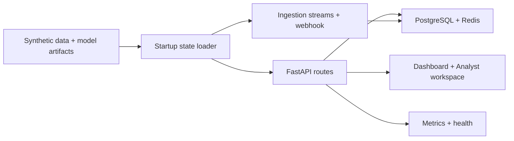

# Part 1 — What The System Does Today

This section explains the system as it exists in the repo right now.

The goal here is not to say what the product could become.
The goal is to explain what is already built, how it currently runs, and how complete each subsystem really is.

## Current-State Reading Path

1. [System overview](./01-system-overview.md)
2. [Data and ML pipeline](./02-data-and-ml-pipeline.md)
3. [Runtime and API flow](./03-runtime-and-api-flow.md)
4. [Ingestion, cases, and KPI layer](./04-ingestion-cases-and-kpis.md)
5. [Frontend, security, infrastructure, and observability](./05-frontend-security-infra.md)
6. [Completion map and current gaps](./06-current-completion-map.md)

## Current-State Map

## What “Current State” Includes

- the synthetic historical dataset and model artifacts in `data/raw/` and `model/weights/`
- the startup/runtime path in `api/state.py` and `api/main.py`
- the online scoring and analytics routes in `api/inference.py` and `api/routes/*`
- the digital twin and ingestion paths in `ingestion/*`
- the persistent case-management backend in `database/*` and `api/routes/cases.py`
- the dashboard and analyst workspace in `dashboard-ui/src/*`
- the current AWS deployment path in `infrastructure/aws/*`

## What “Current State” Does Not Mean

- it does not mean fully hardened production proof on real Porter data
- it does not mean every planned feature is done
- it does not mean every enterprise control is finished

## Related Docs

- [Hub](../README.md)
- [System overview](./01-system-overview.md)
- [Completion map](./06-current-completion-map.md)
- [Target-state index](../part-2-target/README.md)
