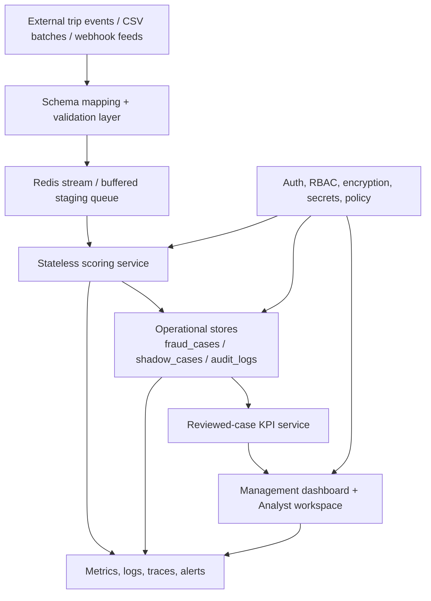

# Final System Architecture

Related docs:
[Target Index](./README.md) |
[Final Ingestion + Shadow + Live](./02-final-data-ingestion-shadow-and-live.md) |
[Final Security + Buyer Readiness](./04-final-security-scale-and-buyer-readiness.md) |
[Current Runtime](../part-1-current/03-runtime-and-api-flow.md)

## The End-State Architecture Goal

The final architecture should keep the current product strengths while removing the main enterprise objections:

- too much in-memory mutable state
- not enough configuration validation
- too much reliance on synthetic startup artifacts
- not enough separation between demo, shadow, and production execution paths

## Final Runtime Model

The target runtime is:

- API layer for synchronous reads and writes
- Redis-backed asynchronous transport
- PostgreSQL-backed operational truth
- explicit mode separation:
  - demo
  - shadow
  - production
- modular scoring paths that no longer depend on per-replica local state for correctness

## Final Architecture Diagram

## Final State Design Principles

### 1. Business Truth Lives In Shared Systems

The final system should not require each API instance to hold the same working truth in local memory.

Shared truth should live in:

- PostgreSQL
- Redis
- persisted model artifacts
- explicit runtime config

### 2. Startup Is Lighter And Safer

The final runtime should still preload what is useful, but not in a way that makes correctness depend on one container’s memory image.

### 3. Modes Are First-Class

The system should behave differently by design in:

- demo mode
- shadow mode
- production mode

Each mode should have:

- its own write rules
- its own visibility labels
- its own operational guarantees

### 4. Evidence Layers Are Explicit

The product should never blur:

- synthetic evidence
- estimated value
- analyst-reviewed truth
- production-confirmed savings

## Final Module Boundaries

### Fraud Decision Core

Responsibilities:

- accept a normalized trip event
- score risk
- assign tier
- attach top signals
- write the right entity depending on runtime mode

### Ingestion Layer

Responsibilities:

- accept CSV, webhook, and replay feeds
- map external schemas into internal schema
- queue events reliably
- expose queue status and replay behavior

### Operational Workflow Layer

Responsibilities:

- create and maintain cases
- support analyst actions and audit logging
- isolate shadow-mode review from production enforcement

### Executive Intelligence Layer

Responsibilities:

- reviewed-case KPIs
- fraud and savings trends
- city and zone breakdowns
- CFO, COO, CEO, and fraud/risk lenses

## Final Outcome

When this architecture is complete, the product should feel less like a collection of clever modules and more like one coherent operating system.

## Related Docs

- [Final ingestion and shadow mode](./02-final-data-ingestion-shadow-and-live.md)
- [Final operations and workspaces](./03-final-operations-and-workspaces.md)
- [Final buyer readiness](./04-final-security-scale-and-buyer-readiness.md)
