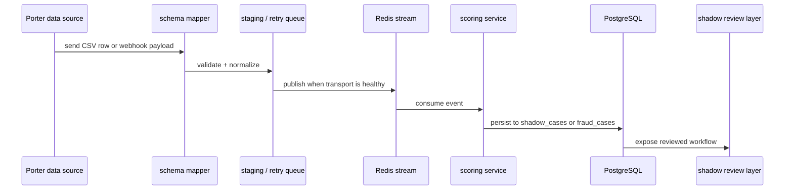

# Final Ingestion, Shadow Mode, And Live Data

Related docs:
[Final Architecture](./01-final-system-architecture.md) |
[Final Operations + Workspaces](./03-final-operations-and-workspaces.md) |
[Current Ingestion Layer](../part-1-current/04-ingestion-cases-and-kpis.md)

## Why This Layer Matters Most

This is the layer that will decide whether Porter sees the product as:

- easy to adopt

or as:

- another system that needs custom engineering before it becomes useful

The final design must make the product feel plug-and-play.

## Final Ingestion Modes

The target product should support three ingestion modes cleanly:

### 1. Batch CSV Import

Use case:

- Porter sends masked historical data
- we map it quickly
- we score it
- we produce shadow-mode intelligence

Target endpoint:

- `POST /ingest/batch-csv`

### 2. Live Webhook Feed

Use case:

- Porter emits trip-completion or event webhooks
- the platform validates signatures
- the platform normalizes fields
- the platform queues the event for async scoring

### 3. Replay / Retry / Drain

Use case:

- Redis or downstream consumers are temporarily unavailable
- events are staged durably
- the system drains staged events when transport recovers

## Final Ingestion Flow

## Final Schema Mapping Layer

The schema-mapping system should become a product feature, not just a helper function.

It should:

- support arbitrary external field names
- support JSON-defined mappings
- support known Porter-like aliases
- validate required fields before scoring
- produce operator-readable errors

The demo value is very high here:

`Give us 20 masked rows. We map them live.`

That sentence only works when the schema layer is robust enough to survive small input variations in front of a buyer.

## Final Shadow Mode

The shadow-mode design should do exactly one thing well:

`let Porter see what the system would have done without changing Porter’s operations.`

Target properties:

- explicit `SHADOW_MODE`
- isolated `shadow_cases`
- isolated KPI views
- no enforcement webhook firing
- no production-side writeback
- clear operator-visible labels

## Final Live Data Path

After the buyer-ready stage, the real-data path should be:

1. Porter provides masked sample payloads
2. mapping is proven on those samples
3. system runs in shadow mode
4. analysts review flags
5. reviewed-case precision and savings are measured
6. only then does live enforcement become a decision

## The Critical Commercial Point

This is the difference between saying:

- “trust us, it should work on your data”

and saying:

- “we can show you exactly how it behaves on your data without operational risk”

## Related Docs

- [Final architecture](./01-final-system-architecture.md)
- [Final operations and workspaces](./03-final-operations-and-workspaces.md)
- [Current ingestion layer](../part-1-current/04-ingestion-cases-and-kpis.md)
