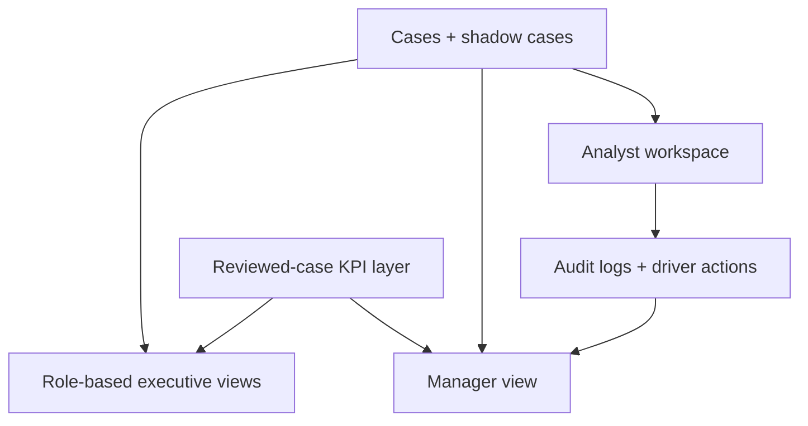

# Final Operations And Workspaces

Related docs:
[Final Ingestion + Shadow + Live](./02-final-data-ingestion-shadow-and-live.md) |
[Final Buyer Readiness](./04-final-security-scale-and-buyer-readiness.md) |
[Current Frontend + Infra](../part-1-current/05-frontend-security-infra.md)

## The Final Product Should Feel Operational

The final pre-integration buyer-ready version should not feel like:

- a dashboard that happens to show fraud charts

It should feel like:

- a working fraud and leakage operations product

## Final User Surfaces

### 1. Analyst Workspace

The analyst workspace should become the daily execution surface for reviewed operations.

It should support:

- queue triage
- case details
- top feature signals
- note-taking
- override reasons
- confirm / false-alarm / escalate actions
- batch review
- driver-level interventions
- full action trail

### 2. Manager Workspace

Managers should see:

- analyst workload
- pending cases by age
- city and zone concentrations
- reviewed precision trend
- false-alarm trend
- confirmed recoverable value

### 3. CXO Views

Each decision-maker should have a tailored story:

- CEO: leakage trend and city risk
- CFO: confirmed savings, payback, and ROI scenarios
- COO: operational load and intervention velocity
- CPTO / CTO: architecture, latency, security, and integration credibility
- Fraud / Risk: ring detection, driver distribution, fraud-type breakdown

## Final Workspace Diagram

## Final Product Story By Role

### For Analysts

The system should answer:

- what should I review next?
- why was this trip flagged?
- what action do I take?
- what did previous analysts already do?

### For Managers

The system should answer:

- how many high-risk cases are waiting?
- which zones or cities are spiking?
- are analysts keeping up?
- is the signal quality improving or degrading?

### For CXOs

The system should answer:

- what leakage is being stopped?
- what is the operational or financial impact?
- is this safe, governable, and deployable?

## Why This Matters For A Buyer

Porter does not need another static dashboard.
Porter would only care if this becomes:

- a workflow product
- a savings engine
- a decision surface

That is why the analyst and manager surfaces matter as much as the model itself.

## Related Docs

- [Final security and scale](./04-final-security-scale-and-buyer-readiness.md)
- [Current analyst and dashboard surfaces](../part-1-current/05-frontend-security-infra.md)
