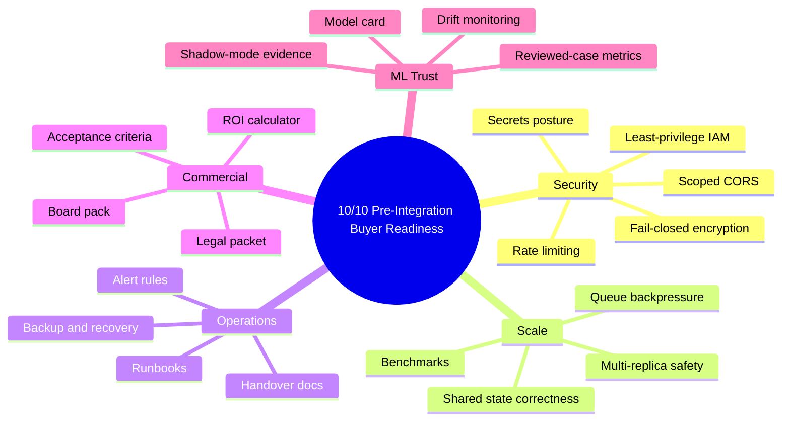

# Final Security, Scale, And Buyer Readiness

Related docs:
[Target Index](./README.md) |
[Final Architecture](./01-final-system-architecture.md) |
[Current Completion Map](../part-1-current/06-current-completion-map.md) |
[Sale Checklist](../../_archive/archive/checklist.md)

## What “Buyer Ready” Actually Means

For this product to feel like a `10/10 pre-integration buyer-ready asset`, the buyer should be able to say:

`Even before connecting our live data, this already looks like something we could own, run, review, and hand across teams.`

That means the final state must solve four kinds of trust at once:

1. technical trust
2. security trust
3. operational trust
4. commercial trust

## Final Security Target

The final security posture should include:

- no seeded production credentials in code
- no default runtime secrets in deployable environments
- scoped CORS
- rate limiting on exposed public-sensitive routes
- fail-closed encryption behavior
- least-privilege IAM
- secrets rotation procedure
- buyer-reviewable security summary

## Final Scale Target

The final scale story must answer the current architectural objection around `app_state`.

Target outcomes:

- correctness should not depend on one container’s memory
- the system should behave safely with multiple API replicas
- queue and persistence should absorb spikes
- benchmark outputs should exist for:
  - startup
  - p95 scoring latency
  - ingestion throughput

## Final Readiness Diagram

## Final CI/CD And Supply Chain Target

The product should eventually expose build trust, not just source code.

Target additions:

- stronger CI coverage
- linting and static checks
- reproducible build strategy
- SBOM generation
- dependency scanning
- build provenance / attestation

This matters because a serious buyer or diligence reviewer does not only ask:

- what does the app do?

They also ask:

- how do we trust the software supply chain?

## Final Observability Target

The final observability layer should combine:

- logs
- metrics
- traces
- alerts
- operator runbooks

The point is not just to “monitor.”
The point is to make the product handover-safe.

## Final Buyer Packet Target

By the final pre-integration stage, the product should ship with:

- architecture overview
- setup and deployment guide
- rollback guide
- secrets guide
- operator runbooks
- model card
- ROI calculator
- board pack
- security summary
- legal/commercial packet
- acceptance criteria

## The Last Honest Gap

If all of the above is complete, there should be only one major unresolved item before full production proof:

- live Porter data ingestion and validation

That is the cleanest possible place to stop before outreach.

It says:

- the asset is ready
- the buyer packet is ready
- the controls are ready
- the integration path is ready
- only the buyer’s own data remains to prove

## Related Docs

- [Final ingestion and shadow mode](./02-final-data-ingestion-shadow-and-live.md)
- [Current completion map](../part-1-current/06-current-completion-map.md)
- [Sale checklist](../../_archive/archive/checklist.md)
