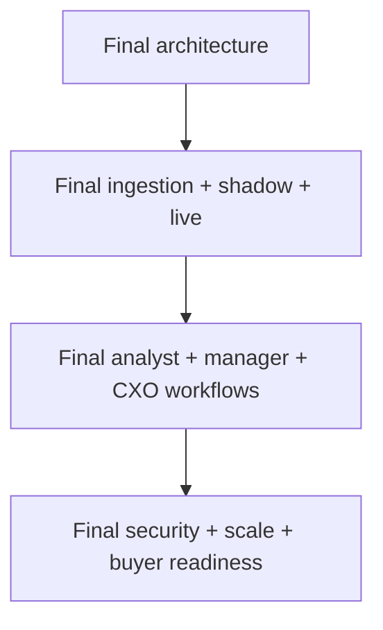

# Part 2 — How The Final System Is Supposed To Work

This section explains the intended end-state once the build reaches the final planned stage before live Porter data integration.

This is not fiction.
It is the documented target state implied by:

- the current codebase
- the daily execution checklist
- the buyer-side review gaps we are closing

## Important Framing

The target described here is:

- `10/10 pre-integration buyer-ready`

It is not yet claiming:

- `10/10 proven on Porter real data`

That final proof only happens after:

- live data connection
- shadow-mode run
- reviewed-case validation

## Target-State Reading Path

1. [Final system architecture](./01-final-system-architecture.md)
2. [Final ingestion, shadow mode, and live data path](./02-final-data-ingestion-shadow-and-live.md)
3. [Final operations and workspaces](./03-final-operations-and-workspaces.md)
4. [Final security, scale, and buyer readiness](./04-final-security-scale-and-buyer-readiness.md)

## Target-State Map

## What The Final Stage Means In Practice

By the time this section becomes true, the product should feel like:

- a leakage-control operating system
- a plug-and-play integration asset
- an analyst workflow product
- an executive decision surface
- a handover-ready enterprise purchase

## Related Docs

- [Current completion map](../part-1-current/06-current-completion-map.md)
- [Final architecture](./01-final-system-architecture.md)
- [Sale checklist](../../_archive/archive/checklist.md)
