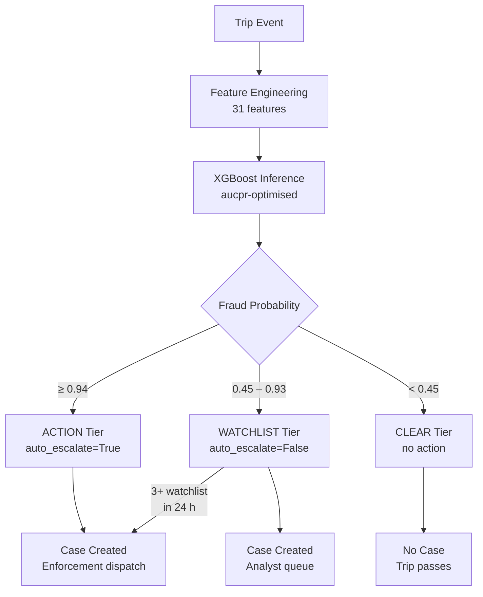
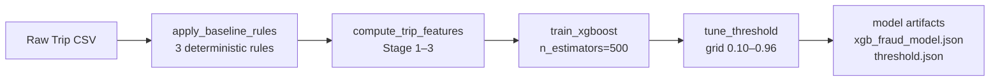
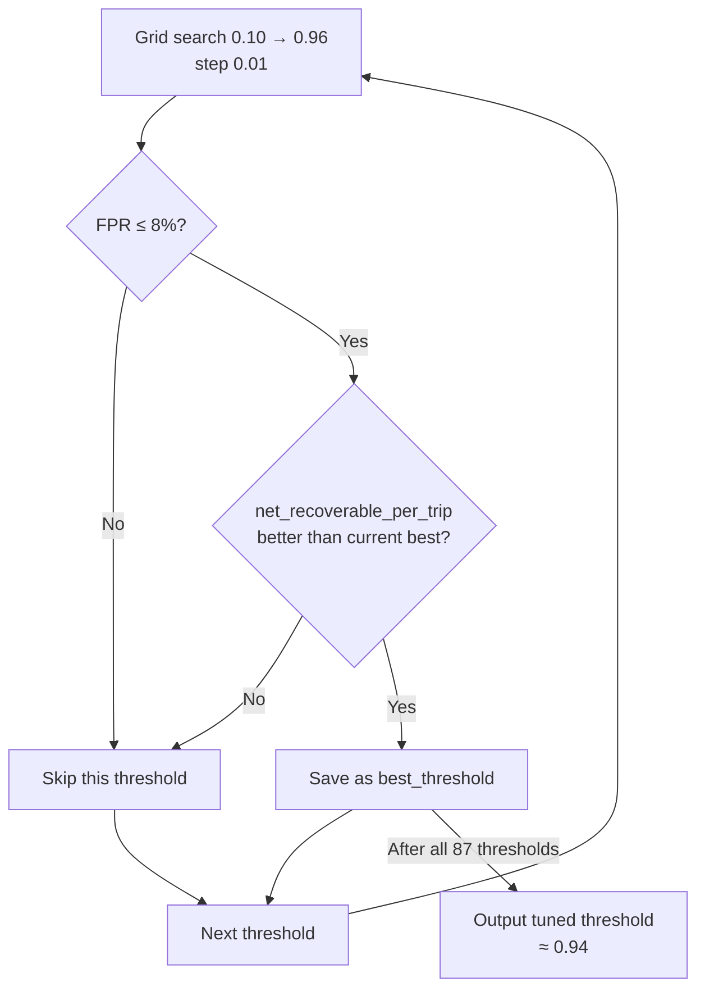

# 01 — Fraud Scoring Engine

[Index](./README.md) | [Next: Feature Engineering](./02-feature-engineering.md)

This file explains the complete fraud scoring pipeline: how the XGBoost model is trained, how the two-stage tiered scoring works, how the threshold is tuned, and how confidence weighting shapes the training signal.

---

## Model Architecture

The platform uses a single **XGBoost binary classifier** to predict whether a trip is fraudulent. The model outputs a probability in `[0, 1]` which is then mapped to a tier through the two-stage scoring system.



### Why XGBoost

- Handles mixed feature types (numeric + encoded categorical) without preprocessing
- Built-in handling of missing values — critical when driver profiles are incomplete
- AUCPR (area under precision-recall curve) as the native eval metric — appropriate for imbalanced fraud data
- Fast inference (< 1ms per trip) — suitable for real-time stream scoring
- Model serialises to a single `.json` file — no dependency on training environment at inference time

**Source:** `model/train.py:train_xgboost()`

---

## Training Pipeline



## Training Configuration

```python
XGBClassifier(
    n_estimators      = 500,
    max_depth         = 6,
    learning_rate     = 0.05,
    subsample         = 0.8,
    colsample_bytree  = 0.8,
    eval_metric       = "aucpr",
    early_stopping_rounds = 50,
    use_label_encoder = False,
    random_state      = 42,
)
```

### Parameter rationale

| Parameter | Value | Why |
|-----------|-------|-----|
| `n_estimators=500` | Maximum 500 boosting rounds | Early stopping at 50 rounds without improvement prevents overfitting |
| `max_depth=6` | Tree depth limit | Deep enough to capture interaction effects (e.g. cash + night + high fare), shallow enough to avoid memorising individual trips |
| `learning_rate=0.05` | Low learning rate | Slower learning + more trees = better generalisation. Combined with early stopping, this finds the sweet spot |
| `subsample=0.8` | Row sampling per tree | 80% of rows per tree — reduces variance without losing too much signal |
| `colsample_bytree=0.8` | Column sampling per tree | 80% of features per tree — forces the model to find diverse signal paths |
| `eval_metric="aucpr"` | Precision-recall AUC | Standard AUC (ROC) can look good even with poor precision on minority class. AUCPR directly measures precision at recall levels, which is what matters for fraud |
| `early_stopping_rounds=50` | Stop after 50 rounds without improvement | Prevents overfitting while allowing the model to fully explore the learning curve |

### Train/test split

The training function uses a **90/10 internal split** within the training data itself. This split is used for early stopping evaluation — the 10% held-out set determines when to stop boosting.

```python
X_train, X_val, y_train, y_val, w_train, w_val = train_test_split(
    X, y, weights, test_size=0.1, random_state=42, stratify=y
)
```

The `stratify=y` ensures the fraud/non-fraud ratio is preserved in both splits.

**Source:** `model/train.py:train_xgboost()`

---

## Confidence-Weighted Training

Not all fraud labels are equally trustworthy. The training uses a **confidence weighting** column (`fraud_confidence_score`) to weight each sample during training:

```python
model.fit(
    X_train, y_train,
    sample_weight=w_train,
    eval_set=[(X_val, y_val)],
    sample_weight_eval_set=[w_val],
    verbose=False,
)
```

### How confidence weights work

- Each labelled trip has a `fraud_confidence_score` between 0 and 1
- Trips labelled by clear rule-based signals (e.g. fare > 2x expected, cash, night) get higher confidence
- Trips labelled by weaker signals get lower confidence
- The model treats high-confidence labels as more important during gradient computation
- This prevents the model from overfitting to noisy or uncertain labels

**Source:** `model/features.py` — `WEIGHT_COLUMN = "fraud_confidence_score"`

---

## Baseline Rules

Before the ML model scores anything, three **deterministic baseline rules** flag obvious fraud patterns. These exist as a safety net and also provide high-confidence training labels.

### Rule 1: Cash Extortion

```python
cash_extortion = (
    (row.payment_mode == "cash") &
    (row.fare_inr > row.expected_fare * 2.0)
)
```

**Logic:** If the payment is cash AND the actual fare is more than 2x the expected fare for that vehicle/distance, this is flagged. Cash payments are inherently harder to audit, and 2x fare inflation is a strong signal of driver-side extortion.

### Rule 2: Fake Trip

```python
fake_trip = (
    (row.distance_time_ratio < 0.1) &
    (row.declared_distance_km > 2.0)
)
```

**Logic:** If the distance-to-time ratio is extremely low (< 0.1 km/min) AND the declared distance is > 2 km, the trip likely didn't happen as reported. A ratio below 0.1 means the driver would be moving at less than 6 km/h over a distance > 2 km — physically implausible for a vehicle trip.

### Rule 3: Cancellation Ring

```python
cancel_ring = (row.cancel_velocity_3h >= 3)
```

**Logic:** If a driver has 3 or more cancellations in a 3-hour window, this flags a cancellation abuse pattern. Drivers cancel trips to manipulate payout calculations or to selectively avoid certain routes/customers.

**Source:** `model/train.py:apply_baseline_rules()`

---

## Two-Stage Tiered Scoring

After the model produces a fraud probability, the **two-stage tier system** maps it to an operational category.

### Tier definitions

```python
TIERS = {
    "action":    ScoringTier(name="action",    min_prob=0.94, auto_escalate=True),
    "watchlist": ScoringTier(name="watchlist",  min_prob=0.45, auto_escalate=False),
    "clear":     ScoringTier(name="clear",      min_prob=0.0,  auto_escalate=False),
}
```

### Tier assignment logic

```python
def get_tier(probability: float) -> ScoringTier:
    if probability >= 0.94:
        return TIERS["action"]
    if probability >= 0.45:
        return TIERS["watchlist"]
    return TIERS["clear"]
```

| Tier | Probability Range | Behaviour |
|------|-------------------|-----------|
| **action** | >= 0.94 | Auto-escalated. Creates a case in the analyst queue. Enforcement dispatch fires (unless shadow mode). Override reason required to dismiss as false alarm. |
| **watchlist** | 0.45 - 0.93 | Creates a case. No auto-escalation. Analyst reviews when capacity allows. Subject to watchlist escalation (see below). |
| **clear** | < 0.45 | No case created. Trip passes through scoring without operational impact. |

### Why these thresholds

The 0.94 action threshold is tuned to maximise `net_recoverable_per_trip` while keeping the false positive rate below 8%. See the Threshold Tuning section below.

The 0.45 watchlist floor captures trips with enough signal to warrant human review but not enough confidence for automated action. The gap between 0.45 and 0.94 is intentional — it creates a review pipeline that builds reviewed-case evidence over time.

**Source:** `model/scoring.py`

---

## Watchlist Escalation

Watchlist-tier trips are individually below the action threshold, but repeated watchlist hits from the same driver in a short window trigger escalation.

```python
def check_watchlist_escalation(
    driver_id: str,
    recent_watchlist_trips: list[dict],
    window_hours: int = 24,
) -> bool:
    now = datetime.now(timezone.utc)
    cutoff = now - timedelta(hours=window_hours)
    recent = [
        trip for trip in recent_watchlist_trips
        if trip.get("scored_at", now) >= cutoff
    ]
    return len(recent) >= 3
```

**Rule:** If a driver accumulates **3 or more watchlist-tier trips within 24 hours**, they are escalated to action tier. This catches drivers who systematically score just below the action threshold — the accumulation of near-misses is itself a strong signal.

**Source:** `model/scoring.py:check_watchlist_escalation()`

---

## Threshold Tuning Decision



## Threshold Tuning

The action threshold (0.94) is not hardcoded — it is the result of a **constrained grid search** over the probability space.

### Grid search method

```python
def tune_threshold(y_true, y_prob, fares):
    best_threshold = 0.5
    best_net_rec = -float("inf")

    for threshold in np.arange(0.10, 0.961, 0.01):
        y_pred = (y_prob >= threshold).astype(int)
        metrics = compute_metrics(y_true, y_pred, y_prob, fares)

        # Constraint: FPR must be <= 8%
        if metrics["fpr"] > 0.08:
            continue

        if metrics["net_recoverable_per_trip"] > best_net_rec:
            best_net_rec = metrics["net_recoverable_per_trip"]
            best_threshold = threshold

    return best_threshold
```

### What this optimises

| Term | Meaning |
|------|---------|
| **Objective** | Maximise `net_recoverable_per_trip` — the average recoverable value per trip after subtracting false alarm costs |
| **Constraint** | `FPR <= 8%` — false positive rate must stay below 8%. This means no more than 8% of legitimate trips are flagged |

### Why net recoverable per trip

Pure precision ignores the economic value of correct catches. A model with 100% precision but 1% recall catches almost nothing. `net_recoverable_per_trip` accounts for:

- The fare value recovered from true positives
- The operational cost of investigating false positives
- The volume of trips processed

This metric directly answers: "For every trip that passes through the system, how much value does the model recover on average?"

### Search range

The search scans from 0.10 to 0.96 in steps of 0.01 (87 candidate thresholds). Lower thresholds are explored to validate that the constraint is active — if FPR is already low at 0.50, the search confirms this rather than assuming it.

**Source:** `model/train.py:tune_threshold()`

---

## Metrics Computation

The `compute_metrics()` function calculates the full evaluation suite for any given threshold:

```python
def compute_metrics(y_true, y_pred, y_prob, fares):
    tp = ((y_pred == 1) & (y_true == 1)).sum()
    fp = ((y_pred == 1) & (y_true == 0)).sum()
    fn = ((y_pred == 0) & (y_true == 1)).sum()
    tn = ((y_pred == 0) & (y_true == 0)).sum()

    precision = tp / (tp + fp) if (tp + fp) else 0
    recall    = tp / (tp + fn) if (tp + fn) else 0
    fpr       = fp / (fp + tn) if (fp + tn) else 0
    f1        = 2 * precision * recall / (precision + recall) if (precision + recall) else 0

    recovered     = fares[(y_pred == 1) & (y_true == 1)].sum()
    false_cost    = fares[(y_pred == 1) & (y_true == 0)].sum() * 0.05
    net_rec       = recovered - false_cost
    net_rec_trip  = net_rec / len(y_true) if len(y_true) else 0

    return {
        "precision": precision,
        "recall": recall,
        "f1": f1,
        "fpr": fpr,
        "net_recoverable": net_rec,
        "net_recoverable_per_trip": net_rec_trip,
        "pilot_pass": precision >= 0.85 and fpr <= 0.08,
    }
```

### Pilot pass gate

```python
"pilot_pass": precision >= 0.85 and fpr <= 0.08
```

This is a boolean gate: the model meets pilot readiness if precision is at least 85% AND the false positive rate is at most 8%. This is used during evaluation to determine whether the model is ready for shadow-mode deployment.

**Source:** `model/train.py:compute_metrics()`

---

## Scoring at Inference Time

At runtime, scoring happens through two paths:

### Path 1: API endpoint (synchronous)

The `/score` endpoint accepts a single trip, computes features, runs inference, and returns the result inline. Used for the Trip Scorer UI component.

### Path 2: Redis Stream consumer (asynchronous)

The stream consumer reads trips from `porter:trips`, scores them with the stateless scorer, and persists flagged cases. This is the production path for batch/streaming ingestion.

Both paths use the same model and feature computation. The stream path additionally:
- Persists action/watchlist cases to PostgreSQL
- Emits Prometheus counters per tier
- ACKs messages only after successful processing (NACK on failure keeps them in the PEL)

**Source:** `ingestion/streams.py:_score_and_persist()`

---

## Model Artifacts

Training produces these artifacts:

| File | Location | Content |
|------|----------|---------|
| `xgb_fraud_model.json` | `model/weights/` | Serialised XGBoost model |
| `threshold.json` | `model/weights/` | Optimised threshold value |
| `feature_names.json` | `model/weights/` | Ordered feature column list |
| `two_stage_config.json` | `model/weights/` | Two-stage tier boundaries and evaluation metrics |
| `evaluation_report.json` | `data/raw/` | Full evaluation metrics for benchmark and two-stage paths |

All artifacts are loaded at startup by the lifespan function in `api/state.py`. See [09 — Runtime and Startup](./09-runtime-and-startup.md).

---

## Next

- [02 — Feature Engineering](./02-feature-engineering.md) — the 31 features that feed this model
- [03 — Ingestion Pipeline](./03-ingestion-pipeline.md) — how trips arrive for scoring
