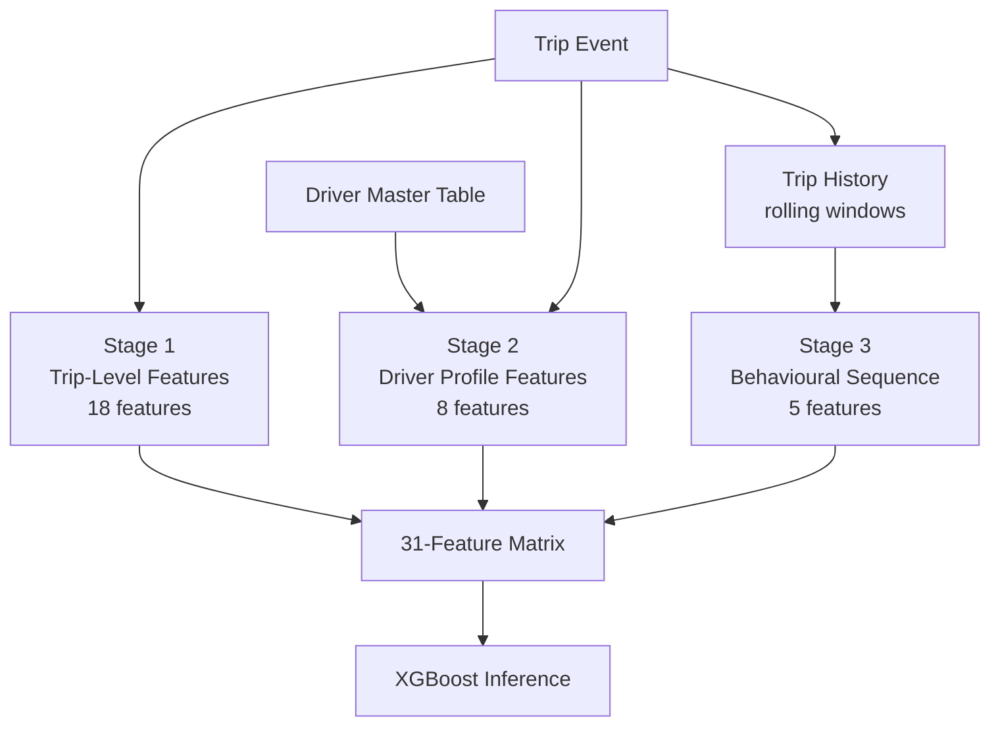
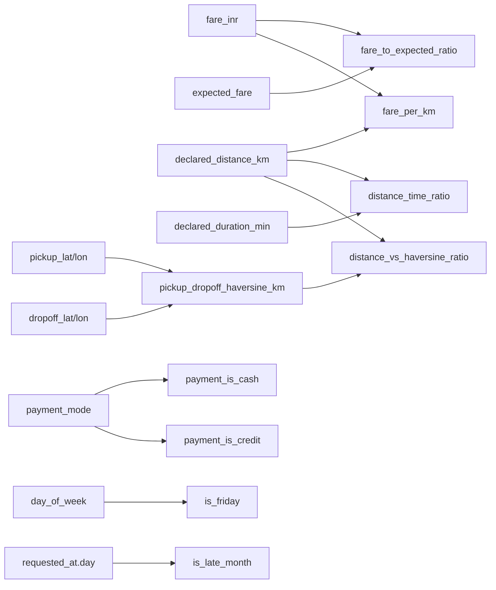

# 02 — Feature Engineering

[Index](./README.md) | [Prev: Fraud Scoring Engine](./01-fraud-scoring-engine.md) | [Next: Ingestion Pipeline](./03-ingestion-pipeline.md)

This file documents every one of the 31 features used by the fraud scoring model: what they measure, how they are computed, and why they matter for fraud detection.

---

## Feature Pipeline Overview

Feature computation happens in three stages, each adding a layer of context:



```
Stage 1: Trip-level features    (derived from the single trip being scored)
Stage 2: Driver profile features (joined from the driver master table)
Stage 3: Behavioural sequence    (rolling windows over the driver's recent history)
```

The output is a 31-column numeric matrix. No NaN values are permitted — every computation includes a fallback or clip to guarantee clean input to XGBoost.

**Source:** `model/features.py`

---

## Complete Feature List

```python
FEATURE_COLUMNS = [
    # Stage 1: Raw trip fields
    "declared_distance_km", "declared_duration_min", "fare_inr",
    "surge_multiplier", "zone_demand_at_time",
    # Stage 1: Derived ratios
    "fare_to_expected_ratio", "distance_time_ratio", "fare_per_km",
    "pickup_dropoff_haversine_km", "distance_vs_haversine_ratio",
    # Stage 1: Temporal
    "hour_of_day", "day_of_week", "is_night", "is_peak_hour",
    "is_friday", "is_late_month",
    # Stage 1: Payment flags
    "payment_is_cash", "payment_is_credit",
    # Stage 3: Driver behavioural sequence
    "driver_cancellation_velocity_1hr", "driver_cancel_rate_rolling_7d",
    "driver_dispute_rate_rolling_14d", "driver_trips_last_24hr",
    "driver_cash_trip_ratio_7d",
    # Stage 2: Driver profile
    "driver_account_age_days", "driver_rating", "driver_lifetime_trips",
    "driver_verification_encoded", "driver_payment_type_encoded",
    # Zone and trip context
    "zone_fraud_rate_rolling_7d", "same_zone_trip", "is_cancelled",
]
```

**Target column:** `is_fraud` (binary: 0 or 1)
**Weight column:** `fraud_confidence_score` (float 0-1, used for sample weighting during training)

---

## Stage 1: Trip-Level Features (18 features — raw + derived + temporal + payment)

These are computed from the single trip being scored. No external data needed.

### Feature interaction map



### Raw trip fields (5 features)

| Feature | Type | Description |
|---------|------|-------------|
| `fare_inr` | float | The fare charged for the trip in INR |
| `declared_distance_km` | float | Distance reported by the trip system |
| `declared_duration_min` | float | Duration reported by the trip system |
| `surge_multiplier` | float | Surge pricing multiplier at time of trip |
| `zone_demand_at_time` | float | Demand level in the pickup zone at trip time |

### Derived ratios (5 features)

#### `fare_to_expected_ratio`

```python
expected_fare = vehicle_config.base_fare + vehicle_config.per_km_rate * declared_distance_km
fare_to_expected_ratio = (fare_inr / expected_fare).clip(lower=0.1)
```

**What it measures:** How much the actual fare deviates from what should be charged for this vehicle type and distance. A ratio of 2.0 means the fare is 2x the expected amount.

**Why it matters:** Fare inflation is the primary fraud pattern. A driver charging 2x the expected fare on a cash trip at night is the canonical extortion signal.

**Clip logic:** `.clip(lower=0.1)` prevents division-by-zero artifacts when expected fare is very small. A ratio of 0.1 means the fare is 10% of expected — unusually cheap but not mathematically broken.

#### `distance_time_ratio`

```python
distance_time_ratio = (declared_distance_km / declared_duration_min).clip(lower=0.1)
```

**What it measures:** Speed in km/min. Normal urban logistics trips are 0.3-0.7 km/min (18-42 km/h). Values below 0.1 km/min (< 6 km/h) suggest the trip either didn't happen or the distance is fabricated.

**Why it matters:** Fake trips often have impossible distance/time ratios. A driver claiming 15 km in 3 minutes (5 km/min) or 15 km in 300 minutes (0.05 km/min) both signal data manipulation.

#### `fare_per_km`

```python
fare_per_km = (fare_inr / declared_distance_km).clip(lower=1.0)
```

**What it measures:** Revenue per kilometre. Normal range varies by vehicle type but is typically Rs 10-40/km for logistics.

**Why it matters:** Outliers in either direction are interesting. Very high fare/km suggests fare inflation. Very low fare/km might indicate a long empty-return trip being disguised.

#### `pickup_dropoff_haversine_km`

```python
pickup_dropoff_haversine_km = haversine(pickup_lat, pickup_lon, dropoff_lat, dropoff_lon)
```

**What it measures:** Straight-line distance between pickup and dropoff GPS coordinates, computed using the Haversine formula.

**Why it matters:** GPS coordinates are harder to fake than declared distances. The ratio between haversine and declared distance reveals route manipulation.

#### `distance_vs_haversine_ratio`

```python
distance_vs_haversine_ratio = declared_distance_km / pickup_dropoff_haversine_km
```

**What it measures:** How much the declared distance exceeds the straight-line distance. Normal trips have ratios of 1.2-2.0 (roads are longer than straight lines). Ratios above 3.0 suggest the declared distance is heavily inflated.

**Why it matters:** Route abuse — declaring a longer route than actually driven — shows up as an unusually high declared/haversine ratio.

### Temporal features (6 features)

| Feature | Computation | Why It Matters |
|---------|-------------|----------------|
| `hour_of_day` | `0-23` | Hour of day encodes intraday risk patterns |
| `day_of_week` | `0-6 (Monday=0)` | Weekend/weekday fraud patterns differ |
| `is_night` | `1 if hour >= 22 or hour < 5 else 0` | Night trips have 2-3x higher fraud rates due to reduced oversight |
| `is_peak_hour` | `1 if zone_demand_at_time >= 1.2 else 0` | Peak hours have higher surge and more opportunity for fare manipulation |
| `is_friday` | `1 if day_of_week == 4 else 0` | Fridays show elevated fraud — end-of-week cash settlement patterns |
| `is_late_month` | `1 if day >= 25 else 0` | Late-month fraud spikes around driver payout cycles |

### Payment flags (2 features)

#### `payment_is_cash`

```python
payment_is_cash = 1 if payment_mode == "cash" else 0
```

**Why it matters:** Cash payments are untraceable and the primary enabler of fare inflation fraud. This is the single strongest payment signal.

#### `payment_is_credit`

```python
payment_is_credit = 1 if payment_mode in ("credit", "card") else 0
```

**Why it matters:** Credit card payments have chargeback risk that correlates with a specific dispute fraud pattern distinct from cash extortion.

**Source:** `model/features.py:compute_trip_features()`

---

## Stage 2: Driver Profile Features (5 features)

These are joined from the driver master table using `driver_id`. They capture static account attributes that don't change trip-to-trip.

### Numeric profile fields (3 features)

| Feature | Description | Why It Matters |
|---------|-------------|----------------|
| `driver_account_age_days` | Days since driver account activation | New accounts are higher risk — fraudsters create fresh accounts |
| `driver_rating` | Average customer rating | Low ratings correlate with complaint patterns and fare disputes |
| `driver_lifetime_trips` | Total trips completed in the driver's history | Low trip count + high-fraud signals = likely a new fraud account |

### Encoded profile fields (2 features)

#### `driver_verification_encoded`

```python
VERIFICATION_ENCODING = {"verified": 0, "pending": 1, "unverified": 2}
```

**Logic:** Verified drivers have completed identity checks. Unverified = highest risk. Encoding preserves the ordinal risk gradient.

#### `driver_payment_type_encoded`

```python
PAYMENT_TYPE_ENCODING = {"upi": 0, "bank": 1, "cash": 2}
```

**Logic:** The driver's preferred payout method. Drivers who prefer cash payouts have a higher correlation with fraud — cash-preferring drivers also tend to demand cash from customers, creating untraceable transactions.

**Source:** `model/features.py:compute_driver_features()`

---

## Stage 3: Behavioural Sequence Features (5 features)

These use rolling time windows over the driver's recent trip history. They capture velocity and pattern changes that static profile features miss.

### `driver_cancellation_velocity_1hr`

```python
# Count of cancellations by this driver in the last 1 hour
driver_cancellation_velocity_1hr = driver_trips_1h[status == "cancelled_by_driver"].count()
```

**What it measures:** Short-term cancellation burst rate. 3+ cancellations in 1 hour is a strong signal of the cancellation ring fraud pattern.

**Window:** 1 hour. Tight window catches burst abuse while filtering normal operational cancellations.

### `driver_cancel_rate_rolling_7d`

```python
# Cancellation rate over the last 7 days
driver_cancel_rate_rolling_7d = cancelled_trips_7d / total_trips_7d
```

**What it measures:** Medium-term cancellation tendency. A driver might have a normal 7-day rate but spike in the last hour — both signals together are more powerful.

**Window:** 7 days. Captures sustained patterns that don't show in short-burst windows.

### `driver_dispute_rate_rolling_14d`

```python
# Dispute rate over the last 14 days
driver_dispute_rate_rolling_14d = disputed_trips_14d / total_trips_14d
```

**What it measures:** How often the driver's trips result in fare disputes or customer complaints over two weeks.

**Window:** 14 days. Disputes take time to file and resolve, so a longer window captures the full signal.

### `driver_trips_last_24hr`

```python
# Total trips by this driver in the last 24 hours
driver_trips_last_24hr = driver_trips_24h.count()
```

**What it measures:** Recent activity volume. Very high trip counts in 24 hours may indicate a driver gaming payout metrics with many short fake trips.

**Window:** 24 hours. One full day cycle captures the activity pattern without noise from multi-day trends.

### `driver_cash_trip_ratio_7d`

```python
# Fraction of trips paid in cash over the last 7 days
driver_cash_trip_ratio_7d = cash_trips_7d / total_trips_7d
```

**What it measures:** How heavily the driver skews toward cash payments recently. Drivers with > 60% cash ratio in a week are significantly more likely to be involved in fare manipulation.

**Window:** 7 days. Enough trips to establish a meaningful ratio.

**Source:** `model/features.py:compute_behavioural_sequence_features()`

---

## Zone and Trip Context Features (3 features)

### `zone_fraud_rate_rolling_7d`

```python
zone_fraud_rate_rolling_7d = zone_fraud_trips_7d / zone_total_trips_7d
```

**What it measures:** Geographic risk context. Some zones have structurally higher fraud rates due to operational patterns (industrial zones, areas with poor GPS coverage, cash-heavy corridors).

**Window:** 7 days. Captures current zone conditions rather than historical averages.

### `same_zone_trip`

```python
same_zone_trip = 1 if pickup_zone_id == dropoff_zone_id else 0
```

**What it measures:** Whether the trip started and ended in the same zone. Same-zone trips are unusual for legitimate logistics deliveries and correlate with fabricated short trips.

### `is_cancelled`

```python
is_cancelled = 1 if status == "cancelled_by_driver" else 0
```

**What it measures:** Whether this specific trip was cancelled by the driver. Driver-cancelled trips fed into the model help capture the cancellation ring fraud pattern where drivers cancel trips after extracting payment.

---

## Feature Computation Safeguards

### No NaN guarantee

Every ratio computation uses `.clip()` or explicit fallback:

```python
fare_to_expected_ratio = (fare_inr / expected_fare).clip(lower=0.1)
distance_time_ratio    = (declared_distance_km / declared_duration_min).clip(lower=0.1)
fare_per_km            = (fare_inr / declared_distance_km).clip(lower=1.0)
```

The clip values are chosen to be:
- Below any legitimate value (no real trip has a fare/expected ratio of exactly 0.1)
- Above zero (prevents downstream division-by-zero)
- Numerically stable (no infinities or NaN propagation)

### Missing driver profiles

When a driver_id doesn't match any record in the driver master table, all driver features default to neutral/zero values. This ensures new or unknown drivers can still be scored — they just lack profile signal.

### Vehicle type lookup

Expected fare computation requires vehicle configuration:

```python
class VehicleConfig:
    base_fare: float      # Minimum charge
    per_km_rate: float    # Per-kilometre rate
    typical_trip_km: tuple # (min, max) typical trip distance
```

Vehicle types are defined in `generator/config.py:VEHICLE_TYPES`. If the trip's vehicle type isn't found, a default mid-range configuration is used.

---

## Feature Importance

The most predictive features (by XGBoost importance) are typically:

1. `fare_to_expected_ratio` — the single strongest signal
2. `payment_is_cash` — highest-risk payment indicator
3. `driver_cancellation_velocity_1hr` — burst abuse detection
4. `distance_time_ratio` — trip plausibility
5. `driver_cash_trip_ratio_7d` — sustained cash payment pattern
6. `zone_fraud_rate_rolling_7d` — geographic risk context
7. `driver_account_age_days` — new-account risk

These seven features account for the majority of the model's splitting decisions. The remaining 24 features provide refinement and edge-case coverage.

---

## Next

- [01 — Fraud Scoring Engine](./01-fraud-scoring-engine.md) — how these features feed the model
- [03 — Ingestion Pipeline](./03-ingestion-pipeline.md) — how trip data arrives for feature computation
