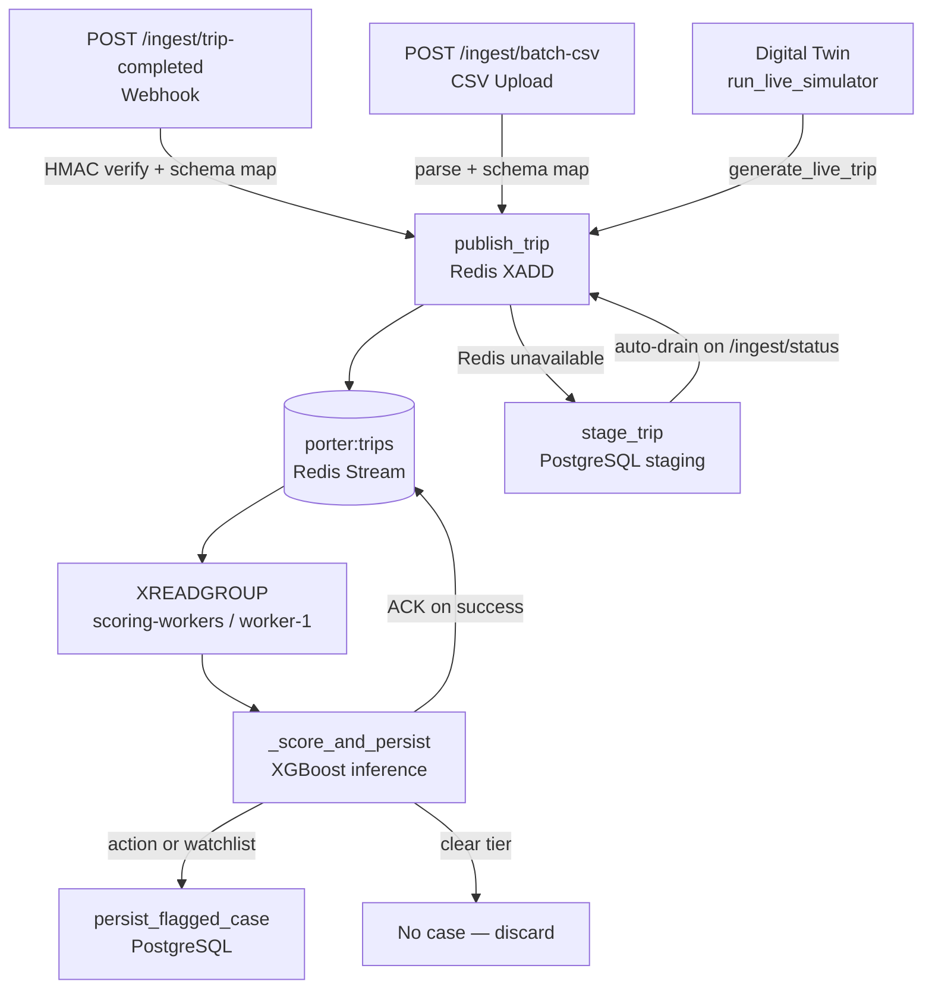
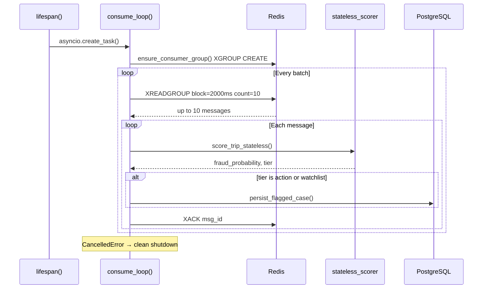

# 03 — Ingestion Pipeline

[Index](./README.md) | [Prev: Feature Engineering](./02-feature-engineering.md) | [Next: Case Lifecycle](./04-case-lifecycle.md)

This file explains how trip data enters the platform, how it flows through Redis Streams, how the PostgreSQL staging fallback works, and how the consumer loop processes and scores trips.

---

## Ingestion Architecture



Three entry points feed the same Redis Stream. The consumer loop reads, scores, and persists. This decouples ingestion latency from scoring latency — the webhook returns 200 immediately.

---

## Entry Point 1: Webhook Ingestion

### Endpoint: `POST /ingest/trip-completed`

Accepts a single trip event via HTTP POST. This is the production integration point — Porter's systems would fire this webhook after each trip completes.

```
Client → POST /ingest/trip-completed
       → HMAC signature verification
       → Schema normalisation
       → publish_trip() → Redis Stream
       → Return 200 with message ID
```

### HMAC Signature Verification

Every webhook call includes an `X-Webhook-Signature` header. The server computes the expected HMAC-SHA256 digest using the shared `WEBHOOK_SECRET` and compares:

```python
expected = hmac.new(
    WEBHOOK_SECRET.encode(),
    request.body,
    hashlib.sha256,
).hexdigest()
```

If the signature doesn't match, the endpoint returns 401. This prevents unauthorized systems from injecting trip data.

### Schema Normalisation

Incoming trip data may use different field names depending on the source system. The schema mapper resolves aliases before publishing:

- `distance` → `declared_distance_km`
- `duration` → `declared_duration_min`
- `fare` or `amount` → `fare_inr`
- `payment` or `payment_type` → `payment_mode`
- Payment mode normalisation: `CASH` → `cash`, `UPI` → `upi`
- Vehicle type normalisation to internal enum values
- Timestamp parsing: ISO 8601, with or without timezone

The default alias map is built into `ingestion/schema_mapper.py`. Custom mapping can be provided as a file parameter with the batch CSV endpoint.

**Source:** `ingestion/webhook.py`, `ingestion/schema_mapper.py`

---

## Entry Point 2: Batch CSV Upload

### Endpoint: `POST /ingest/batch-csv`

Accepts a CSV file upload. Each row is normalised through the schema mapper and published to the Redis Stream individually.

```
Client → POST /ingest/batch-csv (multipart file upload)
       → Auth: Bearer token required
       → Parse CSV rows
       → Schema map each row
       → publish_trip() per row → Redis Stream
       → Return count of accepted rows
```

This is used for:
- Historical data analysis (bulk load past trips for scoring)
- Demo data seeding
- Integration testing with sample files

**Source:** `ingestion/webhook.py`

---

## Entry Point 3: Digital Twin Simulator

The live simulator generates synthetic trips and publishes them directly to the Redis Stream using the same `publish_trip()` function:

```python
async def run_live_simulator():
    while True:
        trip = generate_live_trip(settings=settings)
        await publish_trip(trip)
        await asyncio.sleep(settings.interval_seconds)
```

The simulator is only active when `ENABLE_SYNTHETIC_FEED=true` (default in demo mode, forced off in production mode). See [06 — Digital Twin](./06-digital-twin.md) for the trip generation logic.

**Source:** `ingestion/live_simulator.py:run_live_simulator()`

---

## Redis Stream Transport

### Stream configuration

| Setting | Value | Purpose |
|---------|-------|---------|
| Stream name | `porter:trips` | Single stream for all trip events |
| Consumer group | `scoring-workers` | Shared consumer group for scoring workers |
| Consumer name | `worker-1` | Single worker in current deployment |
| Block timeout | 2000 ms | Long-poll timeout per XREADGROUP call |
| Batch size | 10 | Messages read per XREADGROUP call |

### Publishing

```python
async def publish_trip(trip: Dict) -> str:
    msg_id = await get_redis().xadd(
        STREAM_NAME, {"data": json.dumps(trip)}
    )
    return msg_id
```

Each trip is serialised to JSON and stored as the `data` field of a Redis Stream message. The message ID (Redis-generated timestamp-sequence) is returned to the caller.

### Consumer group creation

The consumer group is created when the consumer loop starts, not when the first trip is published:

```python
async def consume_loop():
    await ensure_consumer_group()  # Creates group on porter:trips
    ...
```

`ensure_consumer_group()` calls `XGROUP CREATE` with `mkstream=True`. If the group already exists (restart scenario), the `BUSYGROUP` error is silently ignored.

**Source:** `ingestion/streams.py`

---

## Consumer Loop Lifecycle



## Consumer Loop

The consumer loop is the core processing engine. It runs as an `asyncio.Task` started during application lifespan.

### Processing flow

```python
async def consume_loop():
    await ensure_consumer_group()

    while True:
        messages = await get_redis().xreadgroup(
            GROUP_NAME, CONSUMER,
            {STREAM_NAME: ">"},     # Read only new messages
            count=10,                # Up to 10 at a time
            block=BLOCK_MS,          # Long-poll for 2 seconds
        )

        for _stream, stream_messages in messages:
            for msg_id, fields in stream_messages:
                trip = json.loads(fields["data"])
                await _score_and_persist(trip, msg_id)
                await get_redis().xack(STREAM_NAME, GROUP_NAME, msg_id)
```

### Key design decisions

**1. `">"` cursor:** The consumer reads only new (undelivered) messages. It never re-reads messages already delivered to another consumer. This is correct for single-consumer deployment but also supports horizontal scaling to multiple workers.

**2. ACK after success only:** The `xack()` call happens only after `_score_and_persist()` completes successfully. If scoring or persistence fails, the message stays in the PEL (Pending Entries List). This guarantees at-least-once processing — no trip is silently dropped.

**3. Error isolation:** Each message is processed independently. A failure on one trip does not affect processing of other trips in the same batch.

**4. Graceful shutdown:** `CancelledError` is caught and triggers clean exit. The lifespan manager cancels the task during application shutdown.

**5. Reconnection:** Non-cancellation exceptions (Redis connection errors) trigger a 5-second sleep before retrying. This handles transient Redis outages without spinning in a tight loop.

**Source:** `ingestion/streams.py:consume_loop()`

---

## Score and Persist

The `_score_and_persist()` function is the bridge between ingestion and the fraud scoring engine.

```python
async def _score_and_persist(trip: Dict, msg_id: str):
    model         = app_state.get("model")
    feature_names = app_state.get("feature_names", [])
    two_stage     = app_state.get("two_stage_config", {})

    # Guard: skip if model not loaded
    if model is None or not feature_names:
        return

    # Score using the stateless scorer
    result     = await score_trip_stateless(trip, model, feature_names, two_stage)
    fraud_prob = result["fraud_probability"]
    tier       = get_tier(fraud_prob)

    # Persist action and watchlist cases
    if tier.name in ("action", "watchlist"):
        await persist_flagged_case(
            trip_id=trip.get("trip_id", msg_id),
            driver_id=trip.get("driver_id", "unknown"),
            zone_id=trip.get("pickup_zone_id", "unknown"),
            tier=tier.name,
            fraud_probability=fraud_prob,
            fare_inr=trip.get("fare_inr", 0),
            recoverable_inr=round(trip.get("fare_inr", 0) * 0.15, 2),
            auto_escalated=tier.auto_escalate,
            source_channel="redis_stream",
        )
```

### Recoverable value estimation

```python
recoverable_inr = round(trip.get("fare_inr", 0) * 0.15, 2)
```

The platform estimates recoverable value as 15% of the trip fare. This is a conservative estimate — not all of the fare is recoverable even on confirmed fraud, due to partial refunds, driver payouts already made, and operational costs.

### Prometheus metrics

After scoring, a Prometheus counter is incremented:

```python
TRIPS_SCORED.labels(tier=tier.name, path="stream").inc()
```

This powers the `trips_scored_total` metric with labels for tier (`action`, `watchlist`, `clear`) and scoring path (`stream` vs `api`).

**Source:** `ingestion/streams.py:_score_and_persist()`

---

## PostgreSQL Staging Fallback

When Redis is unavailable, trips are buffered in a PostgreSQL staging table instead of being dropped.

### Staging flow

```
publish_trip() → Redis XADD
                  ↓ (fails)
              → stage_trip() → PostgreSQL staging table
```

The staging module (`ingestion/staging.py`) provides:

1. **`stage_trip(trip)`** — inserts the trip JSON into the staging table
2. **Auto-drain** — when the ingestion status endpoint is called, it checks for staged trips and attempts to drain them back into Redis

### Auto-drain mechanism

```python
# In ingestion/webhook.py — GET /ingest/status
summary = get_queue_status_summary(auto_drain=True)
```

When `auto_drain=True`, the status check:
1. Queries the staging table for undrained rows
2. For each staged trip, attempts `publish_trip()` to Redis
3. On success, marks the staging row as drained
4. Returns the drain count in the status response

This means the staging table drains itself the next time anyone checks the ingestion status — no separate drain endpoint or cron job needed.

**Source:** `ingestion/staging.py`, `ingestion/webhook.py`

---

## Stream Lag Monitoring

The platform monitors the PEL (Pending Entries List) size as a stream lag gauge:

```python
async def get_stream_lag() -> int:
    groups = await get_redis().xinfo_groups(STREAM_NAME)
    for group in groups:
        if name == GROUP_NAME:
            return int(group.get("pel-count", 0))
    return 0
```

The `pel-count` represents messages delivered to a consumer but not yet ACKed. Under normal operation this should be near zero. A growing PEL indicates:
- Scoring is slower than ingestion rate
- Processing errors are causing messages to stay unacked
- The consumer has stopped processing

This lag value is exposed as a Prometheus gauge (`stream_lag`) and checked every 30 seconds by the APScheduler job.

**Source:** `ingestion/streams.py:get_stream_lag()`

---

## Ingestion Status Endpoint

### `GET /ingest/status`

Returns a summary of the ingestion pipeline state:

```json
{
  "stream": "porter:trips",
  "consumer_group": "scoring-workers",
  "stream_length": 1542,
  "pending_messages": 0,
  "staged_trips": 0,
  "drained_count": 0,
  "redis_connected": true
}
```

This endpoint also triggers auto-drain when staged trips exist (see above).

### `GET /ingest/schema-map/default`

Returns the current default schema mapping — the field alias table used to normalise incoming trip data.

**Source:** `ingestion/webhook.py`

---

## Next

- [02 — Feature Engineering](./02-feature-engineering.md) — what happens to trips after ingestion
- [04 — Case Lifecycle](./04-case-lifecycle.md) — what happens after scoring flags a trip
