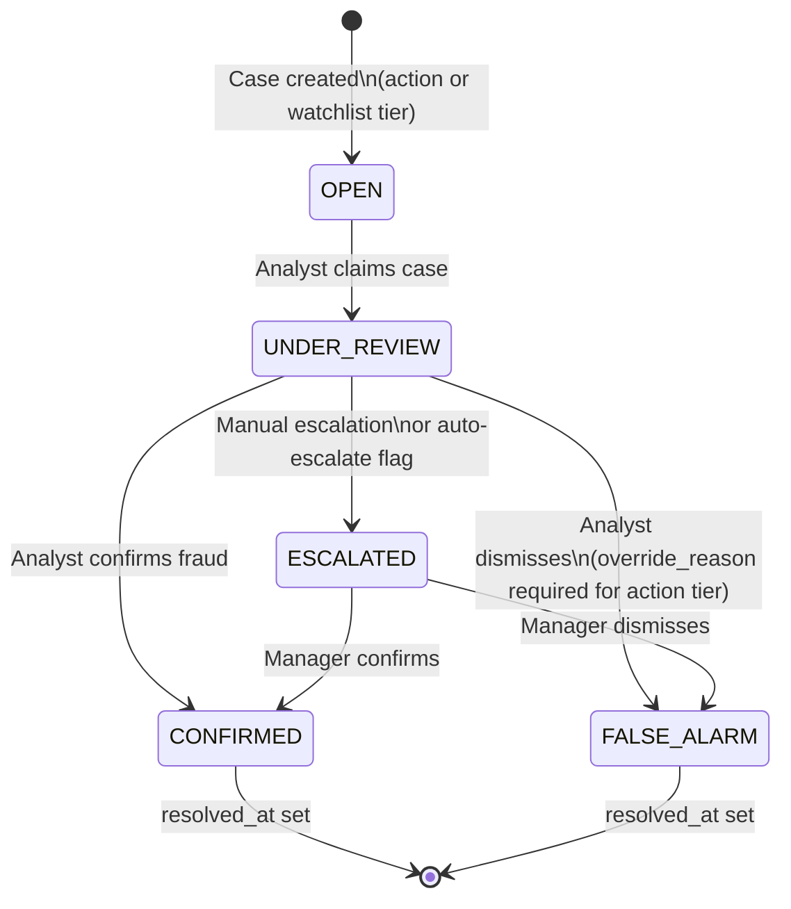
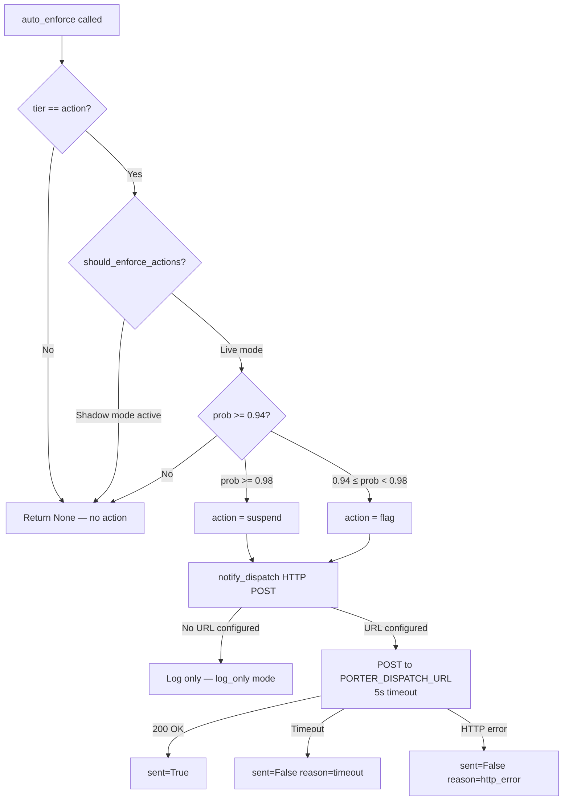

# 04 — Case Lifecycle

[Index](./README.md) | [Prev: Ingestion Pipeline](./03-ingestion-pipeline.md) | [Next: Security Model](./05-security-model.md)

This file explains the complete lifecycle of a fraud case: how cases are created from scored trips, the status transition model, analyst queue mechanics, batch review, driver actions, audit logging, and the dashboard summary computation.

---

## Case Creation

Cases are created by the stream consumer after a trip scores at action or watchlist tier. The `persist_flagged_case()` function in `database/case_store.py` handles routing to the correct table.

### Live vs Shadow routing

```python
def get_case_storage_target():
    if is_shadow_mode_enabled():
        return CasePersistenceResult(storage_mode="shadow", table_name="shadow_cases")
    return CasePersistenceResult(storage_mode="live", table_name="fraud_cases")
```

| Mode | Table | Enforcement | Purpose |
|------|-------|-------------|---------|
| Live | `fraud_cases` | Active | Production operation |
| Shadow | `shadow_cases` | Suppressed | Validation without operational impact |

Shadow cases are structurally identical to live cases but include an extra field:

```python
case = ShadowCase(
    ...
    live_write_suppressed=True,
)
```

This flag confirms that the case was scored and persisted but no operational action was taken.

### PII encryption at write time

Trip ID and driver ID are encrypted before persistence:

```python
trip_id_stored   = encrypt_pii(str(trip_id))
driver_id_stored = encrypt_pii(str(driver_id))
```

All downstream reads must decrypt these fields. See [05 — Security Model](./05-security-model.md) for the encryption logic.

**Source:** `database/case_store.py:persist_flagged_case()`

---

## Case Status Model

Each case moves through a defined set of statuses:



### Status definitions

| Status | Meaning |
|--------|---------|
| `OPEN` | Case created, awaiting analyst pickup |
| `UNDER_REVIEW` | Analyst has claimed and is investigating |
| `ESCALATED` | Auto-escalated (action tier) or manually escalated |
| `CONFIRMED` | Analyst confirmed fraud. Driver action may follow |
| `FALSE_ALARM` | Analyst determined this was not fraud |

### Pending statuses

The codebase groups three statuses as "pending" for queue metrics:

```python
_PENDING_STATUSES = (
    FraudCaseStatus.OPEN,
    FraudCaseStatus.UNDER_REVIEW,
    FraudCaseStatus.ESCALATED,
)
```

These are cases that still need analyst attention.

**Source:** `database/models.py`, `api/routes/cases.py`

---

## Analyst Queue Mechanics

### Case listing: `GET /cases/`

Cases are listed in reverse chronological order (newest first) with optional filters:

```python
@router.get("/")
async def list_cases(
    status: Optional[str] = Query(None),
    tier: Optional[str] = Query(None),
    zone_id: Optional[str] = Query(None),
    limit: int = Query(50, le=200),
    offset: int = Query(0),
):
```

### Analyst isolation

Analysts (`ops_analyst` role) can only see cases that are:
- Assigned to them, OR
- Unassigned (available for pickup)

```python
if user["role"] == "ops_analyst":
    analyst_filter = or_(
        FraudCase.assigned_to == user["sub"],
        FraudCase.assigned_to.is_(None),
    )
    query = query.where(analyst_filter)
```

Managers and admins see all cases regardless of assignment.

### Auto-claim on first interaction

When an analyst opens or updates a case, they automatically claim it if it's unclaimed:

```python
def _claim_case_if_needed(case, user):
    if user.get("role") == "ops_analyst" and not case.assigned_to:
        case.assigned_to = user["sub"]
```

This prevents two analysts from working the same case — once claimed, other analysts can no longer see it.

### Access enforcement

If a case is already assigned to another analyst, any attempt to interact raises 403:

```python
def _ensure_case_access(case, user):
    if user.get("role") != "ops_analyst":
        return  # Managers/admins bypass
    if case.assigned_to not in (None, user["sub"]):
        raise HTTPException(403, "Case is assigned to a different analyst")
```

**Source:** `api/routes/cases.py`

---

## Case Update Logic

### Single case update: `PATCH /cases/{case_id}`

```python
@router.patch("/{case_id}")
async def update_case(case_id, body: CaseUpdateRequest):
    # body contains: status, analyst_notes, override_reason
```

The `_apply_case_update()` function handles all status transitions:

1. **Access check** — ensures the analyst can modify this case
2. **Auto-claim** — claims unassigned case for the requesting analyst
3. **Override reason check** — requires justification for dismissing action-tier cases
4. **Status update** — sets new status
5. **Notes update** — appends analyst notes if provided
6. **Resolution timestamp** — sets `resolved_at` when moving to CONFIRMED or FALSE_ALARM
7. **Audit log** — creates an AuditLog entry recording the change

### Override reason requirement

```python
def _requires_override_reason(case, next_status):
    return (
        case.tier == "action"
        and next_status == FraudCaseStatus.FALSE_ALARM
    )
```

**Logic:** If an action-tier case (>= 94% fraud probability) is being dismissed as a false alarm, the analyst MUST provide an override reason. This prevents casual dismissal of high-confidence cases and creates an accountability trail.

### Resolution timestamp

```python
if next_status in (FraudCaseStatus.CONFIRMED, FraudCaseStatus.FALSE_ALARM):
    case.resolved_at = datetime.utcnow()
```

The `resolved_at` timestamp is critical for KPI computation — reviewed-case precision is calculated from cases where `resolved_at` falls within a time window.

**Source:** `api/routes/cases.py:_apply_case_update()`

---

## Batch Review

### Endpoint: `POST /cases/batch-review`

Allows updating multiple cases at once with the same status and notes:

```python
class BatchReviewRequest(BaseModel):
    case_ids: list[str] = Field(min_length=1, max_length=100)
    status: FraudCaseStatus
    analyst_notes: Optional[str] = None
    override_reason: Optional[str] = None
```

### Batch processing logic

1. Deduplicate case IDs
2. Load all cases in a single query
3. Verify all cases exist (404 if any missing, with list of missing IDs)
4. Apply `_apply_case_update()` to each case individually
5. Each case gets its own audit log entry with action `case_status_change_batch`
6. Single commit for the entire batch

### Guard rails

- Maximum 100 cases per batch (`max_length=100`)
- Override reason applies to all cases — if any are action-tier being dismissed, the reason covers them
- Each case still has independent access checks

**Source:** `api/routes/cases.py:batch_review_cases()`

---

## Driver Actions

### Endpoint: `POST /cases/{case_id}/driver-action`

After confirming fraud, the analyst can take action on the driver:

```python
class DriverActionRequest(BaseModel):
    action_type: DriverActionType   # suspend, flag, monitor, clear
    reason: str
    case_id: Optional[str] = None
```

### Action types

| Action | Meaning | Severity |
|--------|---------|----------|
| `suspend` | Lock driver account immediately | Highest — for confirmed severe fraud |
| `flag` | Flag in dispatch system for supervisor review | Medium — driver can still operate under watch |
| `monitor` | Add to enhanced monitoring list | Low — increased scrutiny on future trips |
| `clear` | Remove previous flags/monitoring | Resolution — driver exonerated |

### Dual audit trail

Driver actions create TWO audit records:

1. **DriverAction record** — persistent record of the action, linked to both the driver and the case
2. **AuditLog entry** — general audit log entry with action type `driver_{action_type}` (e.g., `driver_suspend`)

```python
db.add(DriverAction(
    driver_id=case.driver_id,
    action_type=body.action_type,
    reason=body.reason,
    performed_by=user["sub"],
    case_id=case_id,
))
db.add(AuditLog(
    user_id=user["sub"],
    action=f"driver_{body.action_type.value}",
    resource="driver",
    resource_id=case.driver_id,
    details={"case_id": case_id, "reason": body.reason},
))
```

**Source:** `api/routes/cases.py:take_driver_action()`

---

## Enforcement Dispatch Flow



## Enforcement Dispatch

When a case is confirmed and the tier is `action`, the enforcement module can automatically notify Porter's dispatch system.

### Dispatch flow

```python
async def auto_enforce(driver_id, trip_id, fraud_probability, tier, top_signals):
    if tier != "action":
        return None                          # Only action tier
    if not should_enforce_actions():
        return None                          # Shadow mode suppresses
    if fraud_probability < ACTION_THRESHOLD:
        return None                          # Below 0.94 threshold

    # Severity based on probability
    if fraud_probability >= 0.98:
        action = "suspend"
    elif fraud_probability >= 0.94:
        action = "flag"
    else:
        action = "alert"

    return await notify_dispatch(...)
```

### Severity escalation

| Probability | Action | Meaning |
|-------------|--------|---------|
| >= 0.98 | `suspend` | Lock driver immediately — near-certain fraud |
| >= 0.94 | `flag` | Flag in dispatch — very high confidence |
| < 0.94 | `alert` | Alert supervisor — below action threshold |

### Dispatch webhook

The webhook sends an HTTP POST to `PORTER_DISPATCH_URL` with a 5-second timeout. If the URL is not configured, the action is logged but no HTTP call is made. This allows the full enforcement flow to work in development without requiring Porter's systems.

### Shadow mode suppression

```python
if not should_enforce_actions():
    logger.info("Shadow mode enabled — skipping enforcement")
    return None
```

`should_enforce_actions()` checks the runtime shadow mode setting. When shadow mode is active, no enforcement dispatch occurs — cases are scored and persisted but no operational action is taken.

**Source:** `enforcement/dispatch.py`

---

## Case History and Audit Trail

### Endpoint: `GET /cases/{case_id}/history`

Returns the complete timeline of events for a case:

```python
def _build_case_history(case, audit_logs, driver_actions):
    events = [
        # Event 1: Case creation
        _timeline_event(
            timestamp=case.created_at,
            category="case_created",
            title="Case created",
            description=f"{case.tier.title()} tier case opened at {prob}% risk.",
        )
    ]

    # Status change events from audit logs
    for log in audit_logs:
        events.append(_timeline_event(
            category="status_change",
            title="Case status updated",
            description=f"{old_status} -> {new_status}",
            actor=log.user_id,
            tone=tone,  # danger/success/warning based on status
        ))

    # Driver action events
    for action in driver_actions:
        events.append(_timeline_event(
            category="driver_action",
            title=f"Driver action: {action_type}",
            description=action.reason,
            actor=action.performed_by,
            tone="danger" if suspend else "warning",
        ))

    return sorted(events, key=lambda e: e["timestamp"], reverse=True)
```

### Timeline event structure

```json
{
  "timestamp": "2026-04-08T10:30:00+00:00",
  "category": "status_change",
  "title": "Case status updated",
  "description": "Open -> Confirmed",
  "actor": "analyst_1",
  "tone": "danger",
  "metadata": {
    "old_status": "open",
    "new_status": "confirmed",
    "notes": "Confirmed fare inflation pattern"
  }
}
```

The `tone` field drives UI styling:
- `danger` — fraud confirmed, driver suspended
- `success` — false alarm (good news — not fraud)
- `warning` — escalation, monitoring
- `info` — case creation, neutral events
- `neutral` — default

**Source:** `api/routes/cases.py:_build_case_history()`

---

## Dashboard Summary

### Endpoint: `GET /cases/summary/dashboard`

Returns a manager-focused aggregate view of the case pipeline:

### Queue metrics

```python
{
    "open_cases": 42,
    "under_review_cases": 8,
    "escalated_cases": 3,
    "confirmed_cases": 156,
    "false_alarm_cases": 12,
    "avg_pending_hours": 1.45,
    "oldest_pending_hours": 4.82,
    "cases_older_than_2h": 5,
}
```

`avg_pending_hours` and `oldest_pending_hours` are computed in real time from the `created_at` timestamps of all pending cases. `cases_older_than_2h` counts pending cases aging beyond the target SLA.

### 24-hour throughput

```python
{
    "opened_cases": 28,
    "reviewed_cases": 22,
    "confirmed_cases": 19,
    "false_alarms": 3,
    "reviewed_case_precision": 0.8636,
    "confirmed_recoverable_inr": 45230.50,
}
```

`reviewed_case_precision` = confirmed / (confirmed + false_alarms). This is the buyer-safe quality metric — it measures actual analyst-validated precision, not model-predicted precision.

### Zone breakdown

Top 10 zones by pending case count, with action/watchlist split and average probability per zone. Zones are rolled up to city level using the zone ID prefix mapping (e.g., `blr_koramangala` → Bangalore).

### 7-day precision trend

```python
precision_trend_7d = [
    {"date": "2026-04-02", "reviewed_cases": 18, "reviewed_case_precision": 0.8889},
    {"date": "2026-04-03", "reviewed_cases": 22, "reviewed_case_precision": 0.9091},
    ...
]
```

Daily precision computed from cases resolved each day. This shows whether model quality is stable, improving, or degrading over the past week.

### Analyst load

Per-analyst breakdown showing assigned cases, review counts, and confirmation rates. Used by managers to balance workload.

**Source:** `api/routes/cases.py:dashboard_summary()`

---

## Case Serialisation

The `_to_dict()` function converts a FraudCase ORM object to an API response, including:

- **PII decryption** — trip_id and driver_id are decrypted before returning
- **City resolution** — zone_id prefix maps to city name (`blr_` → Bangalore)
- **Case age** — computed in real time as hours since creation
- **ISO timestamps** — created_at and resolved_at converted to ISO format

**Source:** `api/routes/cases.py:_to_dict()`

---

## Next

- [03 — Ingestion Pipeline](./03-ingestion-pipeline.md) — how trips arrive before case creation
- [05 — Security Model](./05-security-model.md) — the encryption and auth system protecting cases
