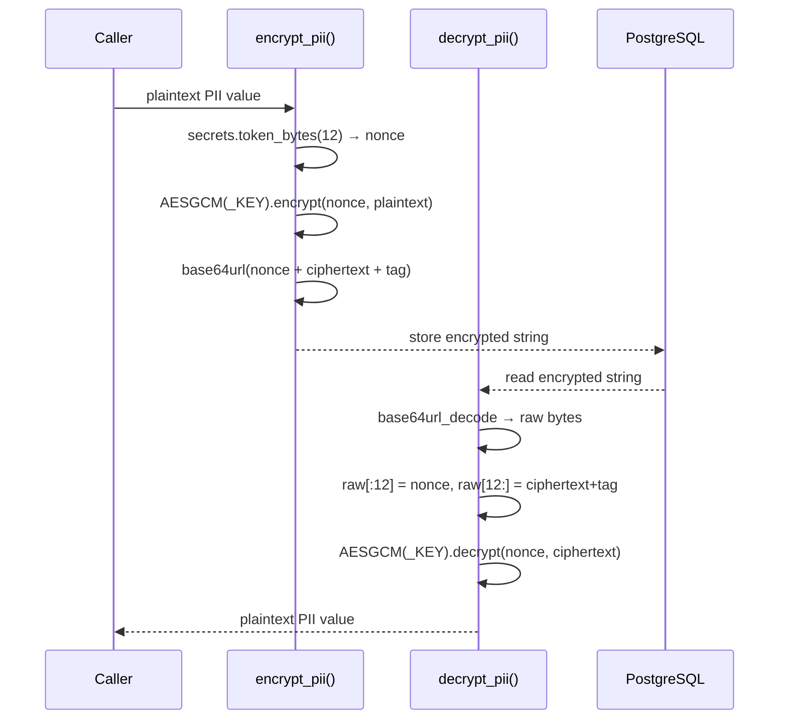
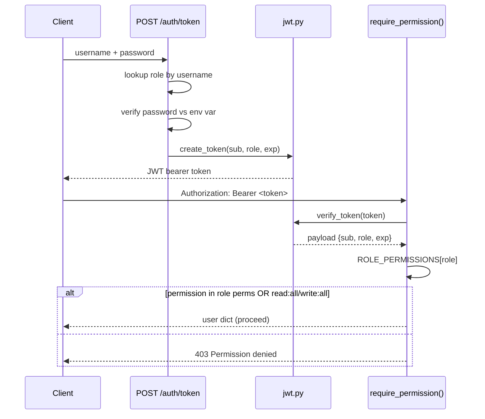
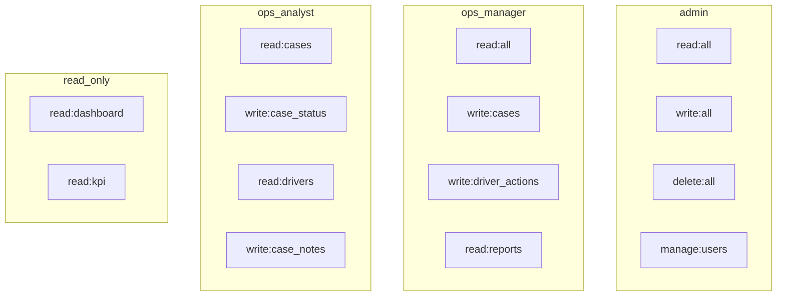

# 05 — Security Model

[Index](./README.md) | [Prev: Case Lifecycle](./04-case-lifecycle.md) | [Next: Digital Twin](./06-digital-twin.md)

This file explains the security architecture: AES-256-GCM PII encryption, JWT HS256 authentication, the 4-role RBAC permission system, placeholder detection, and startup security validation.

---

## PII Encryption (AES-256-GCM)

All personally identifiable information (trip IDs, driver IDs) is encrypted at rest using AES-256-GCM before being written to PostgreSQL.

### Encryption architecture



### Encryption flow

```python
def encrypt_pii(value: str) -> str:
    nonce      = secrets.token_bytes(12)           # 96-bit random nonce
    aesgcm     = AESGCM(_KEY)                      # 256-bit key
    ciphertext = aesgcm.encrypt(nonce, value.encode("utf-8"), None)
    return base64.urlsafe_b64encode(nonce + ciphertext).decode("ascii")
```

### Step by step

1. **Generate nonce** — 12 bytes (96 bits) of cryptographically random data via `secrets.token_bytes(12)`. A new nonce is generated for every encryption operation, which is why the same plaintext produces different ciphertext each time.

2. **Encrypt** — AES-256-GCM encrypts the UTF-8 bytes of the plaintext. GCM mode provides both confidentiality (encryption) and integrity (authentication tag). The 16-byte authentication tag is appended to the ciphertext automatically by the `cryptography` library.

3. **Encode** — The nonce (12 bytes) + ciphertext + tag are concatenated and base64url-encoded. The result is a URL-safe ASCII string that can be stored in any text column.

### Decryption flow

```python
def decrypt_pii(value: str) -> str:
    raw        = base64.urlsafe_b64decode(value + "==")   # pad-tolerant
    nonce, ct  = raw[:12], raw[12:]                         # Split nonce from ciphertext+tag
    aesgcm     = AESGCM(_KEY)
    return aesgcm.decrypt(nonce, ct, None).decode("utf-8")
```

The `+ "=="` padding handles base64 strings with missing padding characters — common when values are URL-transported or copy-pasted.

### Key management

The encryption key is loaded from the `ENCRYPTION_KEY` environment variable:

```python
raw = os.getenv("ENCRYPTION_KEY", "").strip()
key = base64.urlsafe_b64decode(raw + "==")
if len(key) != 32:
    raise ValueError(f"Key must decode to 32 bytes, got {len(key)}")
```

Requirements:
- Must be base64url-encoded
- Must decode to exactly 32 bytes (256 bits)
- Must not be a placeholder value (see Placeholder Detection below)

### Plaintext fallback

In demo mode, if the encryption key is invalid or missing, the platform can fall back to storing PII in plaintext:

```python
if allow_plaintext_pii():
    return value  # Store as-is
```

`allow_plaintext_pii()` returns `True` only when:
1. `APP_RUNTIME_MODE` is `demo`, AND
2. `ALLOW_PLAINTEXT_PII` is explicitly set to `true`

Both conditions must be met. In production mode, plaintext PII is never allowed — a missing or invalid key raises `EncryptionConfigurationError` and blocks startup.

**Source:** `security/encryption.py`

---

## JWT Authentication (HS256)

API endpoints are protected by JWT bearer tokens. The platform uses HS256 (HMAC-SHA256) symmetric signing.

### Token creation

```
POST /auth/token
Content-Type: application/x-www-form-urlencoded

username=analyst_1&password=AnalystPass!123
```

The auth endpoint validates credentials against role-specific passwords from environment variables:

| Role | Env Variable |
|------|-------------|
| admin | `PORTER_AUTH_ADMIN_PASSWORD` |
| ops_manager | `PORTER_AUTH_OPS_MANAGER_PASSWORD` |
| ops_analyst | `PORTER_AUTH_ANALYST_PASSWORD` |
| read_only | `PORTER_AUTH_VIEWER_PASSWORD` |

On success, a JWT is returned with these claims:

```json
{
  "sub": "analyst_1",
  "role": "ops_analyst",
  "exp": 1712600000,
  "iat": 1712571200
}
```

### Token verification

```python
def verify_token(token: str) -> dict | None:
    payload = jwt.decode(token, JWT_SECRET_KEY, algorithms=["HS256"])
    return payload  # Contains sub, role, exp, iat
```

The verification checks:
1. Signature validity using `JWT_SECRET_KEY`
2. Expiration (`exp` claim) — expired tokens are rejected
3. Algorithm — only HS256 is accepted

### Dual extraction

The `get_current_user` dependency supports two token sources:

```python
async def get_current_user(
    token = Depends(oauth2_scheme),        # OAuth2 password bearer
    credentials = Depends(bearer_scheme),   # HTTP Bearer header
):
    raw_token = token or credentials.credentials
```

This allows tokens from both `Authorization: Bearer <token>` headers and OAuth2 form-based flows.

**Source:** `auth/jwt.py`, `auth/dependencies.py`

---

## Authentication Flow



## RBAC Permission System

The platform uses a 4-role system with granular permissions.

### Roles

| Role | Username Pattern | Purpose |
|------|-----------------|---------|
| `admin` | `admin` | Full system access, user management |
| `ops_manager` | `ops_manager` | Case oversight, reports, driver actions |
| `ops_analyst` | `analyst_1`, `analyst_2`, etc. | Case review, notes, status updates |
| `read_only` | `viewer` | Dashboard and KPI read access only |

### Permission matrix

```python
ROLE_PERMISSIONS = {
    UserRole.ADMIN: [
        "read:all",
        "write:all",
        "delete:all",
        "manage:users",
    ],
    UserRole.OPS_MANAGER: [
        "read:all",
        "write:cases",
        "write:driver_actions",
        "read:reports",
    ],
    UserRole.OPS_ANALYST: [
        "read:cases",
        "write:case_status",
        "read:drivers",
        "write:case_notes",
    ],
    UserRole.READ_ONLY: [
        "read:dashboard",
        "read:kpi",
    ],
}
```

### Permission enforcement

Endpoints declare required permissions using the `require_permission()` dependency:

```python
@router.get("/")
async def list_cases(
    user=Depends(require_permission("read:cases")),
):
```

The enforcement logic:

```python
def require_permission(permission: str):
    async def check(user = Depends(get_current_user)):
        role = UserRole(user.get("role", "read_only"))
        perms = ROLE_PERMISSIONS.get(role, [])
        if (
            permission not in perms
            and "write:all" not in perms
            and "read:all" not in perms
        ):
            raise HTTPException(403, f"Permission denied: {permission}")
        return user
    return check
```

**Key behaviour:** `read:all` and `write:all` are wildcards. If a role has `read:all`, any `read:*` permission check passes. Similarly for `write:all`. Admin has both — admin can do anything. `delete:all` is not a wildcard — it's an explicit permission for destructive operations.

### Permission-endpoint mapping

| Endpoint | Required Permission |
|----------|-------------------|
| `GET /cases/` | `read:cases` |
| `PATCH /cases/{id}` | `write:case_status` |
| `POST /cases/batch-review` | `write:case_status` |
| `POST /cases/{id}/driver-action` | `write:driver_actions` |
| `GET /cases/{id}/history` | `read:cases` |
| `GET /reports/*` | `read:reports` |
| `GET /kpi/live` | `read:kpi` |

**Source:** `auth/models.py`, `auth/dependencies.py`

---

## Permission Matrix Diagram



## Placeholder Detection

The platform detects placeholder secrets at startup and blocks production deployment if real secrets aren't configured.

### Detection logic

```python
_PLACEHOLDER_VALUES = {
    "change-me",
    "change-this",
    "replace-me",
    "your-secret-here",
    "placeholder",
    "xxx",
    "todo",
    "fixme",
    "secret",
    "password",
}

def is_placeholder_value(value: str) -> bool:
    if not value or not value.strip():
        return True              # Empty = placeholder
    normalised = value.strip().lower()
    if normalised in _PLACEHOLDER_VALUES:
        return True              # Exact match
    if normalised.startswith("replace-"):
        return True              # replace-* pattern
    if normalised.startswith("change-"):
        return True              # change-* pattern
    return False
```

### What gets checked

At startup, the security validation system checks these environment variables:

| Variable | What It Protects |
|----------|-----------------|
| `JWT_SECRET_KEY` | Token signing — placeholder allows token forgery |
| `ENCRYPTION_KEY` | PII encryption — placeholder means no real encryption |
| `WEBHOOK_SECRET` | Ingestion HMAC — placeholder allows unauthorized data injection |
| `PORTER_AUTH_*_PASSWORD` | User credentials — placeholder means trivial login |

### Startup behaviour

```python
security_validation = validate_security_configuration()
app_state["security_validation"] = security_validation.to_dict()

if security_validation.errors:
    for error in security_validation.errors:
        console_log(f"Security config error: {error}")
    if runtime.is_prod:
        raise RuntimeError("Security configuration invalid for prod runtime.")
```

| Mode | Placeholder Found | Result |
|------|-------------------|--------|
| Demo | Yes | Warning logged, startup continues |
| Production | Yes | Error raised, startup blocked |

**Source:** `security/settings.py`, `api/state.py`

---

## Security Headers

Every HTTP response includes security headers via middleware:

```python
class SecurityHeadersMiddleware(BaseHTTPMiddleware):
    async def dispatch(self, request, call_next):
        response = await call_next(request)
        response.headers["X-Content-Type-Options"] = "nosniff"
        response.headers["X-Frame-Options"] = "DENY"
        response.headers["X-XSS-Protection"] = "1; mode=block"
        response.headers["Referrer-Policy"] = "strict-origin-when-cross-origin"
        return response
```

| Header | Purpose |
|--------|---------|
| `X-Content-Type-Options: nosniff` | Prevents MIME type sniffing |
| `X-Frame-Options: DENY` | Prevents clickjacking via iframe |
| `X-XSS-Protection: 1; mode=block` | Enables browser XSS filter |
| `Referrer-Policy: strict-origin-when-cross-origin` | Limits referrer leakage |

**Source:** `api/main.py:SecurityHeadersMiddleware`

---

## CORS Configuration

```python
app.add_middleware(
    CORSMiddleware,
    allow_origins     = get_allowed_origins(),
    allow_credentials = True,
    allow_methods     = ["*"],
    allow_headers     = ["*"],
)
```

`get_allowed_origins()` reads from `API_ALLOWED_ORIGINS` environment variable. In production, this should be set to the exact frontend domain(s). In demo mode, `http://localhost:3000` is included by default.

**Source:** `api/main.py`, `security/settings.py`

---

## Rate Limiting

The platform uses `slowapi` for request rate limiting:

```python
from slowapi import _rate_limit_exceeded_handler
app.state.limiter = limiter
app.add_exception_handler(RateLimitExceeded, _rate_limit_exceeded_handler)
```

Rate limits are configured per-endpoint in `api/limiting.py`. When exceeded, the server returns 429 Too Many Requests with a `Retry-After` header.

**Source:** `api/limiting.py`, `api/main.py`

---

## Next

- [04 — Case Lifecycle](./04-case-lifecycle.md) — where encryption and auth are applied
- [06 — Digital Twin](./06-digital-twin.md) — the simulator that generates test data
