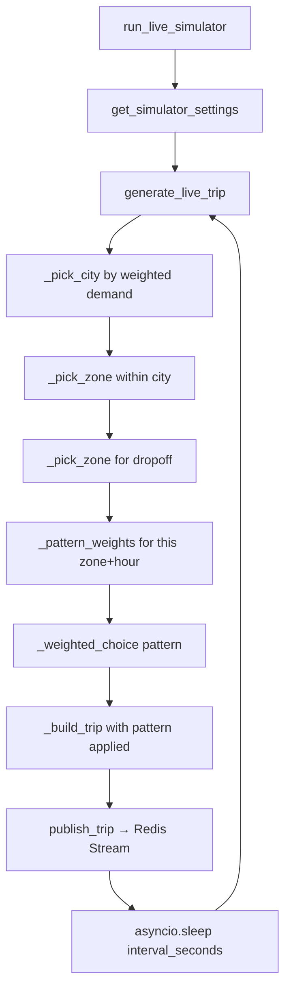
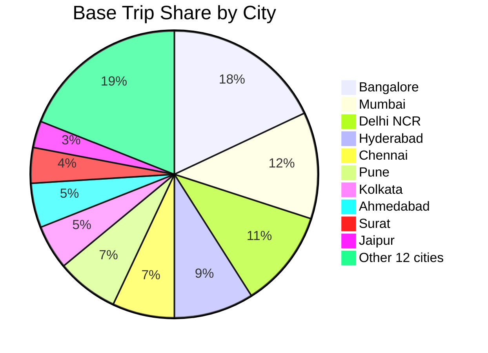
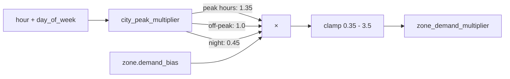
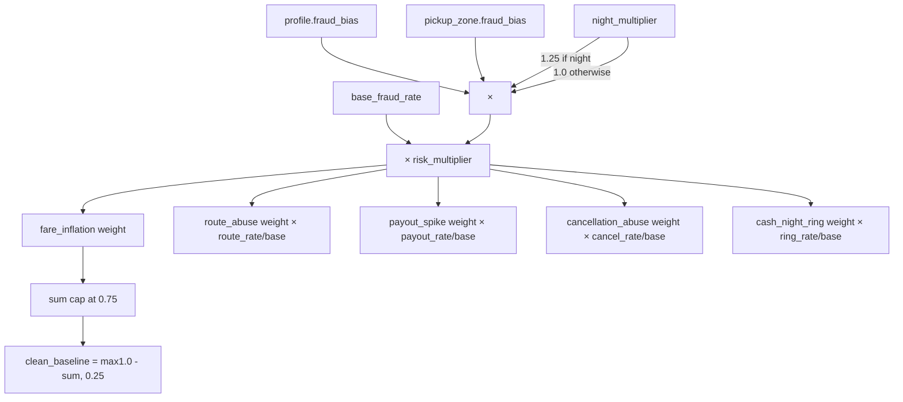

# 06 — Digital Twin Simulator

[Index](./README.md) | [Prev: Security Model](./05-security-model.md) | [Next: Demand Forecasting](./07-demand-forecasting.md)

This file explains the digital twin: the 22-city city profile system, zone demand modelling, fraud pattern injection, trip generation algorithm, and simulator configuration.

---

## Purpose

The digital twin is a synthetic data generator that produces trips indistinguishable from real Porter trips, at Porter-like scale, across a 22-city operating footprint. It feeds the Redis Stream ingestion pipeline directly.

**It is not production data.** It exists to:
- Enable fully offline demos without real trip data
- Generate training data for the fraud model
- Test the scoring, case creation, and analyst workflow end-to-end
- Validate that the pipeline can handle production-scale throughput

When `APP_RUNTIME_MODE=prod`, the simulator is forced off regardless of other settings.

---

## High-Level Flow



The simulator runs as an `asyncio.Task`, continuously generating and publishing trips at the configured rate. Each iteration re-reads settings, allowing live reconfiguration without restart.

---

## SimulatorSettings

All simulator behaviour is driven by environment variables loaded into a frozen `SimulatorSettings` dataclass:

```python
@dataclass(frozen=True)
class SimulatorSettings:
    active_cities: tuple[str, ...]
    base_trips_per_min: float     # PORTER_TWIN_TRIPS_PER_MIN (default: 30)
    scale_multiplier: float       # PORTER_TWIN_SCALE_MULTIPLIER (default: 1.0)
    elapsed_days: int             # PORTER_TWIN_ELAPSED_DAYS (default: 0)
    daily_growth_pct: float       # PORTER_TWIN_DAILY_GROWTH_PCT (default: 0.0)
    base_fraud_rate: float        # PORTER_TWIN_BASE_FRAUD_RATE (default: 0.062)
    payout_anomaly_rate: float    # PORTER_TWIN_PAYOUT_ANOMALY_RATE (default: 0.018)
    cancel_abuse_rate: float      # PORTER_TWIN_CANCEL_ABUSE_RATE (default: 0.014)
    route_abuse_rate: float       # PORTER_TWIN_ROUTE_ABUSE_RATE (default: 0.021)
    cash_ring_rate: float         # PORTER_TWIN_CASH_RING_RATE (default: 0.013)
```

### Effective trip rate

```python
@property
def effective_trips_per_min(self) -> float:
    growth = (1 + daily_growth_pct / 100) ** elapsed_days
    return max(base_trips_per_min * scale_multiplier * growth, 1.0)

@property
def interval_seconds(self) -> float:
    return 60.0 / effective_trips_per_min
```

Example: `base=30`, `scale=2.0`, `elapsed_days=7`, `growth=1.0%` → `30 × 2.0 × 1.01^7 ≈ 64.3 trips/min → interval ≈ 0.93s`

**Source:** `ingestion/live_simulator.py:SimulatorSettings`

---

## 22-City Profile System

Each city has a `CityTwinProfile` with:

```python
@dataclass(frozen=True)
class CityTwinProfile:
    city_id: str
    display_name: str
    base_trip_share: float       # Fraction of total trips (all cities sum to ~1.0)
    fraud_bias: float            # City-level fraud multiplier
    weekday_peak_hours: tuple    # Hours with 1.35x demand
    weekend_peak_hours: tuple    # Different peaks on weekends
    vehicle_weights: dict        # Vehicle type distribution
    zones: tuple[TwinZone, ...]  # 2-3 zones per city
```

### City distribution



Bangalore (18%), Mumbai (12%), Delhi NCR (11%), and Hyderabad (9%) are the top four cities by trip volume, mirroring Porter's real city concentration.

### Fraud bias values

Cities are given a `fraud_bias` multiplier that scales all fraud pattern probabilities for that city:

| Tier | Cities | Fraud Bias |
|------|--------|-----------|
| High | Mumbai (1.08), Delhi NCR (1.07), Bangalore (1.05) | Higher risk — large, dense operations |
| Medium | Hyderabad (1.03), Kolkata (1.02), Ahmedabad (1.02) | Average risk |
| Low | Trivandrum (0.96), Nashik (0.96), Vadodara (0.96) | Lower risk — smaller, less dense |

**Source:** `ingestion/city_profiles.py`

---

## Zone System

Each city has 2-3 `TwinZone` objects:

```python
@dataclass(frozen=True)
class TwinZone:
    zone_id: str
    name: str
    lat: float          # Centre latitude
    lon: float          # Centre longitude
    demand_bias: float  # Zone demand multiplier (0.9 - 1.3)
    fraud_bias: float   # Zone fraud multiplier (0.9 - 1.15)
    zone_type: str      # "commercial", "industrial", "residential"
```

### Zone demand calculation



```python
def zone_demand_multiplier(profile, zone, hour, day_of_week):
    demand = city_peak_multiplier(profile, hour, day_of_week) * zone.demand_bias
    return max(0.35, min(3.5, round(demand, 3)))
```

**City peak multiplier rules:**
- Peak hours (per-city weekday or weekend list): **1.35×**
- Night (22:00-04:59): **0.45×**
- Shoulder hours (06:00-07:00, 20:00-21:00): **0.92×**
- All other hours: **1.0×**

**Source:** `ingestion/city_profiles.py:zone_demand_multiplier()`

---

## City Selection (Weighted Random)

Cities are selected proportionally to their demand-weighted trip share:

```python
def normalised_city_weights(hour, day_of_week, active_cities):
    weighted = {
        city_id: profile.base_trip_share * city_peak_multiplier(profile, hour, day_of_week)
        for city_id in active_cities
    }
    total = sum(weighted.values())
    return {city_id: weight / total for city_id, weight in weighted.items()}
```

At peak hours, high-share cities see an even larger fraction of total trips. At night, all cities' weights compress because the multiplier drops to 0.45 for all.

**Source:** `ingestion/city_profiles.py:normalised_city_weights()`

---

## Fraud Pattern System

After selecting a city and zones, the simulator picks a **simulation pattern** based on weighted probabilities.

### Pattern weight calculation



```python
def _pattern_weights(settings, profile, pickup_zone, hour):
    night_multiplier = 1.25 if hour >= 22 or hour < 5 else 1.0
    risk_multiplier = profile.fraud_bias * pickup_zone.fraud_bias * night_multiplier

    fare_inflation     = settings.base_fraud_rate  * risk_multiplier
    route_abuse        = settings.route_abuse_rate  * risk_multiplier
    payout_spike       = settings.payout_anomaly_rate * risk_multiplier
    cancellation_abuse = settings.cancel_abuse_rate  * risk_multiplier
    cash_night_ring    = settings.cash_ring_rate     * risk_multiplier

    fraud_total = min(sum_of_fraud_weights, 0.75)  # Cap at 75%
    clean_weight = max(1.0 - fraud_total, 0.25)    # Floor at 25%
```

**Safety floor/ceiling:** Fraud total is capped at 75% and clean baseline is floored at 25%. This prevents degenerate scenarios where every generated trip is fraudulent.

### Available patterns

| Pattern | Key Modifications |
|---------|------------------|
| `clean_baseline` | Normal trip with realistic variation |
| `fare_inflation` | Fare ×1.55-2.25, distance ×1.20-1.55, cash, night |
| `route_abuse` | Distance ×1.75-2.45, fare ×1.30-1.75, duration ×1.10-1.35 |
| `payout_spike` | Fare ×1.45-1.95, surge 2.0-3.2, 35% chance of complaint |
| `cancellation_abuse` | Status = `cancelled_by_driver`, high complaint flag |
| `cash_night_ring` | Fare ×1.65-2.35, distance ×1.25-1.80, cash, night |

**Source:** `ingestion/live_simulator.py:_pattern_weights()`

---

## Trip Generation in Detail

Once the pattern is selected, `_build_trip()` constructs the full trip dict:

### Baseline calculation

```python
def _expected_trip_baseline(vehicle_type, pickup_zone, dropoff_zone):
    vehicle = VEHICLE_TYPES[vehicle_type]
    haversine_km = _haversine_km(pickup_zone, dropoff_zone)
    declared_distance = max(
        haversine_km * random.uniform(1.05, 1.35),   # 5-35% longer than straight line
        random.uniform(typical_min, typical_min + 6), # at least minimum typical distance
    )
    base_fare = vehicle.base_fare + vehicle.per_km_rate * declared_distance
    return declared_distance, base_fare
```

The haversine formula computes great-circle distance between zone centres. The declared distance adds 5-35% on top (roads are longer than straight lines). This baseline is then modified by the fraud pattern.

### Fare calculation

```python
peak_multiplier = 1.0 + min(zone_demand - 1.0, 1.2) * 0.35  # Max 42% surge
fare_inr = expected_fare * random.uniform(0.94, 1.08) * peak_multiplier
```

Normal trips have 6-8% natural fare variation plus demand-based surge. Fraud patterns multiply on top of this.

### GPS jitter

```python
"pickup_lat": round(pickup_zone.lat + random.uniform(-0.008, 0.008), 6),
```

Each trip adds ±0.008° of random noise to the zone centre coordinates (roughly ±890 metres). This creates realistic GPS scatter while keeping trips geographically consistent with their zone.

### Driver ID assignment

```python
def _pick_driver_id(city_id, pattern):
    if pattern in {"fare_inflation", "route_abuse", "cash_night_ring"}:
        return f"{prefix}_risk_{random.randint(1, 36):03d}"     # 36 risk drivers per city
    if pattern == "cancellation_abuse":
        return f"{prefix}_cancel_{random.randint(1, 24):03d}"   # 24 cancel abusers per city
    return f"{prefix}_drv_{random.randint(1, 4000):05d}"        # 4000 normal drivers per city
```

Fraud patterns use small, reusable driver ID pools. This means the same driver ID will appear repeatedly in fraud trips, which is realistic — real fraud rings involve a small number of repeat offenders. The behavioural sequence features (`driver_fraud_rate`, `cancel_velocity_3h`) will pick up on these repeat patterns.

**Source:** `ingestion/live_simulator.py:_build_trip()`

---

## Payment Mode Distribution

The base payment mode is sampled from a weighted distribution before pattern modification:

```python
_PAYMENT_MODES   = ["upi", "cash", "credit"]
_PAYMENT_WEIGHTS = [0.62, 0.23, 0.15]
```

62% UPI, 23% cash, 15% credit. Fraud patterns override this — `fare_inflation` and `cash_night_ring` always set cash regardless of the base draw.

---

## Simulation Flags

Every trip includes `simulation_flags` — a list of strings marking what pattern was applied:

```python
# fare_inflation:
simulation_flags = ["fare_inflation", "cash_collection", "after_hours"]

# route_abuse:
simulation_flags = ["route_abuse", "distance_hike"]

# clean:
simulation_flags = ["baseline_clean"]
```

These flags are stored with the trip for audit and training purposes. They are NOT used by the fraud scorer — the scorer only sees the trip fields, not the simulation metadata. This ensures the scoring evaluation is clean.

---

## Night Pattern Amplification

```python
if is_night and "after_hours" not in simulation_flags:
    simulation_flags.append("after_hours")
```

Even on clean-baseline trips generated between 22:00-04:59, the `after_hours` flag is added. Combined with the night multiplier on fraud pattern weights (1.25×), this correctly represents the higher background fraud rate at night without making every night trip fraudulent.

---

## Next

- [05 — Security Model](./05-security-model.md) — how simulator data is protected
- [07 — Demand Forecasting](./07-demand-forecasting.md) — Prophet models that inform zone demand
