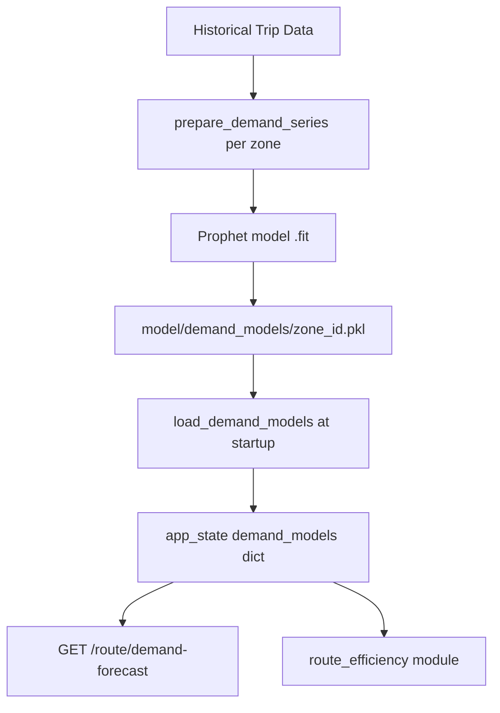
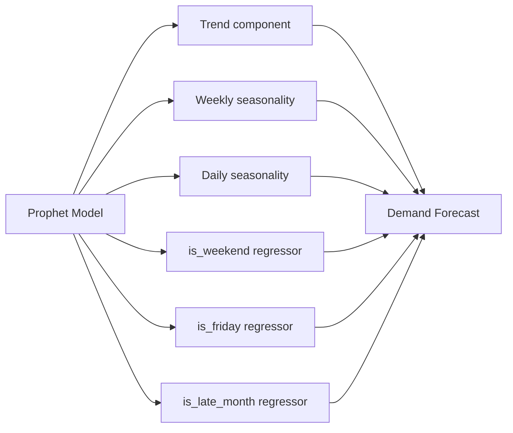

# 07 — Demand Forecasting

[Index](./README.md) | [Prev: Digital Twin](./06-digital-twin.md) | [Next: Driver Intelligence](./08-driver-intelligence.md)

This file explains the Prophet-based demand forecasting system: how zone-level hourly models are built, the three regressors used, how models are persisted and loaded, and how demand forecasts surface in the API.

---

## Purpose

The demand forecasting layer answers: **"What is the expected trip volume for each zone at any given hour?"**

This feeds two downstream uses:

1. **Fraud scoring context** — demand spikes at odd hours (e.g., high volume at 3 AM in a low-demand zone) are a signal. A zone with 5× normal midnight demand suggests payout manipulation.

2. **Route efficiency** — the reallocation suggestion engine uses demand forecasts to identify zones that need more fleet coverage.

---

## Architecture



One Prophet model is trained per zone. Models are serialised to `.pkl` files in `model/demand_models/`. At startup, all available models are loaded into `app_state["demand_models"]`.

**Source:** `model/demand.py`

---

## Time Series Preparation

```python
def prepare_demand_series(
    trips: pd.DataFrame,
    zone_id: str,
) -> pd.DataFrame | None:
```

### Filtering

Only trips with `pickup_zone_id == zone_id` are included. If fewer than 24 rows remain after filtering, `None` is returned — insufficient data for meaningful forecasting.

### Resampling to hourly

```python
series = (
    zone_trips
    .set_index("requested_at")
    .resample("H")["trip_id"]
    .count()
    .reset_index()
    .rename(columns={"requested_at": "ds", "trip_id": "y"})
)
```

Each row becomes one hour. `y` is the count of trips in that hour. The resulting series has the Prophet-required `ds` (datetime) and `y` (value) columns.

### Gap filling

```python
full_range = pd.date_range(
    start=series["ds"].min(),
    end=series["ds"].max(),
    freq="H",
)
series = series.set_index("ds").reindex(full_range, fill_value=0).reset_index()
```

Hours with zero trips are explicitly filled with 0 rather than being absent from the series. Prophet requires a complete, gap-free time series — missing hours would be treated as unknown, skewing the seasonality components.

### Regressor columns

After building the base series, three binary regressors are added:

```python
series["is_weekend"]   = (series["ds"].dt.dayofweek >= 5).astype(int)
series["is_friday"]    = (series["ds"].dt.dayofweek == 4).astype(int)
series["is_late_month"] = (series["ds"].dt.day >= 25).astype(int)
```

**Source:** `model/demand.py:prepare_demand_series()`

---

## Prophet Model Configuration

```python
model = Prophet(
    yearly_seasonality  = False,  # Not enough data for yearly patterns
    weekly_seasonality  = True,   # Day-of-week demand curves
    daily_seasonality   = True,   # Hour-of-day demand curves
    changepoint_prior_scale = 0.05,  # Conservative trend changes
)
model.add_regressor("is_weekend")
model.add_regressor("is_friday")
model.add_regressor("is_late_month")
```

### Seasonality components



| Component | Purpose |
|-----------|---------|
| **Trend** | Slow-moving changes in baseline demand (city growth, seasonal business changes) |
| **Weekly seasonality** | Monday vs Friday vs Sunday demand profiles |
| **Daily seasonality** | Morning rush vs midday vs evening peak vs overnight |
| **is_weekend** | Adjusts for overall weekend vs weekday level shift |
| **is_friday** | Friday evenings often have different patterns than other weekdays |
| **is_late_month** | End-of-month activity often shifts due to payroll cycles and month-end logistics |

### Why `yearly_seasonality=False`

Yearly seasonality requires at least 1 year of data. If the training window is shorter, Prophet will overfit to annual patterns that don't exist in the data. The flag is explicitly disabled to prevent this.

### Why `changepoint_prior_scale=0.05`

The default is 0.05, which represents a conservative trend — the model doesn't chase short-term anomalies as permanent trend changes. This is appropriate for logistics demand, which changes slowly except for major events.

**Source:** `model/demand.py:build_demand_model()`

---

## Three Regressors Explained

### `is_weekend` (Saturday=1, Sunday=1)

Logistics demand patterns differ significantly on weekends:
- Commercial zone demand drops (fewer business deliveries)
- Residential zone demand may increase
- Overall trip volume is lower in most cities

The regressor captures this as a level adjustment on top of the weekly seasonality component.

### `is_friday`

Fridays show a distinct pattern in Indian logistics:
- Evening rush earlier (people leaving work earlier)
- Higher intra-city transfer volume
- Pre-weekend restocking patterns in commercial zones

This regressor isolates Friday from the rest of the weekday seasonality.

### `is_late_month` (day >= 25)

The last week of the month shows elevated logistics activity in India due to:
- Salary payment cycles (end-of-month payroll)
- Month-end inventory replenishment
- Account settlement deadlines

This captures a predictable monthly demand spike that would otherwise appear as noise in the trend component.

---

## Model Training and Serialisation

```python
def build_demand_model(series: pd.DataFrame) -> Prophet:
    model = Prophet(...)
    model.add_regressor("is_weekend")
    model.add_regressor("is_friday")
    model.add_regressor("is_late_month")
    model.fit(series)
    return model

def save_demand_models(models: dict, output_dir: Path):
    for zone_id, model in models.items():
        path = output_dir / f"{zone_id}.pkl"
        with open(path, "wb") as f:
            pickle.dump(model, f)
```

Models are saved as pickle files — one file per zone, named by zone ID (e.g., `blr_koramangala.pkl`).

### Loading at startup

```python
def load_demand_models(model_dir: Path = DEMAND_MODELS_DIR) -> dict:
    models = {}
    for pkl_path in model_dir.glob("*.pkl"):
        zone_id = pkl_path.stem
        with open(pkl_path, "rb") as f:
            models[zone_id] = pickle.load(f)
    return models
```

All `.pkl` files in the `model/demand_models/` directory are loaded. The zone ID is derived from the filename stem. Missing models for a zone simply means that zone has no forecast available — the API handles this gracefully.

**Source:** `model/demand.py:save_demand_models()`, `load_demand_models()`

---

## Forecast Generation

When a forecast is requested for a zone:

```python
def forecast_demand(
    model: Prophet,
    periods: int = 24,
    freq: str = "H",
) -> pd.DataFrame:
    future = model.make_future_dataframe(periods=periods, freq=freq)
    future["is_weekend"]    = (future["ds"].dt.dayofweek >= 5).astype(int)
    future["is_friday"]     = (future["ds"].dt.dayofweek == 4).astype(int)
    future["is_late_month"] = (future["ds"].dt.day >= 25).astype(int)
    forecast = model.predict(future)
    return forecast[["ds", "yhat", "yhat_lower", "yhat_upper"]]
```

The `make_future_dataframe()` call creates a DataFrame extending the training period by `periods` hours. The same regressor columns must be added to the future dataframe with the correct values for those future dates.

### Output columns

| Column | Meaning |
|--------|---------|
| `ds` | Datetime of the forecast hour |
| `yhat` | Point estimate of trip count |
| `yhat_lower` | Lower bound of 80% uncertainty interval |
| `yhat_upper` | Upper bound of 80% uncertainty interval |

---

## Integration with Fraud Scoring

Demand forecasting feeds fraud scoring indirectly through the `zone_demand_at_time` feature:

1. At trip arrival, the zone's demand multiplier for the current hour/day is computed using the city profile's peak hour rules (not Prophet — this is the simpler rule-based version)
2. The Prophet models provide longer-horizon planning and anomaly detection context
3. The route efficiency module uses Prophet forecasts to compute dead-mile risk and reallocation recommendations

The distinction: **Prophet models are for planning and anomaly detection**. The **city profile peak multipliers** are what's used for real-time scoring (faster, no model lookup needed).

---

## Demand Anomaly Detection

The APScheduler drift check job also uses demand models to detect when current trip patterns deviate significantly from the forecast:

```python
async def run_drift_check():
    # Compare last-hour actual trip counts per zone
    # against yhat_lower/yhat_upper bounds from demand models
    # Flag zones where actuals fall outside the 80% CI
```

A zone where actual trips are 3× higher than the upper forecast bound at 3 AM is a potential payout manipulation signal.

**Source:** `monitoring/drift.py:run_drift_check()`

---

## Next

- [06 — Digital Twin](./06-digital-twin.md) — the simulator that uses zone demand profiles
- [08 — Driver Intelligence](./08-driver-intelligence.md) — risk scoring built on top of trip history
