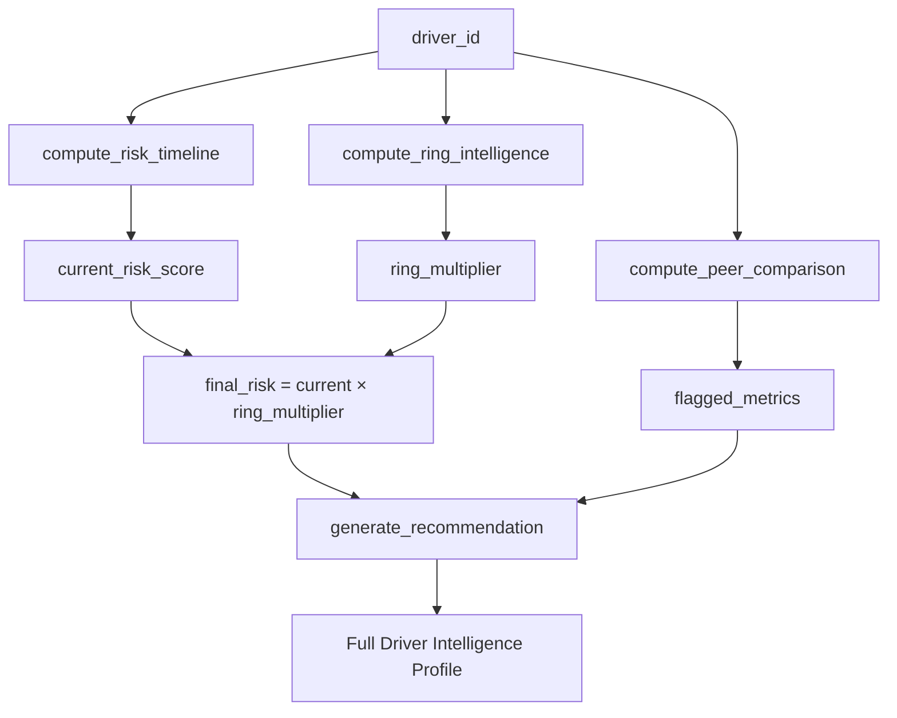
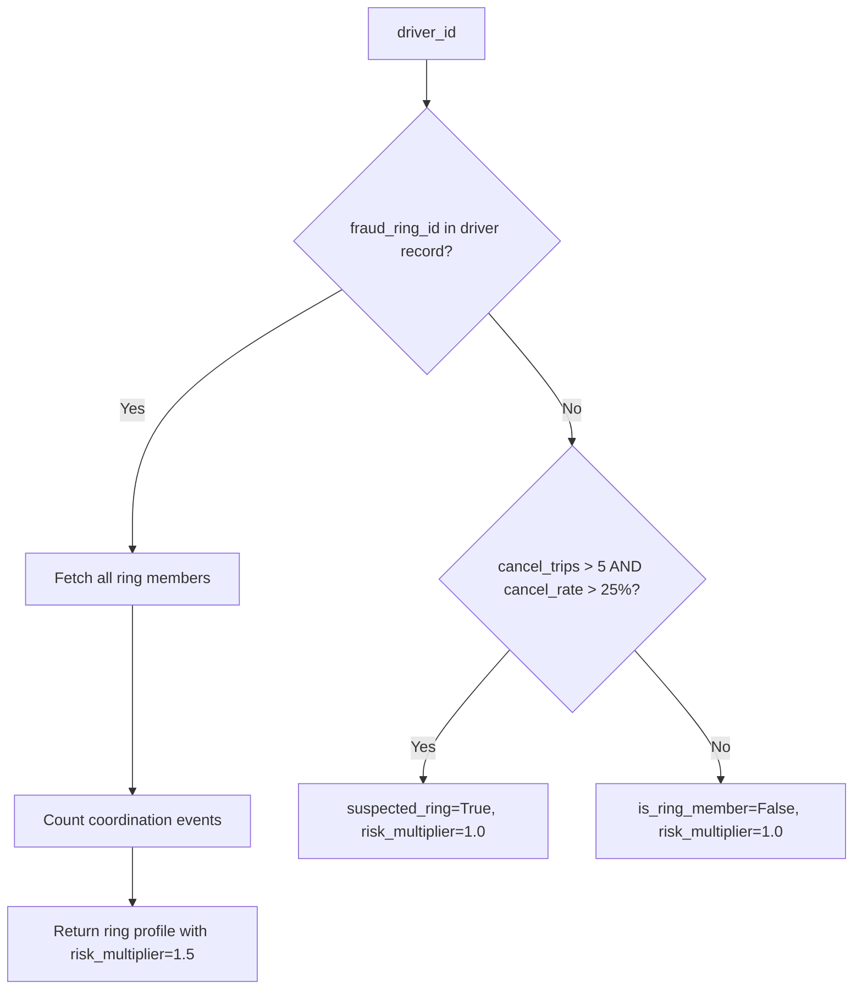
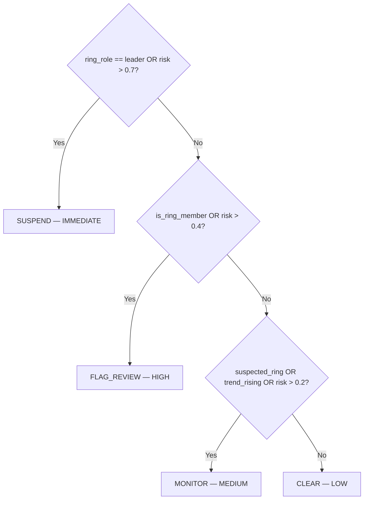

# 08 — Driver Intelligence

[Index](./README.md) | [Prev: Demand Forecasting](./07-demand-forecasting.md) | [Next: Runtime and Startup](./09-runtime-and-startup.md)

This file documents the driver intelligence engine: the composite risk scoring formula, 30-day risk timeline computation, peer comparison methodology, fraud ring detection, recommendation generation, and the top-risk ranking cache.

---

## Purpose

The driver intelligence engine answers the question: **"Given everything we know about this driver, what is their current risk level and what should ops do about it?"**

This replaces manual driver review — the driver profile is computed on-demand by combining four analytical layers into a single actionable output.

---

## Four Analytical Layers



**Source:** `model/driver_intelligence.py:get_driver_intelligence()`

---

## Layer 1: Risk Timeline (30-day)

`compute_risk_timeline()` builds a daily risk series for the last 30 days.

### Daily aggregation

For each day in the window:

```python
daily = trips.groupby("date").agg(
    trips        = ("trip_id", "count"),
    fraud_count  = ("is_fraud", "sum"),
    has_cancel_fraud = ("fraud_type", lambda x: (x == "fake_cancellation").any()),
    has_extortion    = ("fraud_type", lambda x: (x == "cash_extortion").any()),
)
```

Missing days (no trips) are filled with zeros before computing rates. This prevents gaps from distorting the rolling average.

### 3-day rolling fraud rate

```python
daily["fraud_rate_rolling"] = daily["fraud_rate"].rolling(3, min_periods=1).mean()
```

Raw daily fraud rate is noisy — a driver with 2 trips on a given day where 1 is fraudulent has a 50% rate, but that's not meaningful. The 3-day rolling average smooths this noise while remaining responsive to genuine trend changes.

### Risk score formula

```python
def risk_score(row):
    score = row["fraud_rate_rolling"] * 10
    if row["has_cancel_fraud"]:
        score += 0.3
    if row["has_extortion"]:
        score += 0.4
    return float(np.clip(score, 0.0, 1.0))
```

| Component | Formula | Rationale |
|-----------|---------|-----------|
| Base score | `fraud_rate_rolling × 10` | Scales rate [0,1] → [0,10], then clips. A 10% fraud rate → score 1.0 (maximum) |
| Cancel fraud boost | `+0.3` | Fake cancellations are a structured fraud pattern — not opportunistic |
| Extortion boost | `+0.4` | Cash extortion is the most aggressive pattern — direct confrontation with customers |
| Clip | `[0.0, 1.0]` | Hard ceiling and floor |

### Risk level thresholds

```python
"CRITICAL" if risk_score > 0.7
"HIGH"     if risk_score > 0.4
"MEDIUM"   if risk_score > 0.2
"LOW"      otherwise
```

**Source:** `model/driver_intelligence.py:compute_risk_timeline()`

---

## Layer 2: Peer Comparison

`compute_peer_comparison()` measures the driver against other drivers in the same zone.

### Metrics compared

Five metrics are computed for both the driver and the zone population:

| Metric | Definition | Flag threshold |
|--------|-----------|---------------|
| `fraud_rate` | fraud_trips / total_trips | > 2× zone median |
| `cancellation_rate` | cancelled_trips / total_trips | > 2× zone median |
| `cash_trip_ratio` | cash_trips / total_trips | > 2.5× zone median |
| `avg_fare` | mean fare_inr across all trips | > 1.8× zone median |
| `trips_per_day` | total_trips / active_days | Never auto-flagged |

The flag thresholds represent outlier behaviour — being in the 95th percentile isn't enough to flag, but being at 2-2.5× the median is structurally anomalous.

### Percentile rank

```python
def percentile_rank(value, series):
    return float((series <= value).mean() * 100)
```

This gives the percentage of zone drivers with a lower value. A driver at the 98th percentile for fraud rate is in the top 2% worst drivers in their zone.

### Zone population cap

```python
for did in zone_driver_ids[:200]:  # cap for performance
```

The zone comparison uses at most 200 drivers to keep computation time bounded. For zones with very large driver populations, this is a representative sample.

**Source:** `model/driver_intelligence.py:compute_peer_comparison()`

---

## Layer 3: Ring Intelligence

`compute_ring_intelligence()` checks whether the driver is a known or suspected member of a coordinated fraud ring.

### Known ring membership



When a driver has `fraud_ring_id` set in the driver master table:
- `is_ring_member = True`
- `ring_size` = number of drivers in the same ring
- `coordination_events` = count of trips with `ring_coordination=True` flag
- `risk_multiplier = 1.5` — ring membership adds a 50% risk boost

### Suspected ring detection

For drivers without an explicit ring ID:

```python
cancel_trips = driver_trips[status == "cancelled_by_driver"]
suspected = len(cancel_trips) > 5 and (len(cancel_trips) / len(driver_trips) > 0.25)
```

If a driver has more than 5 cancellations AND a cancellation rate above 25%, they are flagged as a `suspected_ring` member. This catches rings that haven't yet been explicitly identified and labelled.

**Source:** `model/driver_intelligence.py:compute_ring_intelligence()`

---

## Layer 4: Composite Risk Scoring

The final risk score combines the timeline risk with the ring multiplier:

```python
final_risk = float(np.clip(current_risk * risk_multiplier, 0.0, 1.0))
```

- **Ring member:** `current_risk × 1.5` — a driver with 0.5 risk score becomes 0.75
- **Non-ring:** `current_risk × 1.0` — no change
- Clipped to `[0.0, 1.0]` after multiplication

This means ring membership can push a MEDIUM driver to HIGH or CRITICAL even if their individual fraud rate isn't extreme.

---

## Recommendation Engine

`generate_recommendation()` produces a clear, deterministic action recommendation:



### Trend detection

```python
recent = timeline[-7:]
trend_rising = (
    len(recent) >= 2
    and recent[-1]["risk_score"] > recent[0]["risk_score"] * 1.3
)
```

If the risk score has grown by more than 30% over the last 7 days, the trend is considered rising. Even a MEDIUM driver with a rising trend triggers a MONITOR recommendation — catching early-stage fraud patterns before they escalate.

### Auto-actionable flag

```python
"auto_actionable": action in ("SUSPEND", "FLAG_REVIEW")
```

SUSPEND and FLAG_REVIEW actions are flagged as `auto_actionable=True` — the ops team should act on these immediately. MONITOR and CLEAR are not auto-actionable — they require monitoring but not immediate intervention.

**Source:** `model/driver_intelligence.py:generate_recommendation()`

---

## Top-Risk Ranking (Summary Score)

The `GET /intelligence/top-risk` endpoint uses a simplified composite score computed in `_compute_top_risk()`:

```python
risk_score = (
    fraud_rate * 0.6
    + cancel_rate * 0.25
    + cash_ratio * 0.15
).clip(0, 1)

# Ring boost
if fraud_ring_id is not null:
    risk_score = (risk_score * 1.5).clip(0, 1)
```

### Weight rationale

| Component | Weight | Why |
|-----------|--------|-----|
| `fraud_rate × 0.6` | 60% | Direct fraud evidence — the primary signal |
| `cancel_rate × 0.25` | 25% | Cancellations are a structural fraud enabler |
| `cash_ratio × 0.15` | 15% | Cash preference correlates with but doesn't prove fraud |
| Ring boost | `× 1.5` | Coordination multiplies individual risk |

This simplified scoring is used for the ranking endpoint because it can be computed over all drivers in a single vectorised Pandas operation — much faster than calling the full `get_driver_intelligence()` per driver.

**Source:** `api/routes/driver_intelligence.py:_compute_top_risk()`

---

## Hourly Cache

Top-risk rankings are cached hourly in Redis:

```python
cache_key = f"driver-intelligence:top-risk:{datetime.utcnow().strftime('%Y%m%d%H')}"
cached = await cache_get(cache_key)
if cached:
    return cached  # Serve from cache

computed = await asyncio.to_thread(_compute_top_risk, ...)
await cache_set(cache_key, computed, ttl_seconds=3600)
```

The cache key includes the hour — it automatically invalidates every hour. The full ranking computation is run at startup and cached:

```python
# In api/state.py lifespan:
app_state["top_risk_cache"] = await asyncio.to_thread(
    _compute_top_risk, trips_df, drivers_df, 50
)
```

This means the first request after startup is served from memory, not computed on demand.

**Source:** `api/routes/driver_intelligence.py:_get_top_risk_cache()`

---

## API Endpoints

### `GET /intelligence/driver/{driver_id}`

Returns the full driver intelligence profile: timeline, peer comparison, ring intel, recommendation.

### `GET /intelligence/top-risk`

Returns the top N highest-risk drivers. Supports filtering by:
- `zone_id` — filter to a specific zone
- `action_filter` — filter to a specific recommended action (SUSPEND, FLAG_REVIEW, etc.)
- `limit` — number of results (default 10)

---

## Next

- [09 — Runtime and Startup](./09-runtime-and-startup.md) — how all intelligence components are loaded at boot
- [04 — Case Lifecycle](./04-case-lifecycle.md) — how driver actions are taken after intelligence review
