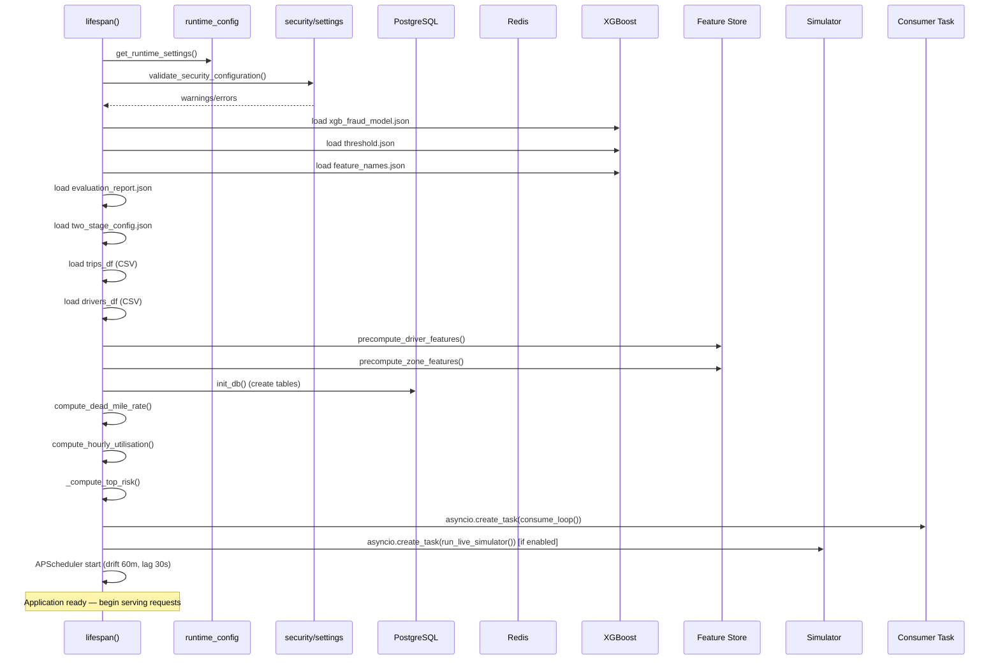

# 09 — Runtime and Startup

[Index](./README.md) | [Prev: Driver Intelligence](./08-driver-intelligence.md) | [Next: ROI and Reporting](./10-roi-and-reporting.md)

This file explains the startup sequence, runtime mode detection, synthetic feed control, shadow mode, and how all platform components are initialised and wired together at boot time.

---

## Runtime Modes

The platform has two runtime modes:

| Mode | Env Values | Behaviour |
|------|-----------|-----------|
| `demo` | `demo`, `sandbox`, `staging` | Synthetic feed enabled by default. Plaintext PII allowed. Security warnings don't block startup. |
| `prod` | `prod`, `production`, `live` | Synthetic feed forced off. Security errors block startup. No plaintext PII. |

### Mode detection

```python
def get_runtime_mode() -> RuntimeMode:
    explicit = os.getenv("APP_RUNTIME_MODE")
    if explicit:
        return _normalise_mode(explicit)
    return _normalise_mode(os.getenv("APP_ENV") or "prod")
```

`APP_RUNTIME_MODE` takes priority over `APP_ENV`. If neither is set, defaults to `prod` — the safe production assumption.

### `_normalise_mode()` mapping

```python
if value in {"demo", "sandbox", "staging"}: return RuntimeMode.DEMO
if value in {"prod", "production", "live"}:  return RuntimeMode.PROD
return RuntimeMode.PROD  # Unknown values default to prod
```

Unknown values default to prod — safer than defaulting to demo.

**Source:** `runtime_config.py`

---

## RuntimeSettings Dataclass

```python
@dataclass(frozen=True)
class RuntimeSettings:
    mode: RuntimeMode
    synthetic_feed_enabled: bool
    shadow_mode: bool
```

```python
def get_runtime_settings() -> RuntimeSettings:
    mode = get_runtime_mode()
    default_synthetic = (mode is RuntimeMode.DEMO)   # Default on in demo
    synthetic_enabled = _env_flag("ENABLE_SYNTHETIC_FEED", default_synthetic)

    if mode is RuntimeMode.PROD:
        synthetic_enabled = False   # Force off in prod regardless of flag

    shadow_mode = _env_flag("SHADOW_MODE", False)

    return RuntimeSettings(mode, synthetic_enabled, shadow_mode)
```

**Key rule:** Even if `ENABLE_SYNTHETIC_FEED=true` is set explicitly, it is overridden to `False` in prod mode. The synthetic feed can never run in production.

---

## Shadow Mode

Shadow mode is a cross-cutting flag that changes three behaviours:

| Behaviour | Normal Mode | Shadow Mode |
|-----------|------------|-------------|
| Case persistence | `fraud_cases` table | `shadow_cases` table |
| Enforcement dispatch | Active | Suppressed |
| `live_write_suppressed` flag | Not set | Set to `True` |

```python
def should_enforce_actions() -> bool:
    return not is_shadow_mode_enabled()
```

`should_enforce_actions()` is called by `enforcement/dispatch.py:auto_enforce()` before every dispatch attempt. In shadow mode, this returns `False` and enforcement is skipped.

Shadow mode is independent of runtime mode — you can run shadow mode in either demo or prod.

---

## Startup Sequence

The full startup runs in `api/state.py:lifespan()`. All steps happen before the application begins serving requests.



### Startup steps in order

**1. Runtime configuration**
```python
runtime = get_runtime_settings()
app_state["runtime_mode"] = runtime.mode.value
app_state["synthetic_feed_enabled"] = runtime.synthetic_feed_enabled
app_state["shadow_mode"] = runtime.shadow_mode
```

**2. Security validation**
```python
security_validation = validate_security_configuration()
if security_validation.errors and runtime.is_prod:
    raise RuntimeError("Security configuration invalid for prod runtime.")
```
Errors are raised only in prod. In demo mode, they become warnings.

**3. XGBoost model loading**
```python
model_path = MODEL_WEIGHTS / "xgb_fraud_model.json"
model = xgb.XGBClassifier()
model.load_model(str(model_path))
app_state["model"] = model
```
If the model file doesn't exist, `app_state["model"] = None`. The platform starts but scoring returns errors until the model is trained.

**4. Threshold loading**
```python
thresh_path = MODEL_WEIGHTS / "threshold.json"
app_state["threshold"] = json.load(thresh_path)["threshold"]  # or 0.45 default
```

**5. Data loading (trips + drivers)**
```python
for path in [DATA_RAW / "trips_full_fraud.csv", DATA_RAW / "trips_with_fraud_10k.csv"]:
    if path.exists():
        app_state["trips_df"] = pd.read_csv(path)
        break
```
Full-scale file preferred over sample. Falls back to empty DataFrame if neither exists.

**6. Feature store warm-up**
```python
n_drivers = await precompute_driver_features(trips, drivers)
n_zones   = await precompute_zone_features(trips)
```
Precomputes per-driver and per-zone feature vectors and caches them in Redis. Used by the stateless scorer for fast feature lookup during stream processing. Timeout: 30 seconds for drivers, 20 for zones.

**7. Database initialisation**
```python
await asyncio.wait_for(init_db(), timeout=10.0)
```
Creates all tables (fraud_cases, shadow_cases, audit_log, driver_actions) if they don't exist. 10-second timeout — if DB is unavailable, the platform starts in CSV-only mode.

**8. Route efficiency cache**
```python
dead_mile   = compute_dead_mile_rate(trips)
utilisation = compute_hourly_utilisation(trips)
suggestions = generate_reallocation_suggestions(trips, dead_mile, utilisation)
app_state["efficiency_cache"] = {"dead_mile": ..., "utilisation": ..., "suggestions": ...}
```
Precomputed at startup so the first route efficiency API call is instant. Cached in Redis with 1-hour TTL.

**9. Driver risk cache**
```python
app_state["top_risk_cache"] = await asyncio.to_thread(
    _compute_top_risk, trips_df, drivers_df, 50
)
```
Top 50 high-risk drivers computed and cached. First `/intelligence/top-risk` call served from memory.

**10. Stream consumer task**
```python
_consumer_task = asyncio.create_task(consume_loop())
```
Starts the Redis Stream consumer as a background asyncio task. Runs for the lifetime of the application. See [03 — Ingestion Pipeline](./03-ingestion-pipeline.md).

**11. Simulator task (if enabled)**
```python
if runtime.synthetic_feed_enabled:
    _simulator_task = asyncio.create_task(run_live_simulator())
```
Starts the digital twin generator. Only runs if `ENABLE_SYNTHETIC_FEED=true` AND mode is demo.

**12. APScheduler**
```python
_scheduler.add_job(run_drift_check, "interval", minutes=60)
_scheduler.add_job(update_stream_lag_gauge, "interval", seconds=30)
_scheduler.start()
```
Two recurring jobs: drift detection every 60 minutes, stream lag gauge every 30 seconds.

---

## Shutdown Sequence

On application shutdown (SIGTERM or KeyboardInterrupt), the lifespan context manager runs cleanup:

```python
# Cancel simulator
if _simulator_task:
    _simulator_task.cancel()
    await _simulator_task  # Wait for CancelledError to propagate

# Cancel stream consumer
if _consumer_task:
    _consumer_task.cancel()
    await _consumer_task

# Stop scheduler
if _scheduler:
    _scheduler.shutdown(wait=False)

# Clear state
app_state.clear()
```

Tasks respond to cancellation by catching `asyncio.CancelledError` and logging a clean shutdown message. No trips are lost — unACKed messages remain in the Redis PEL and will be processed on next startup.

---

## app_state Dictionary

`app_state` is the global in-process state dictionary. It's populated at startup and cleared at shutdown.

| Key | Type | Content |
|-----|------|---------|
| `runtime_mode` | str | `"demo"` or `"prod"` |
| `synthetic_feed_enabled` | bool | Whether simulator is running |
| `shadow_mode` | bool | Shadow mode flag |
| `security_validation` | dict | `{ready, warnings, errors}` |
| `model` | XGBClassifier | Loaded XGBoost model |
| `threshold` | float | Tuned action threshold (default 0.45) |
| `feature_names` | list | 35 feature column names |
| `report` | dict | Evaluation report JSON |
| `two_stage_config` | dict | Two-stage scoring config |
| `trips_df` | DataFrame | Historical trip data |
| `drivers_df` | DataFrame | Driver master data |
| `demand_models` | dict | Per-zone Prophet models |
| `zones` | dict | Zone registry |
| `query_context` | dict | Preloaded NL query context |
| `efficiency_cache` | dict | Route efficiency precomputation |
| `top_risk_cache` | list | Top 50 risk drivers |
| `simulator_summary` | dict | Simulator settings summary |

**Note on horizontal scaling:** `app_state` is process-local. In a multi-replica deployment, each replica has its own `app_state`. This is safe for read-only data (model, trips_df). For mutable state, use PostgreSQL or Redis.

---

## Data Provenance

The `/health` endpoint includes a `data_provenance` string explaining where data is coming from:

```python
def describe_data_provenance(mode, synthetic_feed_enabled, shadow_mode):
    if synthetic_feed_enabled:
        return "Synthetic demo feed persisted to PostgreSQL for product validation."
    if shadow_mode:
        return "Shadow-mode case records persisted to isolated PostgreSQL storage..."
    if mode is RuntimeMode.PROD:
        return "Database-backed case records from connected ingestion pipelines..."
    return "Database-backed case records from a non-production runtime."
```

This ensures anyone reading the health endpoint can immediately understand whether they're looking at real or synthetic data.

---

## Next

- [10 — ROI and Reporting](./10-roi-and-reporting.md) — the finance-facing layer built on top of all this
