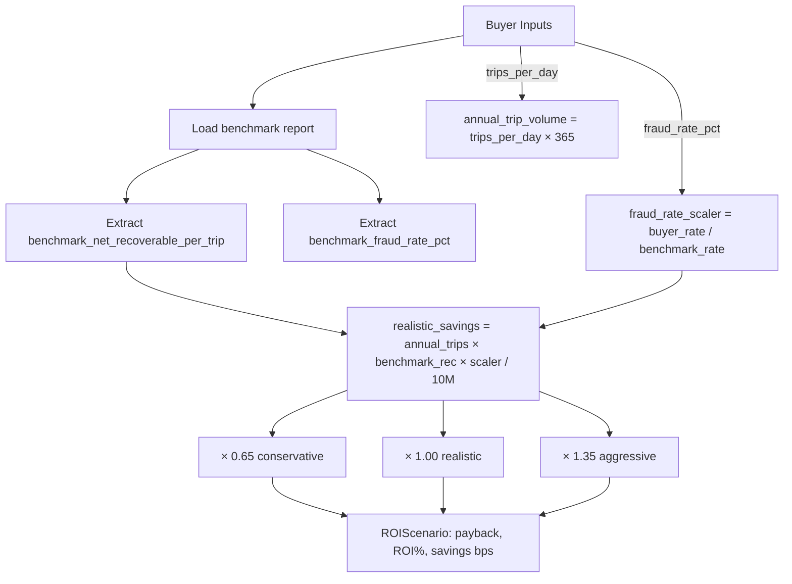
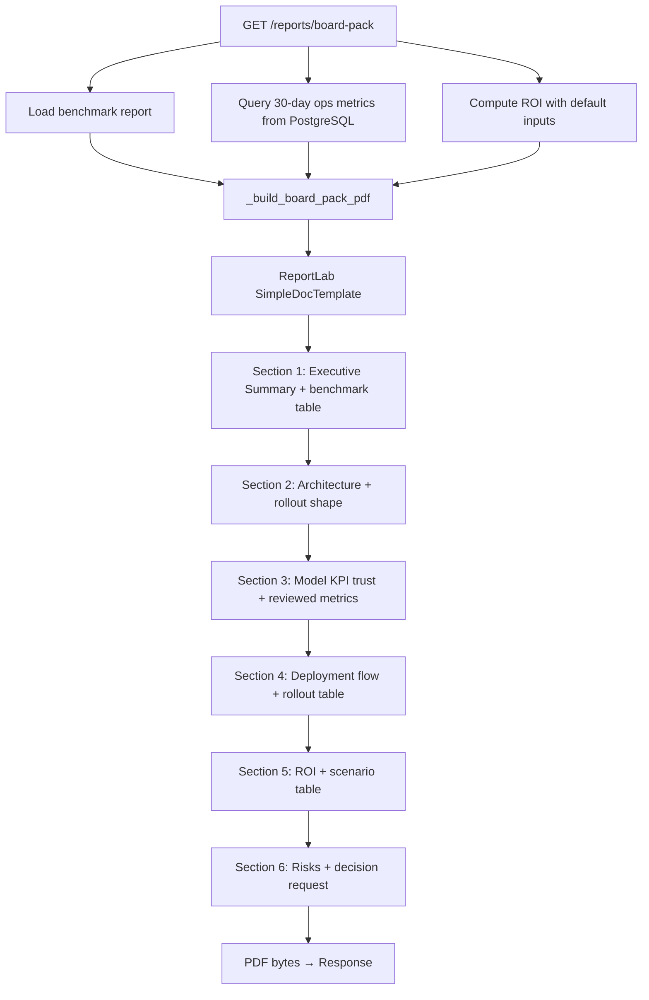

# 10 — ROI and Reporting

[Index](./README.md) | [Prev: Runtime and Startup](./09-runtime-and-startup.md)

This file explains the ROI calculator, how it ties to the evaluation benchmark, the three scenario model, board pack PDF generation, and the management reporting endpoints.

---

## Purpose

The ROI and reporting layer answers the question buyers ask: **"If we buy this, what will we get?"**

The calculator turns the model's benchmark performance into a financial projection specific to the buyer's operating parameters. The board pack compiles everything — model metrics, ops data, ROI, and deployment plan — into a single downloadable PDF.

---

## ROI Calculation Logic

### Endpoint: `POST /roi/calculate`



### Input parameters

```python
class ROICalculationRequest(BaseModel):
    gmv_crore: float            # Total GMV in crore INR
    trips_per_day: int          # Daily trip volume
    fraud_rate_pct: float       # Estimated fraud rate %
    platform_price_crore: float # Platform price in crore INR
```

### Core formula

```python
annual_trip_volume = body.trips_per_day * 365
fraud_rate_scaler  = body.fraud_rate_pct / benchmark_fraud_rate_pct
realistic_savings_crore = (
    annual_trip_volume
    * benchmark_net_rec_trip
    * fraud_rate_scaler
) / 10_000_000
```

**What this means:**
- Start with the benchmark's net recoverable value per trip (empirically measured from the scored dataset)
- Scale it to the buyer's trip volume (× `annual_trip_volume`)
- Adjust for the buyer's fraud rate vs the benchmark's fraud rate (`fraud_rate_scaler`)
- Convert from INR to crore (`/ 10_000_000`)

The scaler is the key insight: if the buyer's fraud rate is 2× the benchmark, the realistic recovery is 2× larger. If it's 0.5×, recovery is halved.

### Why use net recoverable per trip

`net_recoverable_per_trip` is the cleanest financial signal from the evaluation:

```
net_recoverable = recovered_from_TP - false_alarm_cost
net_rec_per_trip = net_recoverable / total_trips
```

It accounts for:
- The fare value recovered from correctly identified fraud
- The operational cost of investigating false positives (5% of the false alarm fare)
- The total trip volume (normalises by scale)

This is a more honest input than raw precision or recall — it reflects actual expected value.

**Source:** `api/routes/roi.py:build_roi_response()`

---

## Three Scenarios

```python
_SCENARIO_MULTIPLIERS = (
    ("conservative", 0.65, "Assumes slower review adoption and lower realised capture."),
    ("realistic",    1.0,  "Uses benchmark recovery scaled by buyer's leakage rate."),
    ("aggressive",   1.35, "Assumes strong review throughput and rollout discipline."),
)
```

| Scenario | Multiplier | Assumptions |
|----------|-----------|-------------|
| **Conservative** | 0.65× | Slow analyst adoption, partial rollout, lower realisation of model potential |
| **Realistic** | 1.0× | Benchmark-equivalent performance on buyer's traffic |
| **Aggressive** | 1.35× | Strong analyst throughput, full city rollout, high case resolution rate |

### Per-scenario output

```python
def _scenario_result(scenario, multiplier, note, annual_savings_crore, gmv_crore, platform_price_crore):
    payback_months = (platform_price_crore / annual_savings_crore) * 12
    roi_pct = ((annual_savings_crore - platform_price_crore) / platform_price_crore) * 100
    savings_pct_of_gmv = (annual_savings_crore / gmv_crore) * 100
    savings_bps_of_gmv = savings_pct_of_gmv * 100
```

| Output field | Formula | Meaning |
|-------------|---------|---------|
| `annual_savings_crore` | `realistic × multiplier` | Annual recovery in crore INR |
| `monthly_savings_lakh` | `annual / 12 × 100` | Monthly recovery in lakh INR |
| `payback_months` | `price / annual × 12` | Break-even time in months |
| `payback_days` | `payback_months × 30.4` | Break-even time in days |
| `roi_pct` | `(savings - price) / price × 100` | Return on investment |
| `savings_pct_of_gmv` | `savings / gmv × 100` | Recovery as percentage of GMV |
| `savings_bps_of_gmv` | `pct × 100` | Recovery in basis points of GMV |

**Source:** `api/routes/roi.py:_scenario_result()`

---

## Benchmark Data Source

The ROI calculator reads from the evaluation report artifact:

```python
_BENCHMARK_REPORT_PATH = Path("data/raw/evaluation_report.json")

def _load_roi_benchmark():
    report = app_state.get("report")   # In-memory first
    if not report:
        report = json.loads(_BENCHMARK_REPORT_PATH.read_text())
    return report
```

The evaluation report structure (simplified):

```json
{
  "xgboost": {
    "total_trips": 50000,
    "total_fraud": 3100,
    "net_recoverable_per_trip": 4.27
  },
  "two_stage": {
    "action_precision": 0.88,
    "action_fpr": 0.031,
    "net_recoverable_per_trip": 5.12,
    "total_fraud_caught_pct": 72.4
  }
}
```

The two-stage metrics are preferred over raw XGBoost metrics — they reflect the actual operational performance with the tiered scoring applied.

### Guard: negative or zero benchmark

```python
if benchmark_net_rec_trip <= 0 or benchmark_fraud_rate_pct <= 0:
    raise HTTPException(503, "Benchmark recovery inputs are unavailable.")
```

If the evaluation pipeline hasn't been run or produced invalid results, the calculator returns 503 rather than producing meaningless numbers.

---

## Board Pack PDF

### Endpoint: `GET /reports/board-pack`

Requires `read:reports` permission. Returns a PDF built with ReportLab.



### Default board pack inputs

```python
_DEFAULT_BOARD_PACK_INPUTS = {
    "gmv_crore":              1000.0,
    "trips_per_day":          43200,
    "fraud_rate_pct":         5.895,
    "platform_price_crore":   3.25,
}
```

These defaults produce a representative ROI scenario for demo use. The buyer's actual numbers should replace these during a live demo or sales conversation.

### Live ops metrics

The board pack pulls 30-day ops data from PostgreSQL at generation time:

```python
since = datetime.utcnow() - timedelta(days=30)
total_cases = await db.scalar(select(count(FraudCase.id)).where(created_at >= since))
confirmed   = await db.scalar(...)
false_alarms = await db.scalar(...)
recovered   = await db.scalar(select(sum(recoverable_inr)).where(confirmed, since))
```

This means the PDF reflects actual operational performance, not just benchmark claims. If analysts have been reviewing cases, the reviewed-case precision appears in the board pack alongside the benchmark.

### Six sections

| Section | Content |
|---------|---------|
| 1. Executive Summary | Platform positioning + benchmark action precision, FPR, recovery/trip |
| 2. Platform Architecture | Architecture description + "What Exists Today" + "Target Rollout Shape" |
| 3. Model and KPI Trust | Reviewed-case precision from 30-day ops + evidence boundaries |
| 4. Deployment Flow | 3-phase deployment description + Week 1/2/3+ rollout table |
| 5. ROI and Commercial Framing | 3-scenario ROI table + commercial structure |
| 6. Risks and Decision Request | Risk mitigations + call to action |

**Source:** `api/routes/reports.py:_build_board_pack_pdf()`

---

## Daily Summary Endpoint

### `GET /reports/daily-summary`

```json
{
  "date": "2026-04-08",
  "cases_opened": 28,
  "reviewed_cases": 22,
  "cases_confirmed": 19,
  "cases_false_alarm": 3,
  "unresolved": 6,
  "reviewed_case_precision": 0.8636,
  "reviewed_false_alarm_rate": 0.1364,
  "confirmed_recoverable_inr": 45230.50,
  "note": "Buyer-safe quality metrics are based only on analyst-reviewed cases...",
  "generated_at": "2026-04-08T18:00:00"
}
```

Accepts an optional `?date=YYYY-MM-DD` parameter. Defaults to today.

The "buyer-safe" framing is deliberate: `reviewed_case_precision` is computed from analyst decisions, not model predictions. This is the number that can be shown to a buyer as evidence of quality.

---

## Model Performance Endpoint

### `GET /reports/model-performance`

```json
{
  "period_days": 30,
  "total_cases": 842,
  "reviewed_cases": 622,
  "confirmed_fraud": 541,
  "false_alarms": 81,
  "unresolved": 220,
  "reviewed_case_precision": 0.8698,
  "reviewed_false_alarm_rate": 0.1302,
  "confirmed_recoverable_inr": 2341087.00,
  "avg_per_confirmed": 4327.33
}
```

The `avg_per_confirmed` field is the average recovery per confirmed case — a key business metric for communicating value per analyst decision.

---

## Benchmark vs Reviewed Metrics

The platform is explicit about the distinction between two types of quality metrics:

```
Benchmark metrics:
  → Come from the scored synthetic evaluation artifact
  → Not dependent on analyst review
  → Represent model performance in a controlled setting
  → Used in ROI calculator and board pack section 1

Reviewed-case metrics:
  → Come from analyst decisions on actual cases
  → Build up over time as analysts work the queue
  → Become the buyer-safe quality layer after shadow deployment
  → Used in board pack section 3 and daily summary
```

The platform never conflates these. During early deployment (before many cases are reviewed), the benchmark is the primary evidence. After 30-60 days of shadow operation, the reviewed-case metrics become the authoritative quality signal.

---

## End of Logic Reference

Return to [README](./README.md) for navigation across all files.
