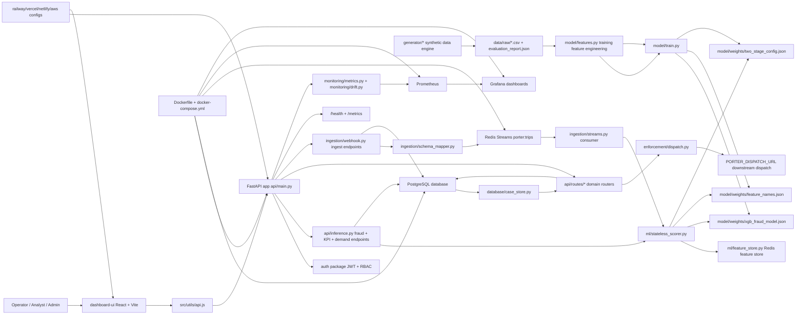
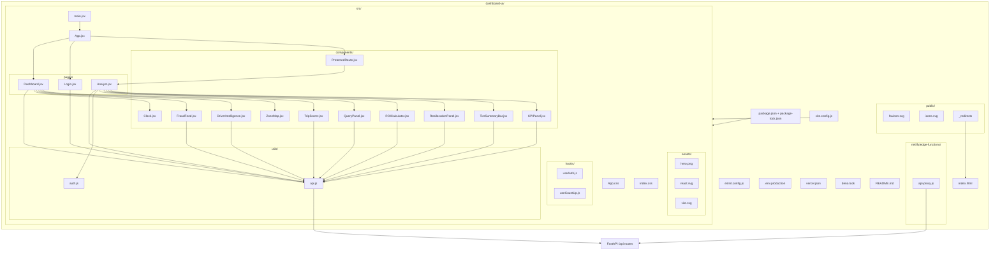
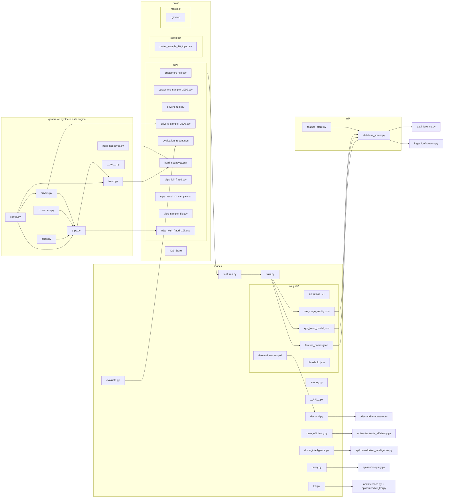
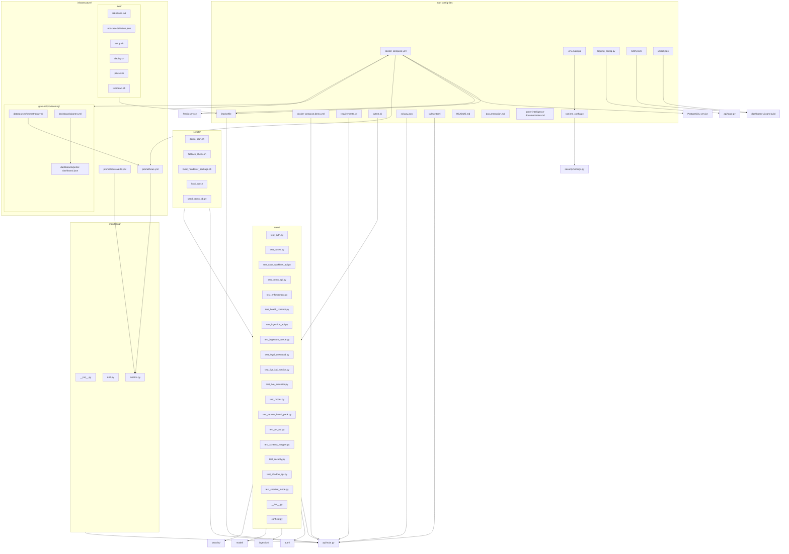

# Porter Intelligence Architecture Map

Generated for the current repository layout on 2026-04-27.

Mermaid AI / Mermaid Live plain source: [architecture-map.mmd](architecture-map.mmd).

This document uses Mermaid diagrams to show how the frontend, API, backend services, ML/model code, data files, infrastructure, tests, scripts, docs, and archive folders connect. It is intentionally repository-shaped, not just product-shaped, so a new teammate can move from a runtime concept to the exact files that implement it.

## System Flow

## Backend Code Map

```mermaid
flowchart TB
  subgraph api["api/"]
    apiMain["main.py\nFastAPI app, middleware, router registration"]
    apiState["state.py\nstartup lifespan, model/data/db/redis warmup"]
    apiInference["inference.py\nfraud score, live feed, KPI, demand"]
    apiSchemas["schemas.py\nPydantic contracts"]
    apiLimiting["limiting.py\nslowapi limiter"]
    apiInit["__init__.py"]

    subgraph apiRoutes["api/routes/"]
      routeAuth["auth.py"]
      routeCases["cases.py"]
      routeDemo["demo.py"]
      routeDemand["demand.py compatibility"]
      routeDriver["driver_intelligence.py"]
      routeFraud["fraud.py compatibility"]
      routeKpi["kpi.py compatibility"]
      routeLegal["legal.py"]
      routeLiveKpi["live_kpi.py"]
      routeQuery["query.py"]
      routeReports["reports.py"]
      routeRoi["roi.py"]
      routeEfficiency["route_efficiency.py"]
      routeShadow["shadow.py"]
      routeInit["__init__.py"]
    end
  end

  subgraph auth["auth/"]
    authConfig["config.py\nseed users from env"]
    authDeps["dependencies.py\nget_current_user + permissions"]
    authJwt["jwt.py\nhashing + token create/verify"]
    authModels["models.py\nroles + permissions"]
    authInit["__init__.py"]
  end

  subgraph database["database/"]
    dbConnection["connection.py\nSQLAlchemy async engine/session"]
    dbModels["models.py\ncase/audit tables"]
    dbCaseStore["case_store.py\npersist/query case workflow"]
    dbRedis["redis_client.py\nRedis helpers"]
    dbInit["__init__.py"]
  end

  subgraph ingestion["ingestion/"]
    ingestWebhook["webhook.py\ntrip + batch ingest routes"]
    ingestMapper["schema_mapper.py\npartner schema normalization"]
    ingestDefault["schema_map.default.json"]
    ingestStreams["streams.py\nRedis stream consumer"]
    ingestStaging["staging.py\nfallback staging"]
    ingestSimulator["live_simulator.py\ndemo trip publisher"]
    ingestCities["city_profiles.py"]
    ingestInit["__init__.py"]
  end

  subgraph security["security/"]
    securitySettings["settings.py\nsecrets, CORS, runtime validation"]
    securityEncryption["encryption.py\nPII encryption"]
    securityInit["__init__.py"]
  end

  subgraph enforcement["enforcement/"]
    enforcementDispatch["dispatch.py\nwebhook dispatch integration"]
    enforcementInit["__init__.py"]
  end

  apiMain --> apiState
  apiMain --> apiInference
  apiMain --> routeAuth
  apiMain --> routeCases
  apiMain --> routeDemo
  apiMain --> routeDriver
  apiMain --> routeLegal
  apiMain --> routeLiveKpi
  apiMain --> routeQuery
  apiMain --> routeReports
  apiMain --> routeRoi
  apiMain --> routeEfficiency
  apiMain --> routeShadow
  apiMain --> ingestWebhook
  apiMain --> apiLimiting
  apiMain --> securitySettings

  apiInference --> apiSchemas
  apiInference --> apiState
  apiInference --> authDeps
  apiInference --> dbCaseStore
  apiInference --> securitySettings

  routeAuth --> authConfig
  routeAuth --> authJwt
  routeAuth --> authDeps
  routeCases --> dbCaseStore
  routeCases --> dbModels
  routeCases --> authDeps
  routeLiveKpi --> dbCaseStore
  routeDriver --> dbCaseStore
  routeLegal --> configCommercial["config/commercial.py"]
  routeReports --> dbCaseStore
  routeRoi --> configCommercial
  routeShadow --> dbCaseStore
  routeEfficiency --> modelEfficiency["model/route_efficiency.py"]
  routeQuery --> modelQuery["model/query.py"]

  apiState --> dbConnection
  apiState --> dbRedis
  apiState --> ingestStreams
  apiState --> ingestSimulator
  apiState --> securitySettings
  ingestWebhook --> ingestMapper
  ingestWebhook --> ingestStreams
  ingestStreams --> dbCaseStore
  ingestStreams --> mlScorer["ml/stateless_scorer.py"]
  mlScorer --> dbRedis
  dbCaseStore --> dbConnection
  dbCaseStore --> dbModels
  enforcementDispatch --> routeCases
```

## Frontend Code Map

## ML, Data, And Digital Twin Map

## Infrastructure, Deployment, And Tooling Map

## Documentation And Archive Map

```mermaid
flowchart TB
  subgraph docs["docs/ active docs"]
    docsReadme["README.md"]
    docsArchitecture["architecture.md"]
    docsMap["architecture-map.md"]
    audit1["audit-response-2026-04-19.md"]
    audit2["audit-response-round2-2026-04-19.md"]
    subgraph docsBench["benchmarks/"]
      benchmarkSheet["benchmark-sheet.md"]
    end
    subgraph docsDemo["demo/"]
      demoChecklist["day-13-final-checklist.md"]
      demoKillers["demo-killers.md"]
    end
    subgraph docsDeployment["deployment/"]
      oneCommand["one-command-setup.md"]
    end
    subgraph docsHandover["handover/"]
      handoverReadme["README.md"]
      acceptance["acceptance-criteria.md"]
      deployRunbook["deployment-runbook.md"]
      scope["deployment-and-support-scope.md"]
      packageStructure["package-structure.md"]
      repoAccess["repo-access-and-handover.md"]
      securityNotes["security-notes.md"]
    end
    subgraph docsRunbooks["runbooks/"]
      runbookReadme["README.md"]
      addCity["add-a-city.md"]
      retrainModel["retrain-model.md"]
    end
    docsSecurity["security/ directory"]
  end

  subgraph archive["_archive/ historical/legacy material"]
    archiveChecklist["archive/checklist.md"]
    archiveEngineer["archive/engineer.md"]
    archiveDashboardIndex["dashboard/index.html"]
    archiveDashboardAnalyst["dashboard/analyst.html"]
    archiveProject["project.md"]
    archiveRemember["remember.md"]
    archiveReview["review_report.md"]
    archiveImpl["implemetations.md"]
    archiveTutorial["tutorial.md"]
    archiveRunChecks["run_checks.sh"]
    archiveTestPhase["test_phase_a.py"]
    archiveTrain["train.py"]

    subgraph archiveData["_archive/data/"]
      archiveDriversMasked["masked/drivers_masked.csv"]
      archiveCustomersMasked["masked/customers_masked.csv"]
      archiveTripsMasked["masked/trips_masked.csv"]
      archiveCustomersRaw["raw/customers_sample_2k.csv"]
      archiveDriversRaw["raw/drivers_sample_2k.csv"]
      archiveTripsFull["raw/trips_full.csv"]
      archiveTrips10k["raw/trips_sample_10k.csv"]
      archiveTrips5k["raw/trips_sample_5k.csv"]
    end

    subgraph archivePrep["_archive/data_prep/"]
      archiveGenerate["generate.py"]
      archiveGenerateFull["generate_full.py"]
      archiveMaskInit["masking/__init__.py"]
      archivePseudo["masking/pseudonymise.py"]
    end

    subgraph archiveHow["_archive/docs_internal/how-it-works/"]
      howReadme["README.md"]
      howQuickstart["01-quickstart-tutorial.md"]
      howArch["02-architecture-deep-dive.md"]
      howData["03-data-and-ml-pipeline.md"]
      howApi["04-api-reference.md"]
      howIngestion["05-ingestion-and-shadow-mode.md"]
      howFrontend["06-frontend-and-dashboard.md"]
      howSecurity["07-security-and-auth.md"]
      howDeploy["08-deployment-and-infrastructure.md"]
      howTesting["09-testing-and-quality.md"]
      howDemo["10-demo-guide.md"]
      howTrouble["11-troubleshooting-and-faq.md"]
    end

    subgraph archiveLogic["_archive/docs_internal/logic/"]
      logicReadme["README.md"]
      logicFraud["01-fraud-scoring-engine.md"]
      logicFeatures["02-feature-engineering.md"]
      logicIngest["03-ingestion-pipeline.md"]
      logicCases["04-case-lifecycle.md"]
      logicSecurity["05-security-model.md"]
      logicTwin["06-digital-twin.md"]
      logicDemand["07-demand-forecasting.md"]
      logicDriver["08-driver-intelligence.md"]
      logicRuntime["09-runtime-and-startup.md"]
      logicRoi["10-roi-and-reporting.md"]
    end

    subgraph archiveSales["_archive/docs_sales/founders-work/"]
      salesReadme["README.md"]
      day01["day-01-commercial-framing.md"]
      day02["day-02-cfo-note-and-roi.md"]
      day03["day-03-digital-twin-story.md"]
      day04["day-04-data-mapping-ask.md"]
      day05["day-05-shadow-mode-story.md"]
      day06["day-06-ops-and-manager-stories.md"]
      day07["day-07-cxo-talk-tracks.md"]
      day08["day-08-handover-and-key-person-risk.md"]
      day09["day-09-commercial-framing.md"]
      day10["day-10-board-pack.md"]
      day11["day-11-demo-fail-safe.md"]
      day12["day-12-close-packet.md"]
      day13["day-13-war-game.md"]
      day14["day-14-meeting-day.md"]
      salesArtifacts["artifacts/* notes + board-pack pdf"]
    end

    subgraph archiveUnused["_archive/unused_modules/"]
      archiveDrift["drift.py"]
    end
  end

  docsArchitecture --> docsMap
  docsMap --> docsReadme
  docsHandover --> infraAws["infrastructure/aws"]
  docsRunbooks --> modelTrain["model/train.py"]
  docsRunbooks --> generatorConfig["generator/config.py"]
  docsDeployment --> dockerCompose["docker-compose.yml"]
  archiveHow --> docs
  archiveLogic --> docs
  archiveSales --> docsHandover
  archiveData --> dataActive["data/"]
  archivePrep --> generatorActive["generator/"]
  archiveDashboardIndex --> dashboardUi["dashboard-ui/"]
```

## Full Repository Inventory

This mindmap lists the active repository files and the legacy archive files that are useful for archaeology. Large dependency/build/cache directories are listed separately in the final section instead of expanded.

```mermaid
mindmap
  root((Porter repo))
    root files
      README.md
      documentation.md
      porter-intelligence-documentation.md
      Dockerfile
      docker-compose.yml
      docker-compose.demo.yml
      requirements.txt
      pytest.ini
      logging_config.py
      runtime_config.py
      .env.example
      netlify.toml
      vercel.json
      railway.json
      railway.toml
    api
      __init__.py
      main.py
      state.py
      inference.py
      schemas.py
      limiting.py
      routes
        __init__.py
        auth.py
        cases.py
        demand.py
        demo.py
        driver_intelligence.py
        fraud.py
        kpi.py
        legal.py
        live_kpi.py
        query.py
        reports.py
        roi.py
        route_efficiency.py
        shadow.py
    auth
      __init__.py
      config.py
      dependencies.py
      jwt.py
      models.py
    config
      __init__.py
      commercial.py
    database
      __init__.py
      case_store.py
      connection.py
      models.py
      redis_client.py
    enforcement
      __init__.py
      dispatch.py
    security
      __init__.py
      encryption.py
      settings.py
    ingestion
      __init__.py
      city_profiles.py
      live_simulator.py
      schema_map.default.json
      schema_mapper.py
      staging.py
      streams.py
      webhook.py
    ml
      feature_store.py
      stateless_scorer.py
    model
      __init__.py
      demand.py
      driver_intelligence.py
      evaluate.py
      features.py
      kpi.py
      query.py
      route_efficiency.py
      scoring.py
      train.py
      weights
        README.md
        demand_models.pkl
        feature_names.json
        threshold.json
        two_stage_config.json
        xgb_fraud_model.json
    generator
      __init__.py
      cities.py
      config.py
      customers.py
      drivers.py
      fraud.py
      hard_negatives.py
      trips.py
    monitoring
      __init__.py
      drift.py
      metrics.py
    dashboard-ui
      .env.production
      README.md
      deno.lock
      eslint.config.js
      index.html
      package.json
      package-lock.json
      vercel.json
      vite.config.js
      netlify
        edge-functions
          api-proxy.js
      public
        _redirects
        favicon.svg
        icons.svg
      src
        App.css
        App.jsx
        index.css
        main.jsx
        assets
          hero.png
          react.svg
          vite.svg
        components
          Clock.jsx
          DriverIntelligence.jsx
          FraudFeed.jsx
          KPIPanel.jsx
          ProtectedRoute.jsx
          QueryPanel.jsx
          ROICalculator.jsx
          ReallocationPanel.jsx
          TierSummaryBar.jsx
          TripScorer.jsx
          ZoneMap.jsx
        hooks
          useAuth.js
          useCountUp.js
        pages
          Analyst.jsx
          Dashboard.jsx
          Login.jsx
        utils
          api.js
          auth.js
    data
      .DS_Store
      masked
        .gitkeep
      raw
        customers_full.csv
        customers_sample_1000.csv
        drivers_full.csv
        drivers_sample_1000.csv
        evaluation_report.json
        hard_negatives.csv
        trips_fraud_v2_sample.csv
        trips_full_fraud.csv
        trips_sample_5k.csv
        trips_with_fraud_10k.csv
      samples
        porter_sample_10_trips.csv
    docs
      README.md
      architecture.md
      architecture-map.md
      audit-response-2026-04-19.md
      audit-response-round2-2026-04-19.md
      benchmarks
        benchmark-sheet.md
      demo
        day-13-final-checklist.md
        demo-killers.md
      deployment
        one-command-setup.md
      handover
        README.md
        acceptance-criteria.md
        deployment-and-support-scope.md
        deployment-runbook.md
        package-structure.md
        repo-access-and-handover.md
        security-notes.md
      runbooks
        README.md
        add-a-city.md
        retrain-model.md
      security
    infrastructure
      prometheus.yml
      prometheus-alerts.yml
      aws
        README.md
        deploy.sh
        ecs-task-definition.json
        pause.sh
        setup.sh
        teardown.sh
      grafana
        provisioning
          dashboards
            porter-dashboard.json
            porter.yml
          datasources
            prometheus.yml
    scripts
      build_handover_package.sh
      demo_start.sh
      fallback_check.sh
      local_up.sh
      seed_demo_db.py
    tests
      __init__.py
      conftest.py
      test_auth.py
      test_case_workflow_api.py
      test_cases.py
      test_demo_api.py
      test_enforcement.py
      test_health_contract.py
      test_ingestion_api.py
      test_ingestion_queue.py
      test_legal_download.py
      test_live_kpi_metrics.py
      test_live_simulator.py
      test_model.py
      test_reports_board_pack.py
      test_roi_api.py
      test_schema_mapper.py
      test_security.py
      test_shadow_api.py
      test_shadow_mode.py
    _archive
      .DS_Store
      implemetations.md
      project.md
      remember.md
      review_report.md
      run_checks.sh
      test_phase_a.py
      train.py
      tutorial.md
      archive
        checklist.md
        engineer.md
      dashboard
        analyst.html
        index.html
      data
        masked
          customers_masked.csv
          drivers_masked.csv
          trips_masked.csv
        raw
          customers_sample_2k.csv
          drivers_sample_2k.csv
          trips_full.csv
          trips_sample_10k.csv
          trips_sample_5k.csv
      data_prep
        generate.py
        generate_full.py
        masking
          __init__.py
          pseudonymise.py
      docs_internal
        how-it-works
          README.md
          01-quickstart-tutorial.md
          02-architecture-deep-dive.md
          03-data-and-ml-pipeline.md
          04-api-reference.md
          05-ingestion-and-shadow-mode.md
          06-frontend-and-dashboard.md
          07-security-and-auth.md
          08-deployment-and-infrastructure.md
          09-testing-and-quality.md
          10-demo-guide.md
          11-troubleshooting-and-faq.md
        logic
          README.md
          01-fraud-scoring-engine.md
          02-feature-engineering.md
          03-ingestion-pipeline.md
          04-case-lifecycle.md
          05-security-model.md
          06-digital-twin.md
          07-demand-forecasting.md
          08-driver-intelligence.md
          09-runtime-and-startup.md
          10-roi-and-reporting.md
      docs_sales
        founders-work
          README.md
          day-01-commercial-framing.md
          day-02-cfo-note-and-roi.md
          day-03-digital-twin-story.md
          day-04-data-mapping-ask.md
          day-05-shadow-mode-story.md
          day-06-ops-and-manager-stories.md
          day-07-cxo-talk-tracks.md
          day-08-handover-and-key-person-risk.md
          day-09-commercial-framing.md
          day-10-board-pack.md
          day-11-demo-fail-safe.md
          day-12-close-packet.md
          day-13-war-game.md
          day-14-meeting-day.md
          artifacts
            README.md
            board-pack-cover-notes.md
            demo-run-sheet.md
            finance-memo.md
            porter-intelligence-board-pack.pdf
      unused_modules
        drift.py
```

## Generated, Cache, And Local-Only Directories

These directories exist in the working tree but are intentionally not expanded in the architecture diagrams because they are generated, dependency-heavy, provider state, or runtime cache:

| Path | Role |
|---|---|
| `.git/` | Git object database and refs |
| `.claude/` | local assistant/tooling state |
| `.pytest_cache/` | pytest cache |
| `.vercel/` | Vercel local/provider metadata |
| `dashboard-ui/.netlify/` | Netlify local build/edge-function output |
| `dashboard-ui/.vercel/` | Vercel dashboard metadata |
| `dashboard-ui/dist/` | generated Vite build output |
| `dashboard-ui/node_modules/` | npm dependencies |
| `venv/` | Python virtualenv |
| `__pycache__/` and package `__pycache__/` folders | Python bytecode cache |
| `logs/` | runtime logs |
| `infrastructure/aws/state/` | local AWS script state |

## Read This Map

- Use **System Flow** when debugging behavior across frontend, API, Redis, database, model, and deployment.
- Use **Backend Code Map** when changing FastAPI routes, auth, database, ingestion, or enforcement.
- Use **Frontend Code Map** when changing dashboard screens or API calls.
- Use **ML, Data, And Digital Twin Map** when changing features, generated data, training, or model weights.
- Use **Infrastructure, Deployment, And Tooling Map** when changing Docker, CI checks, AWS, Netlify, Vercel, Prometheus, or Grafana.
- Use **Full Repository Inventory** when hunting for a file in the jumbled parts of the project.
